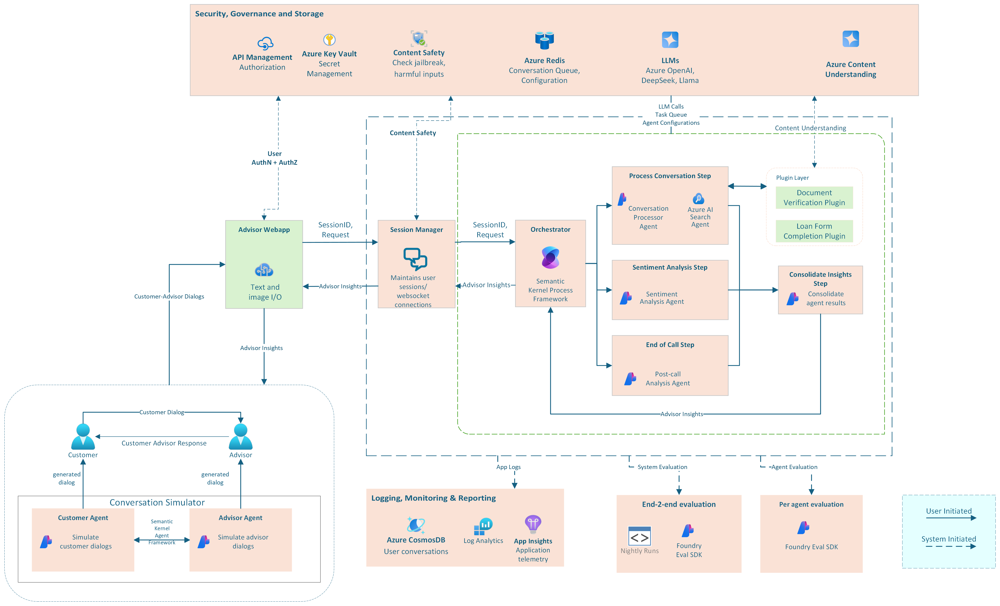
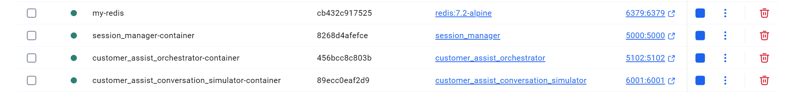

# Customer Assist Setup Instructions

## Overview

The Customer Assist solution is designed to facilitate customer service interactions through an intelligent advisor system that integrates multiple agents and services. By the end of this setup, you should be able to replicate the functionality demonstrated in the following demo video.

https://github.com/user-attachments/assets/aa5abf8f-d49b-4db7-9390-2adb92507af9


## Architecture Diagram

Below is the architecture diagram illustrating the Customer Assist solution components and their interactions.

This diagram provides a visual representation of how various agents and services work together within the Customer Assist solution to provide intelligent customer service support.




## Prerequisites

Before setting up the solution, ensure the following:

1. **System Requirements**:
    - Operating System: Windows (can be extended to Linux)
    - Python 3.12 or higher installed
    - [Visual Studio Code](https://code.visualstudio.com/)
    - [Python VSCode Extension](https://marketplace.visualstudio.com/items?itemName=ms-python.python)
    - [Docker Desktop](https://docs.docker.com/desktop/install/windows-install/) - Required for running the solution in containers
   
## Step 1: Azure Setup

The Customer Assist solution requires several Azure resources to function properly. This section provides guidance on creating and configuring these resources.

#### RBAC Requirements

To successfully set up and use the Customer Assist solution, you must have sufficient permissions for each Azure resource. At minimum, you need:

- **Owner** role on your subscription, or
- Specific RBAC roles for each resource as detailed below

### Required Azure Resources

First, create a resource group to contain all your resources:

```bash
# Create resource group
az group create \
  --name $RESOURCE_GROUP \
  --location $LOCATION
```

1. **Azure AI Foundry Project**:
   - Create a new project in [Azure AI Foundry](https://ai.azure.com/)
   - Save the project connection string for the `.env` configuration
   - Deploy the following models as part of the project setup:
     - `gpt-4o` (required version=2024-08-06) for main conversation processing
   - Keep the deployment names, API key, and endpoint URL
   - Required RBAC Roles:
     - `Azure AI User` - Required to access and use AI Foundry resources
   - [Guide: Start-with-a-project-and-model](https://learn.microsoft.com/en-us/azure/ai-foundry/quickstarts/get-started-code?tabs=azure-ai-foundry&pivots=fdp-project#start-with-a-project-and-model)

2. **Content Understanding using AI Foundry**
   - [Guide: Content Understanding using AI Foundry](https://learn.microsoft.com/en-us/azure/ai-services/content-understanding/quickstart/use-ai-foundry)
   - Save the endpoint URL and API key
   - Create two custom analyzers:
      1. Utility Bill Analyzer (named "utility-bill-analyzer"):
         - Use [this](data/content_understanding_schemas/utility_bill_analyzer_schema.json) schema for creating the analyzer 
         - This includes fields:
            - first_name
            - last_name
            - address
      2. Driver's License Analyzer (named "drivers-license-analyzer") with fields:
         - Use [this](data/content_understanding_schemas/dl_analyzer_schema.json) schema for creating the analyzer
         - This includes fields: 
            - first_name
            - last_name
            - address
            - dl_number
            - expiry_date

3. **DeepSeek Deployment in AI Foundry**:
   - Deploy DeepSeek model in AI Foundry
   - [Guide: Get started with DeepSeek in AI Foundry](https://learn.microsoft.com/en-us/azure/ai-foundry/model-inference/tutorials/get-started-deepseek-r1?context=%2Fazure%2Fai-foundry%2Fcontext%2Fcontext&tabs=python)
   - Save the endpoint URL and API key

4. **Azure Content Safety**:
   - Create a [Content Safety](https://contentsafety.cognitive.azure.com/image) resource 
   - This will be used to detect and prevent harmful or inappropriate content
   - Save the endpoint URL and API key
   - Required RBAC Roles:
     - `Cognitive Services User` - Required to use the content safety service
     - `Cognitive Services Contributor` - Required to create and manage the resource
   - Here's the command to create the Content Safety resource:
     ```bash
     # Create Content Safety service
     az cognitiveservices account create \
       --name $CONTENT_SAFETY_NAME \
       --resource-group $RESOURCE_GROUP \
       --location $LOCATION \
       --kind ContentSafety \
       --sku S0
     ```

5. **Azure Storage Account**:
   - Create a [Storage Account](https://portal.azure.com/#create/Microsoft.StorageAccount) 
   - Create the following containers:
     - `images` - For storing and analyzing images shared during conversations
     - `policy-docs` - For storing loan policy documents
   - Save the connection string and account name
   - [Guide: Create an Azure Storage Account](https://learn.microsoft.com/en-us/azure/storage/common/storage-account-create?tabs=azure-portal)
   - Here are the commands to create the Storage Account with containers:      
   ```bash
      # Create storage account
      az storage account create \
        --name $STORAGE_ACCOUNT_NAME \
        --resource-group $RESOURCE_GROUP \
        --location $LOCATION \
        --sku Standard_LRS \
        --kind StorageV2
      
      # Create images container
      az storage container create \
        --name images \
        --account-name $STORAGE_ACCOUNT_NAME \
        --resource-group $RESOURCE_GROUP
        
      # Create policy-docs container
      az storage container create \
        --name policy-docs \
        --account-name $STORAGE_ACCOUNT_NAME \
        --resource-group $RESOURCE_GROUP
      ```

6. **Azure AI Search**:
   - Create an [Azure AI Search](https://portal.azure.com/#create/Microsoft.Search) resource
   - This will be used to index and search loan policy documents
   - Upload [your loan policy documents](data/policy_documents/) to the Azure Storage container (from step 5)
   - Create an indexer to process the documents
   - Save the search service name, admin key, and query key
   - Connect the search index with your Azure AI Foundry project [Guide: How to add an index in AI Foundry](https://learn.microsoft.com/en-us/azure/ai-foundry/how-to/index-add)
   - Note: For optimal results, use the Standard tier or higher
   - Here's the command to create the Azure AI Search resource:
     ```bash
     # Create Azure AI Search service
     az search service create \
       --name $SEARCH_SERVICE_NAME \
       --resource-group $RESOURCE_GROUP \
       --location $LOCATION \
       --sku Standard
     ```
    
    **Bring Your Own Data**:
    - You can extend the agent's capabilities by adding your own domain-specific data:
        - Upload your company's loan policy documents, FAQs, manuals, or other reference materials to the same Azure Storage container
        - Update the indexer to process your custom documents
        - The agent will be able to retrieve and reference this information during customer conversations
        - This allows the system to provide accurate, company-specific information to customers
    - Required RBAC Roles for Custom Data Access:
        - `Storage Blob Data Reader` - Required to read data from the storage container
        - `Search Index Data Reader` - Required to query the search index
        - `Search Service Contributor` - Required to configure the search service

7. **Setup tracing in AI Foundry**:
   - [Guide: Tracing in AI Foundry project by setting up Application Insights](https://learn.microsoft.com/en-us/azure/ai-services/agents/concepts/tracing#trace-agents-using-opentelemetry-and-an-application-insights-resource)
   - Save the App insights connection string for telemetry and monitoring
   - Here's the command to create the Application Insights resource:
     ```bash
     # Create Application Insights resource
     az monitor app-insights component create \
       --app $APP_INSIGHTS_NAME \
       --resource-group $RESOURCE_GROUP \
       --location $LOCATION \
       --application-type web
     
     # Get the connection string
     az monitor app-insights component show \
       --app $APP_INSIGHTS_NAME \
       --resource-group $RESOURCE_GROUP \
       --query connectionString \
       --output tsv
     ```

### Resource Configuration

After creating these resources, make note of the following information that will need to be added to your `.env` files:

- Subscription ID
- Tenant ID
- Resource Group
- Azure OpenAI:
  - Endpoint URL
  - Model deployment names
- Content Understanding:
  - API key
  - Endpoint URL
- Content Safety:
  - API key
  - Endpoint URL
- Storage account:
  - Connection string
  - Account name
  - Container names
- Azure AI Search:
  - Search Index Name
  - Search Service Name
  - Admin Key
  - Custom data collections or index names (if bringing your own data)
- Application Insights connection string (for telemetry)
---

## Step 2: Running the Customer Assist Solution Locally

This guide outlines the steps to set up and run the **Customer Assist** solution locally:

## ⚙️ Project Structure

```
root/
│
├── .vscode/
│   ├── launch.json                               # VSCode launch configuration
│   └── tasks.json                                # VSCode task configuration
├── src/                                          # Project source code
    ├── solution_accelerators/
    │   └── customer_assist/
    │       ├── orchestrator/                     # Main orchestration layer
    │       │   ├── agents/                       # Agent implementations
    │       │   │   ├── plugins/                  # Agent plugins and capabilities
    │       │   │   ├── process_conversation_agent.py  # Processes conversation inputs
    │       │   │   ├── sentiment_analysis_agent.py    # Analyzes sentiment in conversations
    │       │   │   └── post_call_analysis_agent.py    # Provides post-call summaries
    │       │   ├── config/                       # Configuration files
    │       │   ├── process/                      # Process orchestration
    │       │   ├── models/                       # Data models
    │       │   ├── app.py                        # Main application entry point
    │       │   ├── customer_assist_orchestrator.py    # Orchestrator implementation
    │       │   ├── Dockerfile                    # Docker configuration 
    │       │   └── requirements.txt              # Python dependencies
    │       │
    │       ├── conversation_simulator/           # Simulates customer-advisor interactions
    │       │   ├── config/                       # Simulator configuration
    │       │   ├── data/                         # Conversation data and scenarios
    │       │   ├── app.py                        # Simulator application
    │       │   ├── conversation_simulator.py     # Simulator implementation
    │       │   ├── Dockerfile                    # Docker configuration
    │       │   └── requirements.txt              # Python dependencies
    │       │
    │       ├── frontend/                         # User interfaces
    │       │   └── banker_frontend/              # React-based frontend for bankers/advisors
    │       │
    │       ├── docs/                             # Documentation
    │       ├── SETUP.md                          # Setup instructions
    │       └── customer_assist_architecture.png  # Architecture diagram
    │
    ├── services/
    │   └── session_manager/                      # Manages user session contexts
    │       ├── handlers/                         # Request handlers
    │       ├── utils/                            # Utility functions
    │       ├── app.py                            # Main application
    │       ├── config.py                         # Configuration
    │       ├── Dockerfile                        # Docker configuration
    │       └── requirements.txt                  # Python dependencies
    │
    └── common/                                   # Shared libraries and utilities
        ├── agent_factory/                        # Agent creation framework
        ├── clients/                              # API clients
        ├── contracts/                            # Data contracts
        ├── safety/                               # Content safety tools
        └── utilities/                            # Common utilities
```


### Step 2.1: Frontend Setup

Before running either the Docker containers or the VSCode debugging configuration, you need to set up the frontend components:

#### ✅ Setting Up the Advisor Web Interface

**Environment File Path**: `src/solution_accelerators/customer_assist/frontend/banker_frontend/.env`

1. Navigate to the banker frontend directory:
   ```powershell
   cd src\solution_accelerators\customer_assist\frontend\banker_frontend
   ```

2. Install dependencies:
   ```powershell
   npm install
   ```

3. Create a `.env` file by copying the `.env.template` file:
   ```powershell
   Copy-Item .env.template .env
   ```

4. Start the development server:
   ```powershell
   npm run dev
   ```

This will make the Advisor Web Interface accessible at http://localhost:3000.

### Step 2.2: Backend Services Setup

#### Configuring the Services

Each backend service plays a specific role in the Customer Assist solution and requires proper configuration via environment variables. Below are the key services and their configuration requirements:

#### 1. Session Manager Service

**Technical Purpose**: The Session Manager handles WebSocket connections, manages conversation state, and coordinates message flow between webapp and the orchestrator.

**Environment File Path**: `src/services/session_manager/.env`

**Key Environment Variables**:
```
# Azure Services
AZURE_CONTENT_SAFETY_SERVICE=<content-safety-endpoint>
APPLICATION_INSIGHTS_CNX_STR=<app-insights-connection-string>

SPEECH_KEY=<your-azure-ai-services-key>
SPEECH_REGION=<your-azure-ai-services-region>
```

#### 2. Orchestrator Service

**Technical Purpose**: The Orchestrator is the central coordination layer that manages the agent plugins, processes conversation messages, and handles the business logic of the Customer Assist solution. It leverages the Semantic Kernel Process framework for AI agent orchestration.

**Environment File Path**: `src/solution_accelerators/customer_assist/orchestrator/.env`

**Key Environment Variables**:
```
# Azure OpenAI Configuration
AZURE_OPENAI_ENDPOINT=<your-azure-openai-endpoint>
AZURE_OPENAI_DEPLOYMENT=<your-gpt-4o-deployment-name>

# Azure AI Foundry Project
AZURE_AI_AGENT_PROJECT_CONNECTION_STRING=<your-ai-foundry-connection-string>
AZURE_AI_AGENT_MODEL_DEPLOYMENT_NAME=<your-gpt-4o-deployment-name> # default model for Semantic Kernel

# Azure Content Understanding Services
AZURE_CONTENT_UNDERSTANDING_ENDPOINT=<your-content-understanding-endpoint>
AZURE_CONTENT_UNDERSTANDING_KEY=<your-content-understanding-key>

# Azure AI Inference for DeepSeek
AZURE_AI_INFERENCE_ENDPOINT=<your-deepseek-endpoint>
AZURE_AI_INFERENCE_API_KEY=<your-deepseek-key>

# Azure AI Search for Knowledge Base (including custom data)
AZURE_AI_SEARCH_SERVICE_NAME=<your-search-service-name>
AZURE_AI_SEARCH_ADMIN_KEY=<your-search-admin-key>
AZURE_AI_SEARCH_INDEX_NAME=<your-search-index-name>
```

#### 3. Conversation Simulator Service

**Technical Purpose**: The Conversation Simulator provides a environment for simulating conversations between customers and advisors, useful for development, testing, and demonstration purposes without requiring actual end users.

**Environment File Path**: `src/solution_accelerators/customer_assist/conversation_simulator/.env`

**Key Environment Variables**:
```
# Azure OpenAI Configuration for Customer and Advisor Agents
AZURE_OPENAI_ENDPOINT=<your-azure-openai-endpoint>
```

To configure each service:

1. Copy the corresponding `.env.template` file to `.env` in each service directory:
   ```powershell
   # Session Manager
   Copy-Item src\services\session_manager\.env.template src\services\session_manager\.env
   
   # Orchestrator
   Copy-Item src\solution_accelerators\customer_assist\orchestrator\.env.template src\solution_accelerators\customer_assist\orchestrator\.env
   
   # Conversation Simulator
   Copy-Item src\solution_accelerators\customer_assist\conversation_simulator\.env.template src\solution_accelerators\customer_assist\conversation_simulator\.env
   ```
   
2. Fill in the environment-specific values in each `.env` file
3. Ensure that connection strings, endpoints, and API keys match your Azure resources
4. Make sure service URIs and ports are consistent across all configuration files

### Deploying the Services

Running in Docker provides an isolated environment that closely resembles production deployment.

#### ✅ Steps for Docker Deployment

1. Update subscription_id and tenant_id for Customer Assist tasks in .vscode/tasks.json
2. Press `Ctrl+Shift+P` or go to the **View > Command Palette** in VSCode.
3. Type "Run Task" and select **Tasks: Run Task**.
4. Choose one of the following tasks:
   ```
   Customer Assist: Build and Run in Docker
   ```
   or for a clean reinstall:
   ```
   Customer Assist: Build and Run Docker Images [FORCE INSTALL]
   ```

This Docker task will:

* Build Docker images for all required services: Session Manager, Customer Assist Orchestrator, and Conversation Simulator
* Start all containers with proper networking configuration
* Expose services on the following ports:
  * Session Manager: 5000
  * Customer Assist Orchestrator: 5102
  * Conversation Simulator: 6001
* Set up environment variables and dependencies automatically

Once the Docker containers are running, you should see them in Docker Desktop:


*Example of running Docker containers in Docker Desktop*


When the containers are deployed, you'll need to authenticate with Azure. To complete authentication:

1. Click on each container in Docker Desktop and check for logs under the "Logs" tab (or check the VS Code Docker extension)
2. Look for the authentication prompt in the container logs similar to:

```
🔐 Logging in to Azure...

To sign in, use a web browser to open the page https://microsoft.com/devicelogin and enter the code ABCDEFG to authenticate.
```

3. Open a web browser and navigate to the URL shown (https://microsoft.com/devicelogin)
4. Enter the unique code displayed in the logs (e.g., ABCDEFG)
5. Complete the Microsoft authentication process with your Azure credentials
6. The container will continue initialization once authentication is successful

You will need to complete this authentication step for each container that requires Azure support i.e. Orchestrator, Session Manager and Conversation Simulator.

After successful authentication, the services will start up and be ready for use.

## Step 3: Verifying the Setup (Optional)

### Step 3.1: For Docker Deployment
After starting the Docker containers:

* Run `docker ps` to confirm all three containers are running:
  * `customer-assist-session-manager`
  * `customer-assist-orchestrator`
  * `customer-assist-conversation-simulator`
* Check container logs using `docker logs <container_name>` for any error messages
* Verify services are accessible at:
  * Session Manager API: http://localhost:5000/
  * Customer Assist Orchestrator API: http://localhost:5102/
  * Conversation Simulator UI: http://localhost:6001


### Step 3.2: Verifying the Frontend Setup

1. Open your browser and navigate to http://localhost:3000
2. Verify that the dashboard loads properly and shows the expected components
3. Check that the conversation simulator can be accessed from within the interface

## Step 4: Using the Customer Assist Solution

After successful deployment of all services, you can interact with the Customer Assist solution through the advisor interface:

1. Open your browser and navigate to the Advisor Web Interface at http://localhost:3000
2. On the dashboard, click the **Switch to Agent Mode** button to enable simulated agent conversations
3. Observe how the Advisor Insights panel automatically populates with relevant information:
   * Real-time sentiment analysis of the customer's messages
   * Suggested next question based on the conversation context
   * Policy information relevant to the customer's queries
   * Missing information that needs to be collected
   * Document verification status updates

The agent will actively assist during the entire conversation, providing contextual guidance, policy references, and suggesting next steps to improve the customer experience.

## Step 5: Running Evaluations (Optional)

The Customer Assist solution includes an evaluation framework to measure the performance and quality of the AI agents. Running evaluations helps ensure that the system meets the required quality standards and identifies areas for improvement.

### Step 5.1: Setting Up the Evaluation Environment

1. **Configure the Evaluation Service**:
   ```powershell
   # Set up the evaluation environment
   Copy-Item src\evals\.env.template src\evals\.env
   ```

2. **Edit the `.env` file** to include your Azure OpenAI credentials and evaluation configuration.

3. **Required Environment Variables**:
   ```
   KEYVAULT_URI=""  # URI for the Azure Key Vault to retrieve secrets.
   # Azure OpenAI
   AZURE_OPENAI_ENDPOINT="" # Endpoint URL for Azure OpenAI service.

   # Azure ML
   AZURE_SUBSCRIPTION_ID=""  # Subscription ID for Azure.
   AZURE_RESOURCE_GROUP=""  # Resource group name for Azure resources.
   AZURE_WORKSPACE_NAME=""  # Name of the Azure AI Foundry Project.

   # Azure AI Foundry
   AZURE_AI_AGENT_PROJECT_CONNECTION_STRING=""  # Connection string for Azure AI Agent project.
   AZURE_AI_AGENT_MODEL_DEPLOYMENT_NAME=""  # Deployment name for the Azure AI Agent model for evaluators.
   ```

### Step 5.2: Running Evaluation Scenarios

1. **Start the Evaluation Service using VSCode launch task**:
   ```
   Customer Assist Evals: Launch
   ```

2. **Available Agent Evaluations**:
   * Post-Call Analysis Agent
   * Assist Agent

3. **Viewing Evaluation Results**:
   * The URL to the results will be available in the terminal logs
   * Results will be available at Foundry Portal using the link
   ```
   Example Logs: 

   Local Evaluation Results Available at https://ai.azure.com/build/evaluation/XXXXX
   ``` 

More details about supported evaluations and metrics can be found [here](evaluation/README.md).

---

## 📄 Stopping the Service

### For Docker Deployment
To stop the Docker containers:

1. Use the following command to stop all running containers:
   ```powershell
   docker stop $(docker ps -q --filter "name=customer-assist")
   ```
2. To remove the containers (optional):
   ```powershell
   docker rm $(docker ps -a -q --filter "name=customer-assist")
   ```

### Stopping Frontend Development Server
If you started the frontend in development mode:

1. Navigate to the terminal window where the frontend is running
2. Press `Ctrl+C` to stop the development server
3. Confirm by pressing `Y` when prompted

---

## Troubleshooting

### Common Issues

- **Session Manager Issues**: Ensure that the Redis container is running properly. Check that the Redis port (6379) is accessible and the password configuration is correct.
- **Orchestrator Issues**: Verify that the Azure AI Service endpoints are correctly configured and accessible. Check the configuration settings in the `.env` file or Docker environment variables.
- **Conversation Simulator Issues**: If the simulator fails to start, verify that all required dependencies are installed and that the virtual environment or Docker container is properly configured.
- **Azure OpenAI Connection Issues**: Ensure that the Azure OpenAI service is properly configured with the correct endpoints, API keys, and deployment names. Check that rate limits are not exceeded.
- **Custom Data Access Issues**: If the agent cannot access your custom data, verify that:
  - The storage container permissions are correctly set
  - The search index is properly configured and indexed
  - Your environment variables contain the correct search service information
  - Your account has the necessary RBAC permissions to access both the storage account and search service

### Docker-Specific Issues

- **Docker Network Issues**: If containers can't communicate with each other, check the Docker network configuration.
- **Container Startup Failures**: Examine the container logs with `docker logs <container_name>` to identify initialization errors.
- **Port Conflicts**: Ensure that the ports used (5000, 5102, 6001) aren't already in use by other applications.

### Frontend-Specific Issues

- **Node Module Issues**: If you encounter problems with npm dependencies, try deleting the `node_modules` folder and `package-lock.json` file, then run `npm install` again.
- **Next.js Build Failures**: Check for any syntax errors in your components or configuration files. Running `npm run dev` might provide more detailed error messages.
- **API Connection Issues**: Ensure the `.env.local` file has the correct API URLs pointing to your backend services.
- **CORS Issues**: If the frontend can't connect to the backend, check that CORS is properly configured in the orchestrator service.

For content safety issues or harmful inputs being detected, review the Content Safety configuration under the API Management settings.

For any connection issues with Azure services, verify that your Azure subscription is active and properly configured.

---

Customer Assist should be up and running 🚀
