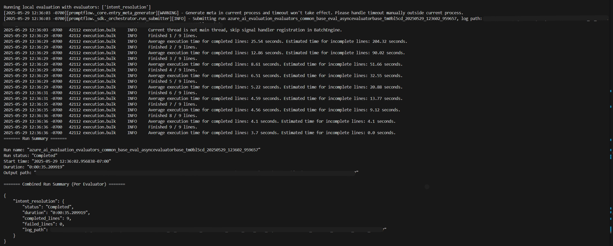
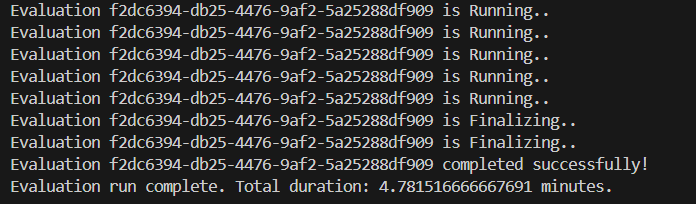
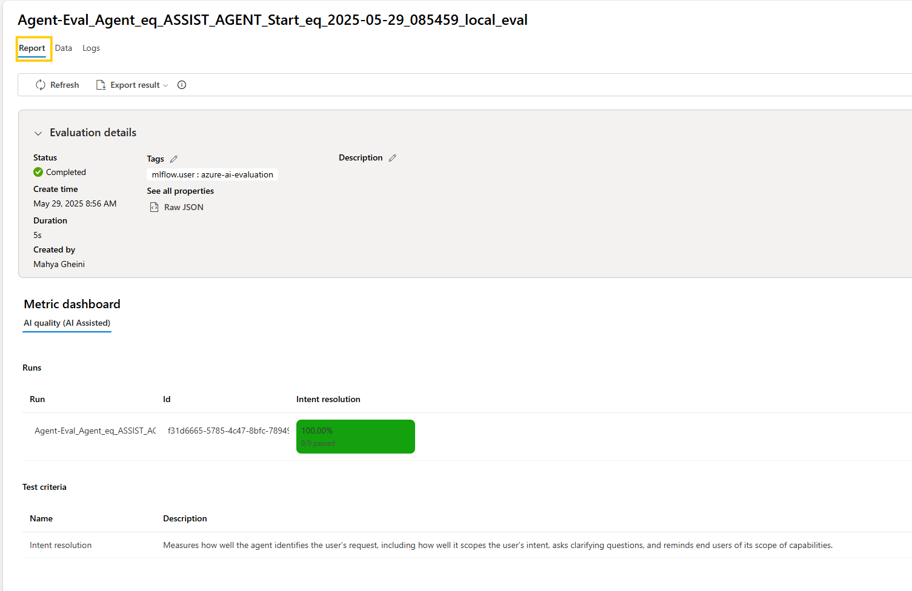
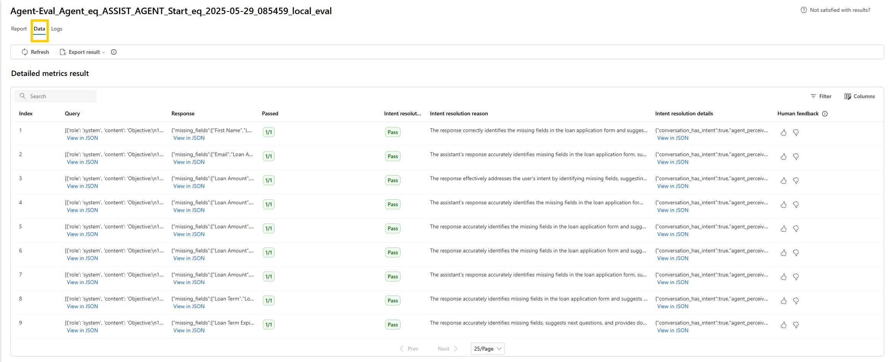
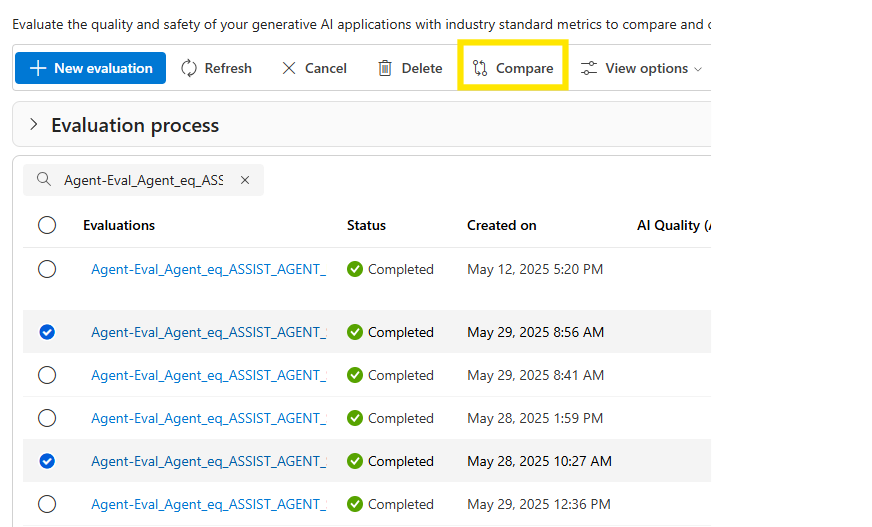

# Customer Assist Evaluation

## Overview

The Customer Assist Evaluation tool is designed to assess and validate the performance of various AI agents used in `customer assist` scenario. Evaluation tool is powered by Azure AI evaluation SDK. It provides a systematic approach to evaluating how well AI agents understand and respond to user queries.

### Key Features

- **Flexible Agent Testing**: Evaluate AI agent's performance with your ground truth.
- **Customizable Metrics**: Assess agents performance across various metrics.

## Supported Evaluation Metrics

The evaluation framework provides a robust set of metrics to assess AI agent performance across multiple dimensions.

### Built-in Metrics for Cloud Evaluation

These metrics are provided by the [Azure AI Evaluation SDK](https://learn.microsoft.com/en-usion/overview). Each metric is identified by a unique ID, which is currently hardcoded in the SDK. To simplify usage, we’ve included several of these metrics and their corresponding IDs in the codebase, allowing you to easily select and apply them in your evaluation pipeline:

- **Relevance**: Assesses how well the agent’s response aligns with the user query.  
  - **Scale**: 1–5 (higher is better)

- **Coherence**: Evaluates the fluency and naturalness of the response.  
  - **Scale**: 1–5 (higher is better)

- **Similarity**: Measures the semantic similarity between the generated response and the ground truth.  
  - **Note**: Requires ground truth data in your dataset.  
  - **Scale**: 1–5 (higher is better)

### Agentic Built-in Metrics for Local Evaluation

These metrics are tailored for agentic workflows and are not yet part of the Foundry Evaluators Library. The tool automatically selects the appropriate evaluation process based on the metrics provided:

- **Task Adherence**: Measures how well the agent follows its assigned task instructions.  
  - **Scale**: 1–5 (higher is better)

- **Intent Resolution**: Evaluates the agent’s ability to correctly identify and scope the user’s intent.  
  - **Scale**: 1–5 (higher is better)

## Capabilities

### Configurability

The evaluation tool is highly configurable, enabling users to:

- Select the agent to evaluate (e.g., `ASSIST_AGENT`, `POST_CALL_ANALYSIS_AGENT`, `SENTIMENT_ANALYSIS_AGENT`).
- Choose from a range of evaluation metrics.
- Configure AI-assisted metrics by integrating Azure OpenAI or OpenAI services, leveraging GPT models for evaluation.

### Monitoring Evaluation Status

Each step of the evaluation process is logged to the terminal for transparency and debugging. The evaluation workflow includes:

- **Dataset Loading**: Reads the evaluation dataset, which can be stored locally or on Azure Machine Learning (AML) Studio.

- **Kernel and Agent Initialization**: Creates, initializes and evaluates both - Semantic Kernel and Azure AI Foundry agents based on the local configuration file.

- **Agent Invocation**: Sends each query to the agent and captures the response.

    

- **Answer File Upload**: Uploads the generated responses to Foundry for evaluation.

- **Evaluation Execution**:
  - **Agent-Specific Metrics**: If selected, the evaluation runs locally. Logs include per-query evaluation status, and results are uploaded to Foundry.

    

  - **Built-in Metrics**: If selected, the evaluation is triggered in the cloud via Foundry. The tool polls Foundry for status updates and displays them in the terminal.

    


## Running Instructions

### Prerequisites

1. Ensure all required Customer Assist resources are set up. You can find them [here](../SETUP.md/#prerequisites)

### Configuration Steps

1. Copy and configure environment variables:
   ```powershell
   cp .env.template .env
   ```
   Update the following values in `.env`:
   ```
   KEYVAULT_URI=""  # URI for the Azure Key Vault to retrieve secrets.
   # Azure OpenAI
   AZURE_OPENAI_ENDPOINT="" # Endpoint URL for Azure OpenAI service.

   # Azure ML
   AZURE_SUBSCRIPTION_ID=""  # Subscription ID for Azure.
   AZURE_RESOURCE_GROUP=""  # Resource group name for Azure resources.
   AZURE_WORKSPACE_NAME=""  # Name of the Azure AI Foundry Project.

   # Azure AI Foundry
   AZURE_AI_AGENT_PROJECT_CONNECTION_STRING=""  # Connection string for Azure AI Agent project.
   AZURE_AI_AGENT_MODEL_DEPLOYMENT_NAME=""  # Deployment name for the Azure AI Agent model for evaluators.

   # For non_openai models using Azure AI Inference. These variables are needed to setup services needed for customer assist solution.
    AZURE_AI_INFERENCE_ENDPOINT=""  # Endpoint URL for Azure AI Inference service.
    AZURE_AI_INFERENCE_API_KEY=""  # API key for Azure AI Inference service.
   ```

2. Configure evaluation settings [here](./static/eval_config.yaml):
   ```yaml
    evaluation_jobs:
        <name of evaluation>:
            config_body:
                type: AgentEvaluation
                agent_config_id: "YOUR_AGENT_NAME"  # The agent to evaluate, can be "ASSIST_AGENT", "POST_CALL_ANALYSIS_AGENT", or "SENTIMENT_ANALYSIS_AGENT"
                local_dataset: "path/to/your/test_data.csv"  # Your test dataset
                config_file_path: "path/to/customer_assist_config.yaml"  # Solution configuration
                metric_config:
                    <name of metric>: # Name of metric for evaluation, can be relevance, coherence, similarity, intent_resolution, task_adherence
                        name: "name_of_metric"
                        type: "type_of_metric" # "BuiltInMetricsConfig" for built-in metrics and "AgentEvaluatorConfig" for agent specific metrics
                        service: # Service to be used for AI assisted metrics
                            llm_service: # "AzureOpenAI" or "OpenAI"
                            deployment_name: "name_of_your_deployment"
   ```

### Running the Evaluation

1. Run and debug evaluation locally inside VS Code:

   - Click on Run and Debug or Ctrl+Shift+D

   - Click on the Drop Down Menu at the top of VSCode

   - Select "Customer Assist Evals" then click Play Button to start the instance

    **Note:** As part of starting the service, VSCode will create python virtual environments in folder .venv and install all project-level dependencies. This will take some time. Wait for all dependencies to be installed. 

2. Choose evaluation from config file to run. After installing all dependencies you will be asked to enter name of the evaluation to run in terminal. Enter name of the evaluation as you entered it in placeholder `name of evaluation` in config file.

## Output

After completion, in the terminal you will get links to results of your evaluation. The results will be saved under evaluation tab in your foundry project.\
If you have used differnt type of metrics results for built-in metrics will be saved seperate from agent specific metrics. Local evaluation results are for agent specific metrics, and results for other metrics can be seen at AI project URI.


Visiting the links you can see report for evaluation. Under Data tab you can see detailed report for run with results for each query in your dataset.




## Compare Results for Multiple Runs

Using Foundry portal you can easily compare results for multiple evaluation run. This is super useful to see how changing agent configuration or prompt can effect its performance.\

To do this visit your Foundry project. Go to Evaluation tab. Under "Automated evaluations" you will see all evaluation runs. By hovering the run instance you can select that instance. Select two or more and click on "compare" at the top.



After that you will be moved to table view, where you can see results of runs, their differences including detailed comaparison for each query in Comparison tab.


By closing Comaparison tab you can open Charts tab to visually see differnece in evaluation runs.

