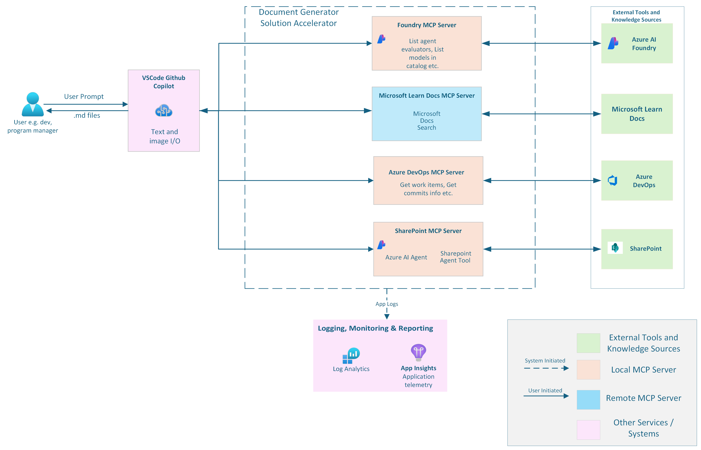

  <h1>
    Document Generator
  </h1>
  
<strong>This solution enables users to leverage intelligent agents and tools for document generation throughout key phases of the system lifecycle, from designing solutions based on best practices or predefined frameworks to developing content for end-user workshops. All of this is seamlessly integrated through the Model Context Protocol (MCP) within VSCode Copilot.
 </strong>

   
  
<a href="https://placeholder-for-demo-video.com">▶️ Watch Demo Video</a>

## 🚀 Overview

**Document Generator** bridges the gap between GitHub Copilot and your organization’s knowledge ecosystem. It empowers users to integrate data from sources like SharePoint Sites, Azure DevOps Boards, Azure AI Foundry Resources, and Microsoft Learn documentation directly into their coding environment, seamlessly through Model Context Protocol (MCP) Servers.

---

## 🔍 Business Value

- **Enhanced Context-Rich Document Generation**: Synthesize insights from across your enterprise ecosystem for intelligent, data-driven decision making
- **Accelerated Project Delivery**: Identify and reuse components across similar projects to reduce duplication and accelerate development cycles
- **Streamlined Planning**: Create optimized development plans using insights from code repositories, documentation, and project management systems
- **Rapid Onboarding & Training**: Generate personalized onboarding guides and dynamic workshop agendas aligned to specific project goals and target users

---

## 💼 Key Use Cases

1. **Strategy Document Generation**: 
Generate comprehensive strategy documents grounded in real project data from SharePoint sites, combining historical insights with current project requirements for data-driven strategic planning.

2. **Intelligent Project Plan**: 
Design and optimize project development plans using synthesized insights from code repositories, documentation, and Azure DevOps work items to create efficient, repeatable processes.

3. **Component Reusability & Discovery**: 
Identify reusable components, patterns, and solutions across similar projects to accelerate development and reduce duplication, including specialized components like evaluations and testing frameworks.

4. **Enterprise Knowledge Synthesis**: 
Transform static documentation into interactive, queryable resources that deliver context-rich suggestions by synthesizing insights from SharePoint sites, Azure DevOps boards, code repositories, and Microsoft documentation.

---

## 🧠 Solution Architecture

The solution utilizes multiple **Model Context Protocol (MCP) Servers** to facilitate seamless integration of various enterprise knowledge sources. 

---
### 🛠️ Technology Stack

| Capability | Technology |
|------------|------------|
| **MCP Integration** | [MCP Servers in VSCode](https://code.visualstudio.com/docs/copilot/chat/mcp-servers), FastMCP |
| **Work Item Management** | Azure DevOps REST APIs |
| **SharePoint Integration** | Azure AI Foundry, [SharePoint Connector](https://learn.microsoft.com/en-us/azure/ai-foundry/agents/how-to/tools/sharepoint) |
| **Microsoft Documents Integration** | [Cloud-hosted MCP Server](https://github.com/microsoftdocs/mcp) |
| **Azure AI Foundry Integration** | [Azure AI Foundry MCP Server](https://github.com/azure-ai-foundry/mcp-foundry) |
| **Observability** | Azure Application Insights |

---

## 🔧 MCP Server Components

### Azure DevOps MCP Server
Provides comprehensive Azure DevOps integration with the following capabilities:

- **Work Item Management**: Retrieve, search, and manage work items
- **Feature Tracking**: Access linked features and dependencies
- **Document Linking**: Access documents linked to work items
- **Tag-based Search**: Find work items by tags and metadata

### SharePoint MCP Server
Intelligent document retrieval and summarization:

- **Document Discovery**: Search and retrieve relevant documents
- **Content Summarization**: AI-powered document summaries
- **Contextual Search**: Query-based document filtering
- **Enterprise Knowledge**: Access to organizational knowledge bases

### Azure AI Foundry MCP Server
Advanced AI capabilities integration:

- **Model Access**: Accessing list of supported models from the Azure AI Foundry catalog
- **Evaluator Resources**: Access to supported agent, and text evaluators and their requirements

### Microsoft Docs MCP Server
Official Microsoft documentation access:

- **Documentation Search**: Query Microsoft Learn and official docs
- **API References**: Access to Microsoft API documentation
- **Best Practices**: Retrieve official guidance and recommendations

---

## 🛠️ Getting Started

> **Note**: This solution accelerator is designed for flexibility, you can choose to run any or all of the supported integrations with SharePoint, Azure DevOps, Foundry, and Microsoft Docs, or bring your own enterprise context by connecting to other systems via MCP

For detailed setup instructions, please follow the guide here: [SETUP INSTRUCTIONS](./src/solution_accelerators/document_generator/SETUP.md)

---

## 📚 Resources

- [Model Context Protocol Documentation](https://modelcontextprotocol.io/)
- [Azure DevOps REST API Reference](https://docs.microsoft.com/en-us/rest/api/azure/devops/)
- [Azure AI Foundry Documentation](https://learn.microsoft.com/en-us/azure/ai-studio/)
- [SharePoint Tool in Azure AI Foundry](https://learn.microsoft.com/en-us/azure/ai-foundry/agents/how-to/tools/sharepoint)
- [Microsoft Learn Docs MCP Server](https://github.com/microsoftdocs/mcp)
- [Azure AI Foundry MCP Server](https://github.com/azure-ai-foundry/mcp-foundry)

---

## Responsible AI Transparency FAQ
Please refer to [Transparency FAQ](./src/solution_accelerators/document_generator/docs/TRANSPARENCY_FAQ%20-%20Doc%20Gen%20Solution%20Accelerator.docx) for responsible AI transparency details of this solution accelerator.

---

## Data License

The dataset in this project is released under the Community Data License Agreement – Permissive, Version 2.0 - CDLA, see the [LICENSE-DATA](DATA-LICENSE.md) file.

---

## 📄 License

This project is licensed under the MIT License. See [LICENSE](./LICENSE) for details.