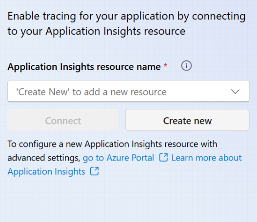
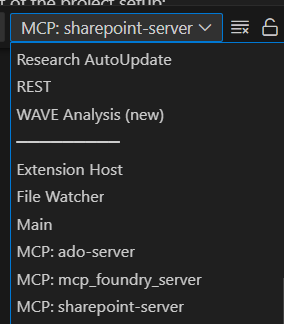

# Document Generator: Setup Guide

This guide provides step-by-step instructions for setting up and running the document generator's Model Context Protocol (MCP) servers to enhance GitHub Copilot with SharePoint Sites, Azure DevOps Boards, Azure AI Foundry Resources, and Microsoft Documents integration.

## Prerequisites

- Python 3.8 or higher
- Visual Studio Code
- Git installed on your machine

## Integration-Specific Setup

Document Generator supports multiple integrations that can be enabled selectively.
- **Microsoft Documentation** and **Azure AI Foundry** servers require no additional setup and can be enabled directly through mcp.json file.
- Setup instructions for **Azure DevOps** and **SharePoint** integrations are detailed below:

### Azure DevOps Integration

**Prerequisites**
- Azure DevOps account with permissions to create and manage PAT and read access to the repository
- Personal Access Token (PAT) for Azure DevOps

**Creating an Azure DevOps Personal Access Token (PAT)**

1. Sign in to your Azure DevOps organization: `https://dev.azure.com/{your-organization}`
2. Select **User settings** (top right corner) > **Personal access tokens**
3. Select **New Token**
4. Name your token and select an expiration period
5. Select the organization where you want to use the token
6. For the MCP server, you'll need the following scopes:
   - **Work Items**: Read
   - **Code**: Read
7. Click **Create** and copy your token for the `.env` configuration.


### SharePoint Integration
SharePoint Intergration is possible through Azure AI Foundry Agent service with SharePoint Connector. To take advantage of this integration follow instruction below to setup an AI Foundry Project for agent and SharePoint connection. Setup tracing in your project to be able to monitor your agent.

1. **Azure AI Foundry Resource and Project**

   **Prerequisites**
   - An Azure subscription. If you don't have an Azure subscription, create a [free account.](https://azure.microsoft.com/free/)

   **RBAC Requirements**
   - **Owner** role on your subscription, or
   - At least `Azure AI User` role on your Azure AI Foundry Project

   **Creating a new resource and project in [Azure AI Foundry](https://ai.azure.com/)**
   - Create a new AI Foundry resource and Foundry Project 
   - Save the project endpoint for the `.env` configuration.

   For more details, you can visit [this guide on creating AI Foundry Project](https://learn.microsoft.com/en-us/azure/ai-foundry/how-to/create-projects?tabs=ai-foundry&pivots=fdp-project#create-a-)

2. **Model Deployment to Support SharePoint Agent**

   - In your Azure AI Foundry Project, under `My assets` select `Models + endpoints`.
   - Select `+ Deploy model` > `Deploy base model`.
   - Recommend using `gpt-4.1-mini`. Confirm your selection and deploy the model. 

      **Note :** You can use other GPT deployments but `gpt-4.1-mini` is recommended (https://learn.microsoft.com/en-us/azure/ai-foundry/agents/concepts/model-region-support)
   - Save the deployment name for the `.env` configuration.

3. **Creating SharePoint Connection**

   **Prerequisites**
   - At least `READ` access to the SharePoint site

   **Setting up the connection**
   - In your Azure AI Foundry Project, click on `Management center`.
   - Select `Connected resource` under your Project on the left bar.
   - Select `New connection` > `SharePoint`.
   - Under `Custom Keys` for `site_url` enter your SharePoint site. Make sure your site_url be in following format: `https://microsoft.sharepoint.com/teams/<site-name>` and "is secret" is selected.
   - Enter your custom Connection name. Save this connection name for the `.env` configuration.
   - Add connection.

4. **Tracing in AI Foundry**

   - In your Azure AI Foundry Project, click on `Tracing`.
   - Create a new Application Insights resource. If you already have an Application Insight you can find it from dropdown menu and connect to it.

      

   - App insights connection string is required for the `.env` configuration. Retrieve it by one of following methods:

      - Visit [Azure Portal](https://portal.azure.com). Search for your application insight resource that you created and get connection string from its overview page, or

      - Use following command
         ```bash
         # Get the connection string
         az monitor app-insights component show \
            --app $APP_INSIGHTS_NAME \
            --resource-group $RESOURCE_GROUP \
            --query connectionString \
            --output tsv
         ```

   For more details, you can visit [this guide on setup tracing in AI Foundry project.](https://learn.microsoft.com/en-us/azure/ai-services/agents/concepts/tracing#trace-agents-using-opentelemetry-and-an-application-insights-resource)

## Setting Up the Environment

1. **Clone the Repository** (if you haven't already)
   ```powershell
   git clone <repository-url>
   cd agents
   ```

2. **Create a `.env` File**
   
   Create a `.env` file in the `src/solution_accelerators/document_generator` directory using the `.env.template` with the following variables:

   ```
   AZURE_DEVOPS_ORG_URL=https://dev.azure.com/your-organization
   AZURE_DEVOPS_PROJECT=Your_Project_Name
   AZURE_DEVOPS_PAT=Your_Personal_Access_Token

   AZURE_AI_PROJECT_ENDPOINT=Azure_AI_Foundry_Project_Endpoint
   AZURE_AI_AGENT_MODEL_DEPLOYMENT_NAME=Your_GPT-4o_deployment_name
   APPLICATION_INSIGHTS_CONNECTION_STRING=App_Insights_Connection_String
   SHAREPOINT_CONNECTION_NAME=SharePoint_Connection_Name_On_Foundry
   ```

   Replace the placeholders with the information gathered in the previous steps.

3. **Set Up Python Virtual Environment**

   You can run the VS Code task to set up the environment automatically:
   
   - Press `Ctrl+Shift+P` and select `Tasks: Run Task`
   - Choose `DocumentGenerator: Setup Environment`

   This is a mandatory step and needs to be implemented at least for the first run

## Running the MCP Server

### Using VS Code (Recommended)

1. **Setup the MCP Configuration**:
   - First, create the `mcp.json` file in the `.vscode` folder  at the root of the repository if it doesn't already exist
   - Copy the MCP configuration using this command:
     ```powershell
     Copy-Item -Path "./src/solution_accelerators/document_generator/mcp_servers/mcp.json" -Destination "./.vscode/"
     ```
   - This will create all the required mcp servers in the `mcp.json` file. 
   - Open the `.vscode/mcp.json` file.
   - VS Code should display a "Start" button at the top of each server.
   - Make sure your `.env` file is set up correctly with all required environment variables.

2. **Start the Servers**:
   - Click on the "Start" button at the top of each server available in the `mcp.json` file
   - Each server will start in a new terminal window


## Connecting to GitHub Copilot

Once the MCP server is running, it will automatically be available to GitHub Copilot as a model context provider. You can then ask Copilot questions about your Azure DevOps work items, features, and other resources, as well as search for information in your SharePoint documents.

## Troubleshooting

- If you encounter authentication errors, verify that your Personal Access Token is correct and has the necessary permissions
- Check the terminal output for any error messages that may indicate configuration issues
   - Logs for each server will be available at its own terminal. You can navigate to logs for each server by:
      1. Choose that server from dropdown menu available in `OUTPUT`

         
      2. In mcp.json at top of running server choose `More...`, then choose `Show Output`.
- Verify that the environment variables in your `.env` file are set correctly
- Ensure that the Azure DevOps organization URL is in the format `https://dev.azure.com/{your-organization}`

## Next Steps

After successfully setting up the Document Generator, you can start using GitHub Copilot to:

- Query work items and features from Azure DevOps
- Access linked documents and code references
- Get insights from your Azure DevOps project directly within your development environment
- Get summary of related documents available in your SharePoint site

## Example Prompts to Try Out

 are a few prompts you can try with the Document Generator to get started.