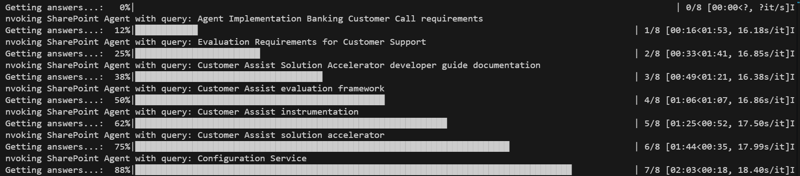
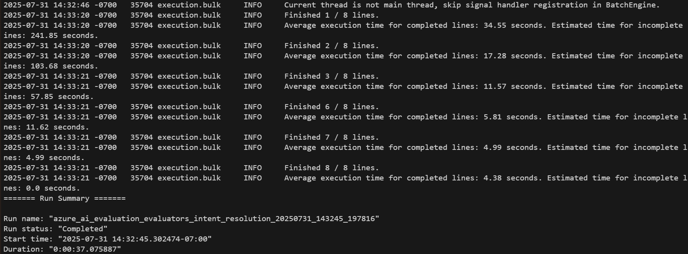
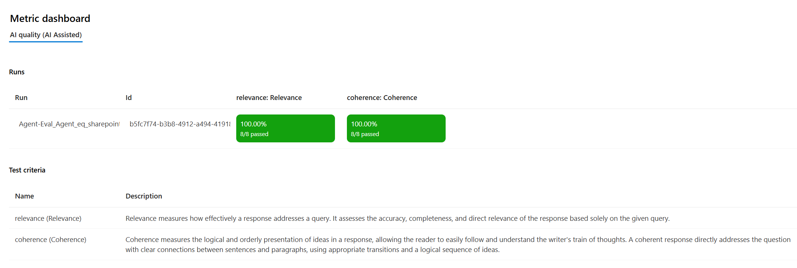
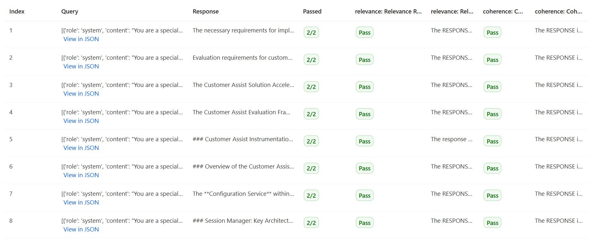

# Document Generator Evaluation

## Overview

The Document Generator Evaluation framework is designed to assess and validate the performance of various AI agents used in document generation scenarios, including the SharePoint agent used in the SharePoint MCP server. Powered by the Azure AI evaluation SDK, this tool provides a comprehensive approach to evaluating how effectively AI agents understand, process, and respond to document-related queries and commands.

### Key Features

- **Comprehensive Agent Testing**: Evaluate AI agents' performance against ground truth data across multiple document generation scenarios.
- **SharePoint Integration**: Allows to evaluate the SharePoint agent used in the SharePoint MCP server.
- **Customizable Metrics**: Assess agent performance across various dimensions with flexible evaluation criteria.


## Supported Evaluation Metrics

The evaluation framework provides a robust set of metrics to assess AI agent performance across multiple dimensions.

### Built-in Metrics for Cloud Evaluation

These metrics are provided by the [Azure AI Evaluation SDK](https://learn.microsoft.com/en-us/azure/ai-foundry/how-to/develop/cloud-evaluation). Each metric is identified by a unique ID, which is currently hardcoded in the SDK. To simplify usage, we’ve included several of these metrics and their corresponding IDs in the codebase, allowing you to easily select and apply them in your evaluation pipeline:

- **Relevance**: Assesses how well the agent’s response aligns with the user query.  
  - **Scale**: 1–5 (higher is better)

- **Coherence**: Evaluates the fluency and naturalness of the response.  
  - **Scale**: 1–5 (higher is better)

### Agentic Built-in Metrics for Local Evaluation

These metrics are tailored for agentic workflows and are not yet part of the Foundry Evaluators Library. The tool automatically selects the appropriate evaluation process based on the metrics provided:

- **Task Adherence**: Measures how well the agent follows its assigned task instructions.  
  - **Scale**: 1–5 (higher is better)

- **Intent Resolution**: Evaluates the agent’s ability to correctly identify and scope the user’s intent.  
  - **Scale**: 1–5 (higher is better)

## Capabilities

### Configurability

The evaluation tool is highly configurable, enabling users to:

- Select specific agents to evaluate, including:
  - **SharePoint Agent**: Assess the agent's ability to interact with SharePoint document libraries, process document metadata, and perform document operations.
  - Other document generation agents in your ecosystem.
- Choose from a comprehensive range of evaluation metrics tailored to document management scenarios.
- Configure AI-assisted metrics by integrating Azure OpenAI or OpenAI services, leveraging GPT models for evaluation.
- Customize evaluation datasets to focus on specific document management use cases.

### Monitoring Evaluation Status

Each step of the evaluation process is logged to the terminal for transparency and debugging. The evaluation workflow includes:

- **Dataset Loading**: Reads the evaluation dataset, which can be stored locally or on Azure Machine Learning (AML) Studio.

- **Kernel and Agent Initialization**: Creates, initializes and evaluates both - Semantic Kernel and Azure AI Foundry agents based on the local configuration file.

- **Agent Invocation**: Sends each query to the agent and captures the response.

- **Answer File Upload**: Uploads the generated responses to Foundry for evaluation.

- **Evaluation Execution**:
  - **Agent-Specific Metrics**: If selected, the evaluation runs locally. Logs include per-query evaluation status, and results are uploaded to Foundry.

  - **Built-in Metrics**: If selected, the evaluation is triggered in the cloud via Foundry. The tool polls Foundry for status updates and displays them in the terminal.


## Running Instructions

### Prerequisites

1. Ensure all required Document Generator resources are set up according to the [setup guide](../SETUP.md/#prerequisites).
2. For SharePoint agent evaluation, ensure you have proper access to SharePoint resources and valid credentials configured.

### Configuration Steps

1. Copy and configure environment variables:
   ```powershell
   cp .env.template .env
   ```
   Update the following values in `.env`:
   ```
   # Azure Application Insights
   APPLICATION-INSIGHTS-CNX-STR=""  # Connection string for Azure Application Insights with Instrumentation Key, Ingestion Endpoint, Live Endpoint, and Application ID.

   # Azure OpenAI
   AZURE_OPENAI_ENDPOINT="" # Endpoint URL for Azure OpenAI service.
   AZURE_OPENAI_KEY=""  # API key for Azure OpenAI service.

   # Azure AI Foundry
   AZURE_AI_AGENT_ENDPOINT=""  # Azure AI Foundry project endpoint (e.g., "https://your-resource.services.ai.azure.com/api/projects/your-project").
   AZURE_AI_AGENT_MODEL_DEPLOYMENT_NAME=""  # Deployment name for the Azure AI Agent model (e.g., "gpt-4o").

   # Azure ML
   AZURE_SUBSCRIPTION_ID=""  # Subscription ID for Azure.
   AZURE_RESOURCE_GROUP=""  # Resource group name for Azure resources.
   AZURE_WORKSPACE_NAME=""  # Name of the Azure Machine Learning workspace.

   # SharePoint Configuration
   SHAREPOINT_CONNECTION_NAME=""  # Name of the SharePoint connector configured in your environment.
   ```

2. Configure evaluation settings in [eval_config.yaml](./static/eval_config.yaml):
   ```yaml
    evaluation_jobs:
        <name of evaluation>:
            config_body:
                type: AgentEvaluation
                agent_config_id: "YOUR_AGENT_NAME"  # The agent to evaluate, can be "SHAREPOINT_AGENT", etc.
                local_dataset: "path/to/your/test_data.csv"  # Your test dataset
                config_file_path: "path/to/document_generator_config.yaml"  # Solution configuration
                metric_config:
                    <name of metric>: # Name of metric for evaluation, can be relevance, coherence, similarity, intent_resolution, task_adherence
                        name: "name_of_metric"
                        type: "type_of_metric" # "BuiltInMetricsConfig" for built-in metrics and "AgentEvaluatorConfig" for agent specific metrics
                        service: # Service to be used for AI assisted metrics
                            llm_service: # "AzureOpenAI"
                            deployment_name: "name_of_your_deployment"
   ```

3. For SharePoint agent evaluation, ensure your test dataset includes relevant SharePoint operations such as:
   - Document retrieval queries
   - Queries spanning multiple data types e.g. videos, etc.

### Running the Evaluation

1. Run and debug evaluation locally inside VS Code:

   - Click on Run and Debug or Ctrl+Shift+D
   - Click on the Drop Down Menu at the top of VSCode
   - Select "Document Generator Evals: Launch" then click Play Button to start the instance

   **Note:** As part of starting the service, VSCode will create Python virtual environments in the `.venv` folder and install all project-level dependencies. This may take some time. Wait for all dependencies to be installed.

2. When prompted in the terminal, enter the name of the evaluation to run (as defined in your config file).

Cloud Evaluations:


Local Evaluations:


### SharePoint Agent Evaluation Example

Here's an example configuration for evaluating the SharePoint agent specifically:

```yaml
evaluation_jobs:
    sharepoint_agent_evaluation:
        config_body:
            type: AgentEvaluation
            agent_config_id: "SHAREPOINT_AGENT"
            local_dataset: "./data/sharepoint_test_queries.csv"
            config_file_path: "./config/sharepoint_config.yaml"
            metric_config:
                relevance:
                    name: "relevance"
                    type: "BuiltInMetricsConfig"
                    service:
                        llm_service: "AzureOpenAI"
                        deployment_name: "gpt-4"
                document_operations_accuracy:
                    name: "task_adherence"
                    type: "AgentEvaluatorConfig"
                    service:
                        llm_service: "AzureOpenAI"
                        deployment_name: "gpt-4"
```

This configuration evaluates the SharePoint agent on both general relevance and coherence of responses.

## Output and Analysis

Upon completion, the terminal will display links to your evaluation results. These results are saved under the evaluation tab in your Azure AI Foundry project.



Different types of metrics will be organized separately - local evaluation results for agent-specific metrics, and cloud evaluation results for built-in metrics accessible at the AI project URI.

### Interpreting Results

When you visit the evaluation results link, you'll see a detailed report of the evaluation run. Under the Data tab, you can explore results for each query in your dataset.




### SharePoint Agent Performance Analysis

For SharePoint agent evaluations, pay particular attention to:

1. **Document Operation Success Rates**: Percentage of document operations (create, read, update, delete) successfully completed.
2. **Query Understanding**: How well the agent interpreted document retrieval and management queries.

Use these metrics to identify areas for improvement in the SharePoint agent's capabilities and performance.

## Comparing Evaluation Results

Azure AI Foundry provides powerful comparison capabilities for multiple evaluation runs. This feature is invaluable when assessing how changes to agent configuration, prompts, or other parameters affect performance.

To compare evaluation runs:

1. Visit your Azure AI Foundry project and navigate to the Evaluation tab.
2. Under "Automated evaluations," you'll see all evaluation runs.
3. Hover over the runs you want to compare and select them.
4. Click "Compare" at the top of the page.


This will open a detailed comparison view with:

- **Table View**: Side-by-side comparison of evaluation metrics.
- **Comparison Tab**: Detailed comparison for each query in your dataset.
- **Charts Tab**: Visual representation of differences between evaluation runs.


## Evaluators

### Built-in Evaluators

Azure AI Foundry provides several built-in evaluators that you can leverage for your Sharepoint Agent assessment:

1. **Relevance**: Evaluates how relevant the agent's response is to the user's query.
2. **Coherence**: Measures the logical flow and clarity of the agent's response.
3. **Intent Resolution**: Assesses how well the agent understands and addresses the user's intent.

These evaluators provide standardized metrics that make it easy to benchmark your agent's performance against established baselines.

### Custom Evaluators

For domain-specific evaluation needs, you can build custom evaluators tailored to document generation and SharePoint scenarios:

1. **Document Quality**: Evaluate the formatting, structure, and completeness of generated documents.
2. **SharePoint Document Retrieval Precision**: Measure the accuracy of document search and retrieval operations.

For more information on creating custom evaluators, refer to the [Azure AI Foundry Evaluation documentation](https://learn.microsoft.com/en-us/azure/ai-foundry/concepts/evaluation-evaluators/custom-evaluators).
