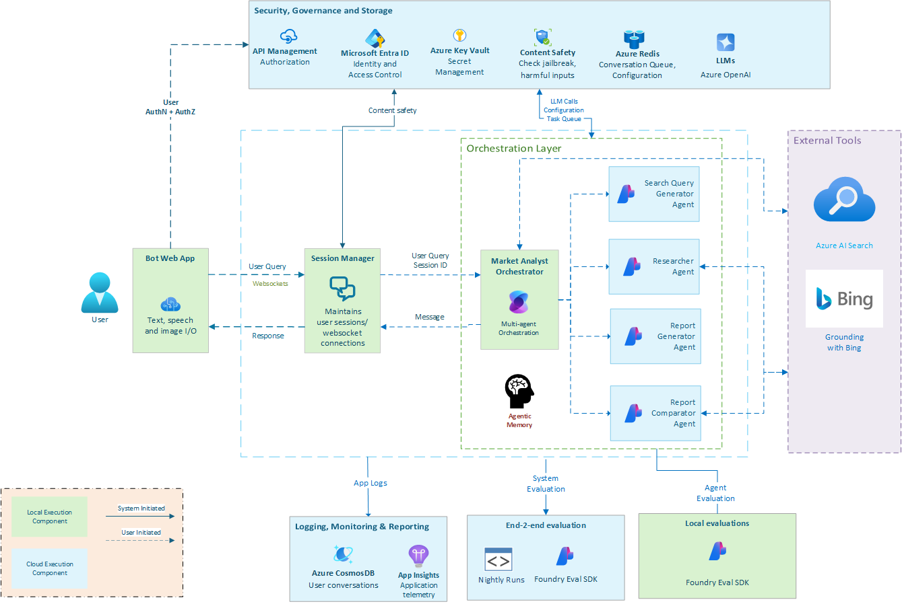

  <h1>
    Market Research Analyst
  </h1>
  
<strong>Compare. Compete. Win — with AI-driven market research</strong>

   
  
<a href="https://placeholder-for-demo-video.com">▶️ Watch Demo Video</a>

> ⚠️ **IMPORTANT NOTE** ⚠️
> Starter templates, instructions, code samples and resources under Agent_Based_Samples are designed to assist in accelerating development of agents for specific scenarios. It is important that you review all provided resources and carefully test Agent behavior in the context of your use case: Learn more: [AI Foundry Agent Service](https://learn.microsoft.com/en-us/azure/ai-foundry/agents/overview).
Certain Agent offerings may be subject to legal and regulatory requirements, may require licenses, or may not be suitable for all industries, scenarios, or use cases. By using any sample, you are acknowledging that Agents or other output created using that sample are solely your responsibility, and that you will comply with all applicable laws, regulations, and relevant safety standards, terms of service, and codes of conduct.

## 🚀 Overview

> ⚠️ **Warning:**
> Market Research Analyst is intended to be used **only with publicly available data. Do not use with any confidential or sensitive data.**

The **Market Research Analyst** code sample helps in building Agentic solutions designed to deliver timely, relevant, and structured product intelligence. It helps you combine intelligent automation and contextual reasoning to generate high-quality, persona-aligned research outputs for your agents.

At the core of this solution are four key capabilities:

- **🔍 Search Query Generation**:
  Automatically creates precise, persona-aware, and context-rich search queries that align with the user’s research goals and desired report depth.

- **📡 Intelligent Research Execution**:
  Conducts targeted searches, filters credible sources, and extracts relevant trends, competitive shifts, and key updates from Bing.

- **📝 Automated Report Generation**:
  Transforms structured insights into clear, well-formatted intelligence reports tailored to the user's persona and the desired depth of information.

- **📊 Comparative Analysis**:
  Identifies progress or changes by comparing new research data against previously generated reports—highlighting what's new, what's shifted, and what remains constant.

Together, these capabilities streamline research workflows and elevate insight accuracy - empowering users to make better-informed, faster decisions.

---

## 🚧 Key Challenges

- Surface only high-quality and relevant insights
- Generate both concise and comprehensive summaries
- Store and compare historical reports to track strategic shifts
- Align reporting with diverse personas and decision levels
- Highlight progress or lack of change across time

## 💼 Use Cases

- Tracking product and platform evolution with time
- Creating focused intelligence reports for leadership
- Generating intelligent comparison reports highlighting latest updates against past benchmarks
- Monitoring feature adoption or innovation trends across products

---

## 🧠 Solution Architecture

The architecture is built on a modular and secure AI-native design leveraging:

- **Azure AI Foundry service** for agents in cloud and supporting tools (Grounding with Bing Search).
- **Semantic Kernel** for agent orchestration, agent memory and tools integration.
- **Azure AI Search** for storing reports and finding best report matches for user query.
- **Azure Key Vault** for secure secret management.

---

## ARCHITECTURE DIAGRAM

This diagram provides a visual representation of how the **Search Query Generator Agent**, **Researcher Agent**, **Report Generator Agent**, and **Report Comparator Agent** collaborate to generate persona-aware reports.

*Diagram above highlights components in the end-to-end system run that run locally (highlighted in green) and components that run in the cloud (highlighted in blue).*

---

## 🛠️ Getting Started

> **Note**: This solution accelerator is designed to be adaptable. You can customize integrations and workflows based on your internal tooling landscape.

For detailed setup instructions, please follow the guide here: [SETUP INSTRUCTIONS](SETUP.md)

### Prerequisites

- Azure Subscription
- Access to Azure OpenAI and Azure AI Foundry
- Azure AI Search resource in subscription
- python >= 3.12
- Docker runtime for running service containers locally (For more information on local execution, refer to this guide: [LOCAL EXECUTION IN DOCKER](../../DOCKER.README.md))

## 📄 License

This project is licensed under the MIT License. See [LICENSE](./LICENSE) for details.

---

## 📚 Additional Resources

- [Azure AI Foundry Agent Service](https://learn.microsoft.com/en-us/azure/ai-services/agents/overview)
- [Semantic Kernel Agent Framework](https://learn.microsoft.com/en-us/semantic-kernel/frameworks/agent/?pivots=programming-language-python)
- [Semantic Kernel Memory](https://learn.microsoft.com/en-us/semantic-kernel/concepts/vector-store-connectors/?pivots=programming-language-python)
- [Azure AI Foundry - Grounding with Bing Search](https://learn.microsoft.com/en-us/azure/ai-foundry/agents/how-to/tools/bing-grounding)

---

  
Developed with ❤️ by Microsoft

