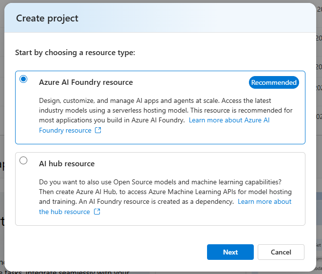
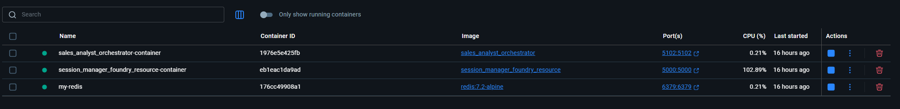

# Sales Analyst Setup Instructions

This document will cover how to setup Azure Resources and steps for running the Sales Analyst Solution Accelerator locally

## Prerequisites

Before setting up the solution, ensure the following:

1. **System Requirements**:
    - Operating System: Windows (can be extended to Linux)
    - Python 3.12 or higher installed
    - [Visual Studio Code](https://code.visualstudio.com/)
    - [Python VSCode Extension](https://marketplace.visualstudio.com/items?itemName=ms-python.python)
    - [Docker Desktop](https://docs.docker.com/desktop/install/windows-install/) - Required for running the solution in containers
    - [Node](https://nodejs.org/en/download) - Required for running the frontend application

## Step 1: Azure Setup

The Sales Analyst solution requires several Azure resources to function properly. This section provides guidance on creating and configuring these resources.

#### RBAC Requirements

To successfully set up and use the Sales Analyst solution, you must have sufficient permissions for each Azure resource. At minimum, you need:

- **Owner** role on your subscription, or
- Specific RBAC roles for each resource as detailed below

### Required Azure Resources

First, create a resource group to contain all your resources:

```bash
# Create resource group
az group create \
  --name $RESOURCE_GROUP \
  --location $LOCATION
```

1. **Azure Content Safety**:
   - Create a [Content Safety](https://contentsafety.cognitive.azure.com/image) resource 
   - This will be used to detect and prevent harmful or inappropriate content
   - Save the endpoint URL and API key
   - Required RBAC Roles:
     - `Cognitive Services User` - Required to use the content safety service
     - `Cognitive Services Contributor` - Required to create and manage the resource
   - Here's the command to create the Content Safety resource:
     ```bash
     # Create Content Safety service
     az cognitiveservices account create \
       --name $CONTENT_SAFETY_NAME \
       --resource-group $RESOURCE_GROUP \
       --location $LOCATION \
       --kind ContentSafety \
       --sku S0
     ```
2. **Azure Storage Account**:
   - Create a [Storage Account](https://portal.azure.com/#create/Microsoft.StorageAccount) 
   - Create the following containers:
     - `viz` - For storing and analyzing images shared during conversations
   - Save the connection string and account name
   - [Guide: Create an Azure Storage Account](https://learn.microsoft.com/en-us/azure/storage/common/storage-account-create?tabs=azure-portal)
   - Here are the commands to create the Storage Account with containers:      
   ```bash
      # Create storage account
      az storage account create \
        --name $STORAGE_ACCOUNT_NAME \
        --resource-group $RESOURCE_GROUP \
        --location $LOCATION \
        --sku Standard_LRS \
        --kind StorageV2
      
      # Create images container
      az storage container create \
        --name viz \
        --account-name $STORAGE_ACCOUNT_NAME \
        --resource-group $RESOURCE_GROUP
      ```
3. **Setup tracing in AI Foundry**:
   - [Guide: Tracing in AI Foundry project by setting up Application Insights](https://learn.microsoft.com/en-us/azure/ai-services/agents/concepts/tracing#trace-agents-using-opentelemetry-and-an-application-insights-resource)
   - Save the App insights connection string for telemetry and monitoring
   - Here's the command to create the Application Insights resource:
     ```bash
     # Create Application Insights resource
     az monitor app-insights component create \
       --app $APP_INSIGHTS_NAME \
       --resource-group $RESOURCE_GROUP \
       --location $LOCATION \
       --application-type web
     
     # Get the connection string
     az monitor app-insights component show \
       --app $APP_INSIGHTS_NAME \
       --resource-group $RESOURCE_GROUP \
       --query connectionString \
       --output tsv
     ```

4. **Azure Databricks**
    - [Guide: How to setup Azure Datarbricks](https://learn.microsoft.com/en-us/azure/databricks/getting-started/free-trial)
    - Upload data
        - Click on `Catalog` on the left bar
        - Click on the `+` button and then select `Add data` - this will redirect you to another page
        - In this page select `Create of modify table`
        - Upload the `/data/sample_sales_data_global.csv` file here by dragging and dropping the file.
        - You will see your data. Click on `Create`
        - (Optional) Repeat this for the `/data/sample_sales_data_united_states.csv`
    - Set up Genie Space
        - Click on `Genie` in the Left bar
        - Select `+New`
        - Select the tables you just created
        - This will create a Genie space for you, where you can ask questions about your data. Try asking a question like `Explain my data set` to see the results
    - (Optional) Add other users and set up associated persmissions **You must be Azure Databricks admin to add users**
        - Select the Profile icon on the top left
        - Select `Settings` > `Identity and access` > `Manage` under `Users` > `Add User`. Here you can add other databricks users
        - Set table permissions for this user
            - Select `Catalog` on the top left bar
            - Find that table you want to set permissions for
            - Click on the `Permissions` tab
            - Click on `Grant`, here you can select the users you want to modify permissions for.

5. **Bing Grounding**
    - Create a [Grounding with Bing Search Resource](https://ms.portal.azure.com/#create/Microsoft.BingGroundingSearch)
    - This will be used to provide your application with real time internet data
    - Required RBAC Roles (for user):
        - `Azure AI User` - Required to connect Bing resource with AI Foundry

6. **Azure AI Foundry Resource and Project**:
- Create a new resource and project in [Azure AI Foundry](https://ai.azure.com/)  
    **Important - Make sure to select the resource type as 'Azure AI Foundry resource'**  
    
    - Save the project endpoint for the `.env` configuration
    - Deploy the following models as part of the project setup:
        - `gpt-4o` (required version=2024-08-06) for main conversation processing
    - Keep the deployment names, API key, and endpoint URL
    - Required RBAC Roles:
        - `Azure AI User` - Required to access and use AI Foundry resources
    - Setting up the Azure Databricks connector
        - Once you have the project set up, click on `Management center`
        - Select `Connected resource` under your Project on the left bar
        - Select `New connection` > `Azure Databricks`
        - Find your Azure Databricks Workspace and select `Connection Type` as `Genie`
        - Select your Genie workspace from the dropdown
        - Make note of the Azure Databricks Connector name for the `.env' file
    - Connect the Bing Grounding Resource to AI Froundry [Guide](https://learn.microsoft.com/en-us/azure/ai-foundry/how-to/connections-add?pivots=fdp-project#create-a-new-connection)

7. **Microsoft Entra ID Setup**
- **Access the Entra Admin Center** - Navigate to the [Microsoft Entra admin center](https://entra.microsoft.com/) and sign in.

- **Register the Backend Application**
    - Go to **Identity > Applications > App registrations**.
    - Click **New registration**.
    - Enter a name (e.g., `Chat App Backend`).
    - Set **Supported account types** as Single tenant.
    - Under **Redirect URI**, select **Web** and enter:  
        `http://localhost:5000/consent-callback`
    - Click **Register**.
    - On the **Overview** page, copy the **Application (client) ID** and **Directory (tenant) ID**.
    - In the left menu, select **Expose an API**:
        - Click **Add** if Application ID URI is not set. Use: `api://<client_id>`
        - Under **Scopes defined by this API**, click **Add a scope**:
            - Scope name: `access_as_user`
            - Who can consent: Admins and users
            - Admin consent display name: `Access Chat App Backend as user`
            - Admin consent description: `Allow the application to access the backend as the signed-in user.`
            - State: Enabled
            - Click **Add scope**
    - In the left menu, select **API permissions**:
        - Click **Add a permission** > **Microsoft Graph** > **Delegated permissions** > add `openid`, `profile`, `email` (if not already present)
        - Click **Add a permission** > **APIs my organization uses** > search for **Azure Databricks** (or use ID `2ff814a6-3304-4ab8-85cb-cd0e6f879c1d`) > select **user_impersonation** > **Add permissions**
    - Click on 'Grant admin consent for \<DIRECTORY-NAME>' if the button isn't greyed out.
    - In the left menu, select **Certificates & secrets**:
        - Click **New client secret**
        - Add a description and set an expiry
        - Click **Add**
        - Copy the generated secret value immediately for the `.env` file

- **Register the Frontend Application**
    - Go to **Identity > Applications > App registrations**.
    - Click **New registration**.
    - Enter a name (e.g., `Chat App Frontend`).
    - Set **Supported account types** as Single tenant.
    - Under **Redirect URI**, select **Single-page application (SPA)** and enter:  
        `http://localhost:3000` (or your deployed frontend URL)
    - Click **Register**.
    - On the **Overview** page, copy the **Application (client) ID** and **Directory (tenant) ID** for frontend configuration.
    - In the left menu, select **Authentication**:
        - Under **Implicit grant and hybrid flows**, ensure both checkboxes are **unchecked** (use Authorization Code with PKCE).
        - Click **Save** if you made changes.
    - In the left menu, select **API permissions**:
        - Click **Add a permission** > **My APIs** > select your backend app > select `access_as_user` scope > **Add permissions**

### Resource Configuration

After creating these resources, make note of the following information that will need to be added to your `.env` files:

- Entra ID
    - Subscription ID
    - Resource Group
    - Tenant ID
    - Backend App Client ID
    - Backend App Secret
    - Frontend App Client ID
- Azure AI Foundry:
  - Endpoint URL
  - Model deployment names
  - Databricks connector name
  - Bing Connection name
- Storage account:
  - Connection string
  - Account name
  - Container names
- Application Insights connection string (for telemetry)


You specifically have to fill in these three environment files (More information on how to create these files later in the setup guide)
- src\services\session_manager_foundry_resource\\.env
- src\solution_accelerators\sales_analyst\frontend\\.env
- src\solution_accelerators\sales_analyst\orchestrator\\.env

---

## Step 2: Running the Sales Analyst Solution Locally

This guide outlines the steps to set up and run the **Sales Analyst** solution locally:

### Step 2.1: Frontend Setup

Before running either the Docker containers or the VSCode debugging configuration, you need to set up the frontend components:

#### Setting Up the Sales Analyst Interface

**Environment File Path**: `src\solution_accelerators\sales_analyst\frontend\.env`

1. Navigate to the frontend directory:
   ```powershell
   cd src\solution_accelerators\sales_analyst\frontend
   ```

2. Install dependencies:
   ```powershell
   npm install
   ```

3. Create a `.env` file by copying the `.env.template` file:
   ```powershell
   Copy-Item .env.template .env
   ```

4. Start the development server:
   ```powershell
   npm start
   ```

This will make the Web Interface accessible at http://localhost:3000.

### Step 2.2: Backend Services Setup

#### Configuring the Services

Each backend service plays a specific role in the Sales Analyst solution and requires proper configuration via environment variables. Below are the key services and their configuration requirements:

#### 1. Session Manager Service

**Technical Purpose**: The Session Manager handles WebSocket connections, manages conversation state, and coordinates message flow between webapp and the orchestrator.

**Environment File Path**: `src/services/session_manager_foundry_resource/.env`

**Key Environment Variables**:
```
AZURE_CONTENT_SAFETY_SERVICE=<content-safety-endpoint>
APPLICATION_INSIGHTS_CNX_STR=<app-insights-connection-string>
AZURE_AI_AGENT_ENDPOINT=<azure-ai-agent-endpoint>
AZURE_STORAGE_ACCOUNT=<azure-store-account>
```

#### 2. Orchestrator Service

**Technical Purpose**: The Orchestrator is the central coordination layer that manages the agent plugins, processes conversation messages, and handles the business logic of the Sales Analyst solution. It leverages the Semantic Kernel Process framework for AI agent orchestration.

**Environment File Path**: `src/solution_accelerators/sales_analyst/orchestrator/.env`

**Key Environment Variables**:
```
APPLICATION_INSIGHTS_CNX_STR=<application-insights-cnx-str>
STORAGE_ACCOUNT_NAME=<storage-account-name>
AZURE_AI_AGENT_ENDPOINT=<azure-ai-agent-endpoint>
AZURE_AI_DATABRICKS_CONNECTION_NAME=<azure-ai-databricks-connection-name>
AZURE_AI_BING_GROUNDING_CONNECTION_NAME=<azure-ai-bing-grounding-connection-name>
CLIENT_ID=<backend-client-id>
TENANT_ID=<backend-tenant-id>
CLIENT_SECRET=<backend-client-secret>
```

To configure each service:

1. Copy the corresponding `.env.template` file to `.env` in each service directory:
   ```powershell
   # Session Manager
   Copy-Item src\services\session_manager_foundry_resource\.env.template src\services\session_manager_foundry_resource\.env
   
   # Orchestrator
   Copy-Item src\solution_accelerators\sales_analyst\orchestrator\.env.template src\solution_accelerators\sales_analyst\orchestrator\.env
   ```
2. Fill in the environment-specific values in each `.env` file
3. Ensure that connection strings, endpoints, and API keys match your Azure resources
4. Make sure service URIs and ports are consistent across all configuration files

### Deploying the Services

Running in Docker provides an isolated environment that closely resembles production deployment.

#### ✅ Steps for Docker Deployment

1. Update subscription_id and tenant_id for Sales Analyst tasks in .vscode/tasks.json
2. Press `Ctrl+Shift+P` or go to the **View > Command Palette** in VSCode.
3. Type "Run Task" and select **Tasks: Run Task**.
4. Choose one of the following tasks:
   ```
   Sales Analyst: Build and Run in Docker
   ```
   or for a clean reinstall:
   ```
   Sales Analyst: Build and Run Docker Images [FORCE INSTALL]
   ```

This Docker task will:

* Build Docker images for all required services: Session Manager, Sales Analyst Orchestrator
* Start all containers with proper networking configuration
* Expose services on the following ports:
  * Session Manager: 5000
  * Sales Analyst Orchestrator: 5102
* Set up environment variables and dependencies automatically

Once the Docker containers are running, you should see them in Docker Desktop:


*Example of running Docker containers in Docker Desktop*


When the containers are deployed, you'll need to authenticate with Azure. To complete authentication:

1. Click on each container in Docker Desktop and check for logs under the "Logs" tab (or check the VS Code Docker extension)
2. Look for the authentication prompt in the container logs similar to:

```
🔐 Logging in to Azure...

To sign in, use a web browser to open the page https://microsoft.com/devicelogin and enter the code ABCDEFG to authenticate.
```

3. Open a web browser and navigate to the URL shown (https://microsoft.com/devicelogin)
4. Enter the unique code displayed in the logs (e.g., ABCDEFG)
5. Complete the Microsoft authentication process with your Azure credentials
6. The container will continue initialization once authentication is successful

You will need to complete this authentication step for each container that requires Azure support i.e. Orchestrator, Session Manager.

After successful authentication, the services will start up and be ready for use.

## Step 3: Verifying the Setup (Optional)

### Step 3.1: For Docker Deployment
After starting the Docker containers:

* Run `docker ps` to confirm all three containers are running:
  * `session_manager_foundry_resource-container`
  * `sales_analyst_orchestrator-container`
* Check container logs using `docker logs <container_name>` for any error messages
* Verify services are accessible at:
  * Session Manager API: http://localhost:5000/
  * Sales Analyst Orchestrator API: http://localhost:5102/

### Step 3.2: Verifying the Frontend Setup

1. Open your browser and navigate to http://localhost:3000
2. Verify that the dashboard loads properly and shows the expected components
3. Check that the conversation simulator can be accessed from within the interface

## Step 4: Using the Sales Analyst Solution

After successful deployment of all services, you can interact with the Sales Analyst solution through the interface:

1. Open your browser and navigate to the Advisor Web Interface at http://localhost:3000
2. Click on 'Continue with Entra ID' and login into the app.
3. You can ask questions in this chat interface

The agent will use Databricks Genie, Bing Grounding to answer your questions.

If you use the sample data provided with the solution you can ask questions like:
1. "What are the total Sales for January 2025, across all countries and regions?"
2. "Show me a line-chart for total sales and total margin for January, February and March 2025, across all countries and regions"
3. "For United States, which product categories see a constant increase in Total Sales across January-February-March 2025? (Give me a chart for this) Once you find this out, use internet insights to check why these product  category sales are increasing?"

## 📄 Stopping the Service

### For Docker Deployment
To stop the Docker containers:

1. Use the following command to stop all running containers:
   ```powershell
   docker stop session_manager_foundry_resource-container
   docker stop sales_analyst_orchestrator-container
   ```
2. To remove the containers (optional):
   ```powershell
   docker rm session_manager_foundry_resource-container
   docker rm sales_analyst_orchestrator-container
   ```

### Stopping Frontend Development Server
If you started the frontend in development mode:

1. Navigate to the terminal window where the frontend is running
2. Press `Ctrl+C` to stop the development server
3. Confirm by pressing `Y` when prompted

---

## Troubleshooting

### Common Issues

- **Session Manager Issues**: Ensure that the Redis container is running properly. Check that the Redis port (6379) is accessible and the password configuration is correct.
- **Orchestrator Issues**: Verify that the Azure AI Service endpoints are correctly configured and accessible. Check the configuration settings in the `.env` file or Docker environment variables.
- **Azure AI Foundry Issues**: Ensure that the Azure Foundry project is properly configured with the correct deployment, connections. Check 
### Docker-Specific Issues

- **Docker Network Issues**: If containers can't communicate with each other, check the Docker network configuration.
- **Container Startup Failures**: Examine the container logs with `docker logs <container_name>` to identify initialization errors.
- **Port Conflicts**: Ensure that the ports used (5000, 5102) aren't already in use by other applications.

### Frontend-Specific Issues

- **Node Module Issues**: If you encounter problems with npm dependencies, try deleting the `node_modules` folder and `package-lock.json` file, then run `npm install` again.
- **Next.js Build Failures**: Check for any syntax errors in your components or configuration files. Running `npm start` might provide more detailed error messages.
- **CORS Issues**: If the frontend can't connect to the backend, check that CORS is properly configured in the orchestrator service.

For content safety issues or harmful inputs being detected, review the Content Safety configuration under the API Management settings.

For any connection issues with Azure services, verify that your Azure subscription is active and properly configured.

---

Sales Analyst should be up and running 🚀
