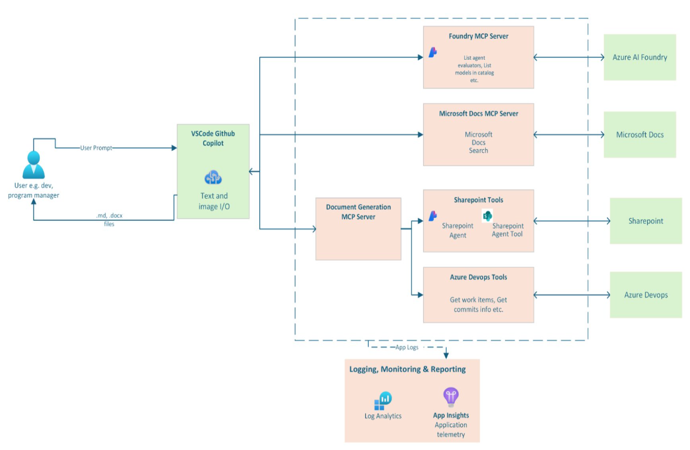

  <h1>
    Document Generator
  </h1>
  
<strong>A powerful solution designed to enhance copilot context by integrating intelligent agents and tools directly into VSCode Copilot using the Model Context Protocol (MCP)</strong>

   

## 🚀 Overview

**Document Generator** bridges the gap between GitHub Copilot and your organization's knowledge ecosystem. By implementing Model Context Protocol (MCP) servers, this solution empowers developers, program managers, and business users with real-time access to SharePoint Sites, Azure DevOps Boards, Azure AI Foundry Resources, and Microsoft Documents directly within their coding environment.

---

## 🔍 Business Value

- **Enhanced Context-Rich Document Generation**: Synthesize insights from across your enterprise ecosystem for intelligent, data-driven decision making
- **Accelerated Project Delivery**: Identify and reuse components across similar projects to reduce duplication and accelerate development cycles
- **Streamlined Planning**: Create optimized development plans using insights from code repositories, documentation, and project management systems
- **Rapid Onboarding & Training**: Generate personalized onboarding guides and dynamic workshop agendas aligned to specific project goals and organizational standards

---

## 💼 Key Use Cases

1. **Strategy Document Generation**: 
Generate comprehensive strategy documents grounded in real project data from SharePoint sites, combining historical insights with current project requirements for data-driven strategic planning.

2. **Intelligent Project Plan**: 
Design and optimize project development plans using synthesized insights from code repositories, documentation, and Azure DevOps work items to create efficient, repeatable processes.

3. **Component Reusability & Discovery**: 
Identify reusable components, patterns, and solutions across similar projects to accelerate delivery and reduce duplication, including specialized components like evaluations and testing frameworks.

4. **Enterprise Knowledge Synthesis**: 
Transform static documentation into interactive, queryable resources that deliver context-rich suggestions by synthesizing insights from SharePoint sites, Azure DevOps boards, code repositories, and Microsoft documentation.

---

## 🧠 Solution Architecture

Multiple **Model Context Protocol (MCP) Servers** for seamless integration of knowledge sources.

- **SharePoint**: An Azure AI Agent with SharePoint Connector as knowledge
- **Azure DevOps**: Interact with Azure DevOps Using Azure DevOps API
- **Microsoft Learn Docs**: Real-time access to [Microsoft Documentation](https://learn.microsoft.com/en-us/)
- **Azure AI Foundry**: Tools for models, knowledge, and evaluation from Foundry

[**Microsoft Learn Docs**](https://github.com/microsoftdocs/mcp) and [**Azure AI Foundry**](https://github.com/azure-ai-foundry/mcp-foundry) are official servers.

---

## ARCHITECTURE DIAGRAM

---
### 🛠️ Technology Stack

| Capability | Technology |
|------------|------------|
| **MCP Integration** | Model Context Protocol, FastMCP |
| **Work Item Management** | Azure DevOps REST APIs, Personal Access Tokens |
| **SharePoint Integration** | Azure AI Foundry, SharePoint Connector |
| **Microsoft Documents Integration** | Cloud-hosted MCP Server |
| **Azure AI Foundry Integration** | Azure AI Foundry MCP Server |
| **Observability** | Azure Application Insights, OpenTelemetry |

---

## 🔧 MCP Server Components

### Azure DevOps MCP Server
Provides comprehensive Azure DevOps integration with the following capabilities:

- **Work Item Management**: Retrieve, search, and manage work items
- **Feature Tracking**: Access linked features and dependencies
- **Document Linking**: Access documents linked to work items
- **Tag-based Search**: Find work items by tags and metadata

### SharePoint MCP Server
Intelligent document retrieval and summarization:

- **Document Discovery**: Search and retrieve relevant documents
- **Content Summarization**: AI-powered document summaries
- **Contextual Search**: Query-based document filtering
- **Enterprise Knowledge**: Access to organizational knowledge bases

### Azure AI Foundry MCP Server
Advanced AI capabilities integration:

- **Model Access**: Accessing list of supported models from the Azure AI Foundry catalog
- **Evaluator Resources**: Access to supported agent, and text evaluators and their requirements

### Microsoft Docs MCP Server
Official Microsoft documentation access:

- **Documentation Search**: Query Microsoft Learn and official docs
- **API References**: Access to Microsoft API documentation
- **Best Practices**: Retrieve official guidance and recommendations

---

## 🛠️ Getting Started

> **Note**: This solution accelerator is designed for flexibility, you can choose to run any or all of the supported integrations with SharePoint, Azure DevOps, Foundry, and Microsoft Docs, or bring your own enterprise context by connecting to other systems via MCP

For detailed setup instructions, please follow the guide here: [SETUP INSTRUCTIONS](src/solution_accelerators/document_generator/SETUP.md)

---

## 📚 Resources

- [Model Context Protocol Documentation](https://modelcontextprotocol.io/)
- [Azure DevOps REST API Reference](https://docs.microsoft.com/en-us/rest/api/azure/devops/)
- [Azure AI Foundry Documentation](https://learn.microsoft.com/en-us/azure/ai-studio/)
- [SharePoint Tool in Azure AI Foundry](https://learn.microsoft.com/en-us/azure/ai-foundry/agents/how-to/tools/sharepoint)
- [Microsoft Learn Docs MCP Server](https://github.com/microsoftdocs/mcp)
- [Azure AI Foundry MCP Server](https://github.com/azure-ai-foundry/mcp-foundry)

---

## 📄 License

This project is licensed under the MIT License. See [LICENSE](./LICENSE) for details.