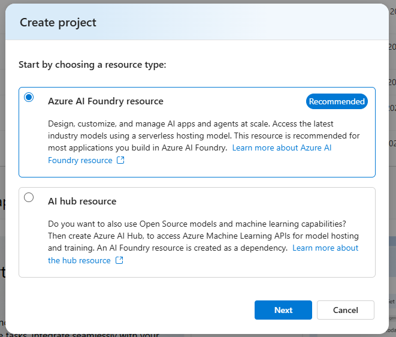
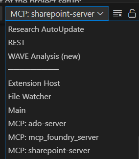

# Document Generator: Setup Guide

This guide provides step-by-step instructions for setting up and running the document generator's Model Context Protocol (MCP) servers to enhance GitHub Copilot with SharePoint Sites, Azure DevOps Boards, Azure AI Foundry Resources, and Microsoft Documents integration.

## Prerequisites

- Python 3.8 or higher
- Visual Studio Code
- Git installed on your machine

## Integration-Specific Setup

Document Generator supports multiple integrations that can be enabled selectively. **Microsoft Documentation** and **Azure AI Foundry** servers require no additional setup. Setup instructions for **Azure DevOps** and **SharePoint** integrations are detailed below:

### Azure DevOps Integration

**Prerequisites**
- Azure DevOps account with proper permissions
- Personal Access Token (PAT) for Azure DevOps

**Creating an Azure DevOps Personal Access Token (PAT)**

1. Sign in to your Azure DevOps organization: `https://dev.azure.com/{your-organization}`
2. Select **User settings** (top right corner) > **Personal access tokens**
3. Select **New Token**
4. Name your token and select an expiration period
5. Select the organization where you want to use the token
6. For the MCP server, you'll need the following scopes:
   - **Work Items**: Read
   - **Code**: Read
7. Click **Create** and copy your token for use with the MCP server

### SharePoint Integration

**Prerequisites**
- At least `READ` access to the SharePoint site
- Foundry Project
- At least one model deployment

**RBAC Requirements**

To successfully set up and use the SharePoint integration, you must have sufficient permissions for each Azure resource. At minimum, you need:

- **Owner** role on your subscription, or
- Specific RBAC roles for each resource as detailed below

**Required Azure Resources**

First, create a resource group to contain all your resources:

```bash
# Create resource group
az group create \
  --name $RESOURCE_GROUP \
  --location $LOCATION
```
1. **Setup tracing in AI Foundry**:
   - [Guide: Tracing in AI Foundry project by setting up Application Insights](https://learn.microsoft.com/en-us/azure/ai-services/agents/concepts/tracing#trace-agents-using-opentelemetry-and-an-application-insights-resource)
   - Save the App insights connection string for telemetry and monitoring
   - Here's the command to create the Application Insights resource:
     ```bash
     # Create Application Insights resource
     az monitor app-insights component create \
       --app $APP_INSIGHTS_NAME \
       --resource-group $RESOURCE_GROUP \
       --location $LOCATION \
       --application-type web
     
     # Get the connection string
     az monitor app-insights component show \
       --app $APP_INSIGHTS_NAME \
       --resource-group $RESOURCE_GROUP \
       --query connectionString \
       --output tsv
     ```

2. **Azure AI Foundry Resource and Project**:
- Create a new resource and project in [Azure AI Foundry](https://ai.azure.com/)  
    **Important - Make sure to select the resource type as 'Azure AI Foundry resource'**

    
    - Save the project endpoint for the `.env` configuration
    - Deploy the following models as part of the project setup:
        - `gpt-4o` (required version=2024-08-06)
    - Keep the deployment names, API key, and endpoint URL
    - Required RBAC Roles:
        - `Azure AI User` - Required to access and use AI Foundry resources
    - Setting up the SharePoint connector
        - Once you have the project set up, click on `Management center`
        - Select `Connected resource` under your Project on the left bar
        - Select `New connection` > `SharePoint`
        - Under `Custom Keys` for `site_url` enter your SharePoint site. Make sure your site_url be in following format: `https://microsoft.sharepoint.com/teams/<site-name>` and "is secret" is selected.
        - Enter your custom Connection name. Make note of this name for MCP server.
        - Add connection.

## Setting Up the Environment

1. **Clone the Repository** (if you haven't already)
   ```powershell
   git clone <repository-url>
   cd agents
   ```

2. **Create a `.env` File**
   
   Create a `.env` file in the `src/solution_accelerators/document_generator` directory with the following variables:

   ```
   AZURE_DEVOPS_ORG_URL=https://dev.azure.com/your-organization
   AZURE_DEVOPS_PROJECT=Your_Project_Name
   AZURE_DEVOPS_PAT=Your_Personal_Access_Token

   AZURE_AI_PROJECT_ENDPOINT=Azure_AI_Foundry_Project_Endpoint
   AZURE_AI_AGENT_MODEL_DEPLOYMENT_NAME=Your_GPT-4o_deployment_name
   APPLICATION_INSIGHTS_CONNECTION_STRING=App_Insights_Connection_String
   SHAREPOINT_CONNECTION_NAME=SharePoint_Connection_Name_On_Foundry
   ```

   Replace the placeholders with your actual Azure DevOps organization URL, project name, and personal access token.

3. **Set Up Python Virtual Environment**

   You can run the VS Code task to set up the environment automatically:
   
   - Press `Ctrl+Shift+P` and select `Tasks: Run Task`
   - Choose `DocumentGenerator: Setup Environment`

## Running the MCP Server

### Using VS Code (Recommended)

1. **Setup the MCP Configuration**:
   - First, create the `mcp.json` file in the `.vscode` folder at the root of the repository if it doesn't already exist
   - Copy the MCP configuration using this command:
     ```powershell
     Copy-Item -Path "./src/solution_accelerators/document_generator/mcp_servers/mcp.json" -Destination "./.vscode/"
     ```
   - Open the `.vscode/mcp.json` file
   - VS Code should display a "Start" button at the top of the file
   - Make sure your `.env` file is set up correctly with all required environment variables.

3. **Start the Servers**:
   - Click on the "Start" button at the top of each server available in the `mcp.json` file
   - Each server will start in a new terminal window


## Connecting to GitHub Copilot

Once the MCP server is running, it will automatically be available to GitHub Copilot as a model context provider. You can then ask Copilot questions about your Azure DevOps work items, features, and other resources, as well as search for information in your SharePoint documents.

## Troubleshooting

- If you encounter authentication errors, verify that your Personal Access Token is correct and has the necessary permissions
- Check the terminal output for any error messages that may indicate configuration issues
   - Logs for each server will be available at its own terminal. You can navigate to logs for each server by:
      1. Choose that server from dropdown menu available in `OUTPUT`

         
      2. In mcp.json at top of running server choose `More...`, then choose `Show Output`.
- Verify that the environment variables in your `.env` file are set correctly
- Ensure that the Azure DevOps organization URL is in the format `https://dev.azure.com/your-organization`

## Next Steps

After successfully setting up the Document Generator, you can start using GitHub Copilot to:

- Query work items and features from Azure DevOps
- Access linked documents and code references
- Get insights from your Azure DevOps project directly within your development environment
- Get summary of related documents available in your SharePoint site