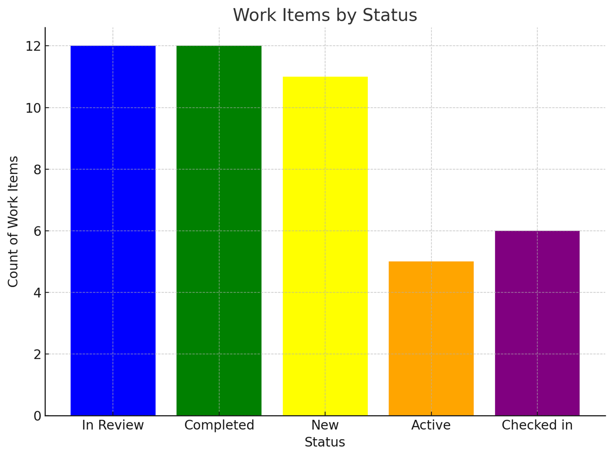

# Release Manager Demo Script

## Topic: Issue Inquiry and Tracking

**User:** Hello!

**Assistant:**
Hi there! How can I assist you today? If you have any queries or need help with tracking and updating issues, getting the status of work items, or generating visual summaries, feel free to let me know!

---

**User:** I need help with release 4.0.0.4000.

**Assistant:**
I'd be happy to help you with release 4.0.0.4000! It would be great if you could provide some more details on what specifically you're looking to do, such as:

- Tracking and updating issues related to the release
- Getting the status of work items within the release
- Generating visual summaries or progress charts

For example, you might say:

- "Update the description of RM-1023 to include the customer's latest feedback."
- "Show me all open items being worked on for release 4.0.0.4000."
- "Generate a chart showing the number of open issues for release 4.0.0.4000."

Could you please clarify or provide more specific information?

---

**User:** Can you give me the work items under release 4.0.0.4000?

**Assistant:**
Sure, please find the list of active issues under release 4.0.0.4000

| Work Item ID | Issue Key | Service        | Release      | Status      | Tag       | Date                |
|--------------|-----------|----------------|--------------|-------------|-----------|---------------------|
| 202006       | 1008      | APP-Analytics  | 4.0.0.4000   | In Review   |           |                     |
| 203157       | 1045      | APP-Analytics  | 4.0.0.4000   | Completed   | r1n4a4p   |                     |
| 203757       | 1046      | APP-Analytics  | 4.0.0.4000   | New         |           |                     |
| 214405       | 1116      | APP-Analytics  | 4.0.0.4000   | New         |           |                     |
| 219310       | 1184      | APP-Analytics  | 4.0.0.4000   | In Review   |           |                     |
| 219352       | 1169      | APP-Analytics  | 4.0.0.4000   | Completed   | i6f3q2i0  | 2025-01-16T22:46:00 |
| 219468       | 1191      | APP-Analytics  | 4.0.0.4000   | Completed   | a2u2p0z3  | 2025-03-19T09:29:00 |
| 223651       | 1154      | APP-Analytics  | 4.0.0.4000   | Completed   | t8d9v9e0  | 2025-03-03T20:50:00 |
| 224652       | 1104      | APP-Analytics  | 4.0.0.4000   | New         |           |                     |
| 225037       | 1155      | APP-Analytics  | 4.0.0.4000   | Completed   | w4k9u8w7  | 2025-04-25T14:09:00 |
| 225562       | 1199      | APP-Analytics  | 4.0.0.4000   | In Review   |           |                     |
| 232494       | 1074      | APP-Analytics  | 4.0.0.4000   | Active      |           |                     |
| 236200       | 1018      | APP-Analytics  | 4.0.0.4000   | Checked in  | g0k6j8i1  | 2025-02-09T20:42:00 |
| 237354       | 1175      | APP-Analytics  | 4.0.0.4000   | In Review   |           |                     |
| 237864       | 1025      | APP-Analytics  | 4.0.0.4000   | In Review   |           |                     |
| 237875       | 1194      | APP-Analytics  | 4.0.0.4000   | New         |           |                     |
| 239625       | 1164      | APP-Analytics  | 4.0.0.4000   | New         |           |                     |
| 240607       | 1055      | APP-Analytics  | 4.0.0.4000   | Checked in  | b7a1r9t9  | 2025-04-29T15:00:00 |
| 241887       | 1095      | APP-Analytics  | 4.0.0.4000   | Active      |           |                     |
| 245392       | 1021      | APP-Analytics  | 4.0.0.4000   | Active      |           |                     |
| 246513       | 1052      | APP-Analytics  | 4.0.0.4000   | Checked in  | t6z8x0p6  | 2025-01-23T02:26:00 |
| 249295       | 1137      | APP-Analytics  | 4.0.0.4000   | Completed   | s1j9o6f4  | 2025-01-10T20:41:00 |
| 250238       | 1001      | APP-Analytics  | 4.0.0.4000   | New         |           |                     |
| 250239       | 1000      | APP-Analytics  | 4.0.0.4000   | In Review   |           |                     |
| 254452       | 1060      | APP-Analytics  | 4.0.0.4000   | Completed   | t6y6l2o8  | 2025-02-05T00:21:00 |
| 255736       | 1101      | APP-Analytics  | 4.0.0.4000   | Completed   | r2b7o2t4  | 2025-05-08T16:03:00 |
| 257123       | 1179      | APP-Analytics  | 4.0.0.4000   | Completed   | j1x8n5g7  | 2025-01-12T16:06:00 |
| 258654       | 1023      | APP-Analytics  | 4.0.0.4000   | In Review   |           |                     |
| 268524       | 1034      | APP-Analytics  | 4.0.0.4000   | New         |           |                     |
| 272580       | 1053      | APP-Analytics  | 4.0.0.4000   | Checked in  | r8j9c5z6  | 2025-05-21T18:17:00 |
| 281938       | 1067      | APP-Analytics  | 4.0.0.4000   | Completed   | t6f0h8e4  | 2025-03-13T11:09:00 |
| 283804       | 1198      | APP-Analytics  | 4.0.0.4000   | In Review   |           |                     |
| 285277       | 1144      | APP-Analytics  | 4.0.0.4000   | Active      |           |                     |
| 285582       | 1102      | APP-Analytics  | 4.0.0.4000   | New         |           |                     |
| 289133       | 1159      | APP-Analytics  | 4.0.0.4000   | Completed   | j6o6k3s1  | 2025-02-16T23:47:00 |
| 289246       | 1165      | APP-Analytics  | 4.0.0.4000   | Checked in  | e3i9z2j1  | 2025-04-21T20:47:00 |
| 289954       | 1007      | APP-Analytics  | 4.0.0.4000   | In Review   |           |                     |
| 290265       | 1113      | APP-Analytics  | 4.0.0.4000   | In Review   |           |                     |
| 292908       | 1085      | APP-Analytics  | 4.0.0.4000   | Active      |           |                     |
| 293423       | 1147      | APP-Analytics  | 4.0.0.4000   | New         |           |                     |
| 293748       | 1162      | APP-Analytics  | 4.0.0.4000   | In Review   |           |                     |
| 294645       | 1070      | APP-Analytics  | 4.0.0.4000   | New         |           |                     |
| 294792       | 1084      | APP-Analytics  | 4.0.0.4000   | Checked in  | j5a8h6u6  | 2025-02-06T23:16:00 |
| 295163       | 1106      | APP-Analytics  | 4.0.0.4000   | Active      |           |                     |
| 298689       | 1193      | APP-Analytics  | 4.0.0.4000   | Checked in  | n5t8p1b0  | 2025-04-04T05:22:00 |

---

**User:** Can you help visualize this data by status?

**Assistant:**

### WORK_ITEM_STATUS Summary

| Status       | Count | Work Item IDs                                                                 |
|--------------|-------|--------------------------------------------------------------------------------|
| In Review    | 12    | 202006, 219310, 225562, 237354, 237864, 237875, 258654, 289954, 290265, 293748, 1000, 283804 |
| Completed    | 12    | 203157, 219352, 219468, 223651, 225037, 254452, 255736, 257123, 281938, 249295, 289133, 1155 |
| New          | 11    | 203757, 214405, 224652, 250238, 268524, 1164, 1194, 1102, 1070, 1134, 1112        |
| Active       | 5     | 232494, 241887, 245392, 285277, 292908                                          |
| Checked in   | 6     | 236200, 240607, 246513, 272580, 273245, 289246                                  |

**User:** Can you get more information on 1008?

**Assistant:**

| Field                  | Details                                                                             |
|---------------------   |-------------------------------------------------------------------------------------|
| **Issue Key**          | RM-1008                                                                             |
| **Affected Version**   | v2.3.5                                                                              |
| **Affected Service**   | Data Layer                                                                          |
| **Escalation Manager** | sandeep.rao@contoso.com                                                             |
| **Status**             | Active                                                                              |
| **Severity**           | 3                                                                                   |
| **Discussion**         | - Customer: The approval page is taking over 10 seconds to load. It’s slowing down  |
|                        |   our workflow significantly.                                                       |
|                        | - Support Lead: We’ve logged multiple tickets on this in the past week. Seems to    |
|                        |   be affecting users across all regions.                                            |
|                        | - Developer: Initial profiling shows that the page is pulling too many records and  |
|                        |   attachments at once. The data fetch isn’t paginated.                              |
|                        | - UX Designer: From a design standpoint, we can introduce lazy loading or           |
|                        |   pagination. Also reduce default visible content.                                  |
|                        | - Product Manager: This delay is unacceptable for a critical workflow page. We      |
|                        |   need both a short-term fix and a long-term improvement.                           |
|                        | - Developer: I’ll implement pagination and defer loading of attachments. That       |
|                        |   should bring load time under 3 seconds.                                           |
|                        | - SRE: We’ve also noticed backend latency spikes during high traffic windows.       |
|                        |   Increasing DB connection pool may help temporarily.                               |
|                        | - QA: Please ensure we cover edge cases during testing, especially for approval     |
|                        |   bulk actions and filters.                                                         |
|                        | - Customer: Please share an ETA. This is impacting SLAs.                            |
|                        | - Engineering Manager: Hotfix will be deployed by tomorrow EOD. A full redesign     |
|                        |   for performance will be included in the next sprint cycle.                        |
| **Linked Issues**      | 1186                                                                                |
| **Owning Team**        | SRE Team                                                                            |
| **Creator**            | sanjay.singh@contoso.com                                                            |
| **Created At**         | 2025-04-29T23:21:00.000-0700                                                        |
| **Issue Type**         | Story                                                                               |

---

## Topic: Issue Update - Human in the loop

**User:** Since the customer has already validated the issue, can you update the description with the following:
“Customer validation completed in Staging environment.”

**Assistant:** Sure, the description “Customer validation completed in Staging environment.” will be added to the issue. Please confirm if you would like to proceed.

**User:** Yes, please go ahead.

**Assistant:** The description for issue 1014 has been updated with the following:
“Customer validation completed in Staging environment.”
