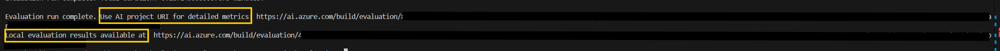

# Release Manager Evaluation

## Overview

The Release Manager Evaluation tool is a framework designed to assess and validate the performance of AI agents in release manager scenario as well as end to end performance of solution and powered by Azure AI evaluation SDK. This tool provides a systematic approach to evaluating how well AI agents understand and respond to queries, supporting multiple metrics including agent specific metrics.

### Key Features

- **Flexible Evaluation Scenario**: Evaluate performance of single agent or whole solution end to end.
- **Flexible Agent Testing**: Evaluate any of AI agent's performance with your own custom datasets
- **Customizable Metrics**: Assess agents based on various performance metrics. Supported metrics will be discussed later on.

## Supported Evaluation Metrics

The evaluation framework includes a comprehensive set of metrics to assess performance across different dimensions, fro end to end you can choose from built-in metrics and for agents from any of built-in or agent specific metrics:

### Built-in Metrics for Cloud Evaluation
These metrics are built in metrics provided by Azure AI Evaluation. Meaning by using their specific id we can access their propmpt and add them to our evaluation process. As of now getting the id for metrics are hardcoded within SDK that's why we have included multiple of these metrics and their id in our code. So you can choose from them and use these metrics:

- **Relevance**: Measures how relevant the response is with respect to the query.
  - Range: 1-5 (higher is better)

- **Coherence**: Measures how well the language model can produce output that flows smoothly, reads naturally, and resembles human-like language.
  - Range: 1-5 (higher is better)

- **Similaritry**: Measures the degrees of similarity between the generated text and its ground truth with respect to a query.
  - **Note:** This metric can be used only if your dataset has ground truth.
  - Range: 1-5 (higher is better)

### Agentic Built-in Metrics for Local Evaluation
These metrics are specific to agentic workflows. As of now these metrics have not been added to Foundry Evaluators Library. So for running these we need different evaluation process. Our tool handles running proper evaluation process based on provided metrics. 

- **Task Adherence**: Measures how well an agent’s response adheres to their assigned tasks, according to their task instruction
  - Range: 1-5 (higher is better)

- **Intent Resolution**: Measures how well the system identifies and understands a user's request, including how well it scopes the user’s intent
  - Range: 1-5 (higher is better)

## Capabilities

### Configurability

The evaluation tool is highly configurable, enabling users to:

- Select type of evaluation (e.g., single agent or whole solution end to end)
- Select the agent to evaluate (e.g., `JIRA_AGENT`, `DEVOPS_AGENT`).
- Choose from a range of evaluation metrics.
- Configure AI-assisted metrics by integrating Azure OpenAI or OpenAI services, leveraging GPT models for evaluation.

### Monitoring Evaluation Status

Each step of the evaluation process is logged to the terminal for transparency and debugging. The evaluation workflow includes:

- **Dataset Loading**: Reads the evaluation dataset, which can be stored locally or on Azure Machine Learning (AML) Studio.

- **Kernel and Agent Initialization for Agent Evaluation**: Creates, initializes and evaluates both - Semantic Kernel and Azure AI Foundry agents based on the local configuration file.

- **Getting Response**: Sends each query to the agent or session manger endpoint and captures the response.

    

- **Answer File Upload**: Uploads the generated responses to Foundry for evaluation.

- **Evaluation Execution**:
  - **Agent-Specific Metrics**: If selected, the evaluation runs locally. Logs include per-query evaluation status, and results are uploaded to Foundry.

    

  - **Built-in Metrics**: If selected, the evaluation is triggered in the cloud via Foundry. The tool polls Foundry for status updates and displays them in the terminal.

    

## Running Instructions

### Prerequisites

1. Ensure all required Release Manager resources are set up. You can find them [here](../SETUP.md/#prerequisites)

### Configuration Steps

1. Copy and configure environment variables:
   ```powershell
   cp .env.template .env
   ```
   Update the following values in `.env`:
   ```
   # Azure Key Vault URI
    KEYVAULT_URI=""  # URI for the Azure Key Vault to retrieve secrets.

    # Azure Application Insights
    APPLICATION_INSIGHTS_CNX_STR=""

    # Azure OpenAI
    AZURE_OPENAI_ENDPOINT="" # Endpoint URL for Azure OpenAI service.
    AZURE_OPENAI_CHAT_DEPLOYMENT_NAME="" # Deployment name for the Azure OpenAI chat model.
    AZURE_OPENAI_API_VERSION=""

    # Azure ML
    AZURE_SUBSCRIPTION_ID=""  # Subscription ID for Azure.
    AZURE_RESOURCE_GROUP=""  # Resource group name for Azure resources.
    AZURE_WORKSPACE_NAME=""  # Name of the Azure Machine Learning workspace.

    # Azure AI Foundry
    AZURE_AI_AGENT_PROJECT_CONNECTION_STRING=""
    AZURE_AI_AGENT_MODEL_DEPLOYMENT_NAME=""  # Deployment name for the Azure AI Agent model.

    # JIRA settings
    JIRA_SERVER_ENDPOINT=""
    JIRA_SERVER_USERNAME=""
    JIRA_SERVER_PASSWORD=""

    # DevOps Settings
    DEVOPS_DATABASE_SERVER_ENDPOINT=""
    DEVOPS_DATABASE_SERVER_USERNAME=""
    DEVOPS_DATABASE_SERVER_PASSWORD=""
    DEVOPS_DATABASE_NAME=""
    DEVOPS_DATABASE_TABLE_NAME=""

    # Endpoints For Services
    SESSION_MANAGER_URI="" # Session manager endpoint for end to end evaluation
   ```
    **Note:** Ensure that the `SESSION_MANAGER_URI` does not include the `https://` protocol prefix. If you encounter the error `[Errno 11001] getaddrinfo failed`, it indicates that the URI was entered with the protocol prefix. Remove the `https://` prefix to resolve the issue.

2. Configure evaluation settings in `evaluation/static/eval_config.yaml`:
   ```yaml
    evaluation_jobs:
        <name of evaluation>:
            config_body:
                type: "AgentEvaluation"
                agent_config_id: "YOUR_AGENT_NAME"  # The agent to evaluate, can be "JIRA_AGENT" or "DEVOPS_AGENT"
                local_dataset: "path/to/your/test_data.csv"  # Your test dataset
                config_file_path: "path/to/release_manager_config.yaml"  # Solution configuration
                metric_config:
                    <name of metric>: # Name of metric for evaluation, can be relevance, coherence, similarity, intent_resolution, task_adherence
                        name: "name_of_metric"
                        type: "type_of_metric" # "BuiltInMetricsConfig" for built-in metrics and "AgentEvaluatorConfig" for agent specific metrics
                        service: # Service to be used for AI assisted metrics
                            llm_service: # "AzureOpenAI" or "OpenAI"
                            deployment_name: "name_of_your_deployment"
        <name of evaluation>:
            config_body:
              type: "EndToEndEvaluation"
              local_dataset: "path/to/your/test_data.csv"  # Your test dataset
              metric_config:
                  <name of metric>: # Name of metric for evaluation, can be relevance, coherence, similarity, intent_resolution, task_adherence
                    name: "name_of_metric"
                    type: "type_of_metric" # "BuiltInMetricsConfig" for built-in metrics and "AgentEvaluatorConfig" for agent specific metrics
                    service: # Service to be used for AI assisted metrics
                        llm_service: # "AzureOpenAI" or "OpenAI"
                        deployment_name: "name_of_your_deployment"
   ```

### Running the Evaluation

1. Run and debug evaluation locally inside VS Code:

   - Click on Run and Debug or Ctrl+Shift+D

   - Click on the Drop Down Menu at the top of VSCode

   - Select "Release Manager Evals: Launch" then click Play Button to start the instance

**Note:** As part of starting the service, VSCode will create python virtual environments in folder .venv and install all project-level dependencies. This will take some time. Wait for all dependencies to be installed. 

2. Choose evaluation from config file to run. After installing all dependencies you will be asked to enter name of the evaluation to run in terminal. Enter name of the evaluation as you entered it in placeholder `name of evaluation` in config file.

## Output

After completion, in the terminal you will get links to results of your evaluation. The results will be saved under evaluation tab in your foundry project.\
If you have used differnt type of metrics results for built-in metrics will be saved seperate from agent specific metrics. Local evaluation results are for agent specific metrics, and results for other metrics can be seen at AI project URI.



Visiting the links you can see report for evaluation. Under Data tab you can see detailed report for run with results for each query in your dataset.