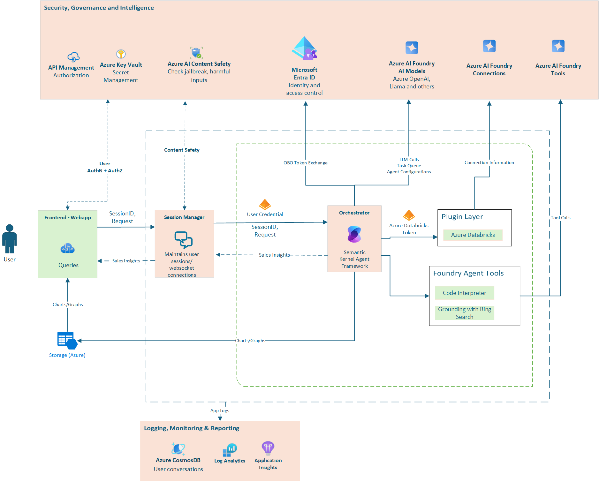

  <h1>
    Sales Analyst AI Agent with Enterprise Security
  </h1>
  
<strong>Analyze sales and revenue trends to identify prescriptive insights & sales improvement opportunities.</strong>

   
  

https://github.com/user-attachments/assets/4a03cbd5-0fdc-4191-88b2-335da9ef8e1b

## 🚀 Overview

This Azure AI Foundry Agent empowers business leaders by providing powerful insights for decision-making and helping improve sales efficiency.

This AI agent is built using Semantic Kernel and enabled with Enterprise Security: featuring Azure AI Foundry, Grounding with Bing Search & the Azure Databricks connector.This also showcases Responsible AI using Azure AI Content Safety.

## 🔍 Business Value

- **Insights for Decision-Making**: Analyzing Sales and Revenue data to provide actionable insights- helping business leaders make informed decisions which drive success.
- **Improving Retail Efficiency**: AI agent with the added power of Bing- Use internet insights to identify key sales trends and provide sales improvement strategies- focused on enhancing retail efficiency and sales. Contributing significantly to overall business success and customer satisfaction.
- **Operational Excellence**: Analyze operational data and validate with key sectoral trends to provide opportunities to minimize costs and maximize productivity in business operations.

## 💼 Core Function

- **Trend Summarization of Business KPIs**
  - Granularity of Data: Users can request trend summaries at various levels of granularity, such as weekly, monthly, quarterly, or yearly—based on their needs.
  - Sales Data Trends:  The trend summarization feature provides users with insights into various sales figures (like product SKUs, units sold, pricing, sales, margin & other details) across multiple geographies & regions.

- **Prescriptive Analytics and Internet Insights**
  - Analyzing Trend Data: The AI agent analyzes trend data alongside historical figures to understand performance changes over time.
  - Internet Insights powered by Bing: Grounding with Bing search helps identify external factors influencing changes in key performance indicators (KPIs) for your business.

- **Sales & Operational Improvement Recommendations**
  - Identify Improvement Opportunities: The AI agent analyses sales and revenue data- collaborates it with internet insights and geographical trends- to provide actionable improvement strategies tailored for each trend.
  - Foresee Expected Outcomes: Analyze and anticipate benefits from each of the proposed actions.

## 🎥 Demo Video

https://github.com/user-attachments/assets/307dd026-3281-4641-92c6-5a38ae997e5b

## ✨ Solution Features

1. **Semantic Kernel and Bring Your Own Azure AI Model:**  
Explore the Semantic Kernel Agentic framework to use any Azure AI model tailored for your needs. Allocate tasks to specialized models while optimizing for cost, performance and latency.

2. **World knowledge and internet insights:**  
Use Grounding with Bing Search to enhance your agent's knowledge with access to real-time internet insights. This allows the agent to provide up-to-date information and context for better decision-making.

3. **Secure access with Azure Databricks (Genie) Integration:**  
Connect your agent to an Azure Databricks workspace for secure, real-time access to structured and unstructured data. Leverage Role-Based Access Control (RBAC) to ensure data security and compliance.

4. **Responsible AI:**  
Use Azure AI Content Safety to build robust guardrails for generative AI. Create custom filters for your AI agent which block harmful inputs and outputs.

5. **Agent Observability:**  
Analyze usage, performance, and quality against operational Agent benchmarks.

### 🛠️ Technology Stack

| Capability | Technology |
|------------|------------|
| **Orchestration** | Microsoft Semantic Kernel Agent Framework |
| **AI Models** | Azure OpenAI Service (GPT-4o) |
| **Responsible AI** | Azure Content Safety |
| **Internet Insights** | Grounding with Bing Search |
| **Data Security & Lakehouse Intelligence** | Azure Databricks Genie |
| **Observability** | Azure Application Insights, Custom Telemetry |

### Architecture Diagram

## 🔧 Getting Started

Ready to deploy Sales Analyst? Follow our comprehensive [Setup Guide](src/solution_accelerators/sales_analyst/SETUP.md) for detailed instructions.

## 📚 Resources

- [Microsoft Semantic Kernel](https://github.com/microsoft/semantic-kernel)
- [Azure AI Foundry](https://ai.azure.com/)

## Sample Datasets
Our solution uses role-based access control (RBAC) to ensure that users have the appropriate level of access to data. 
Let's introduce two of our demo user personas: Global Sales Manager (GSM) and Country Sales Manager (CSM):
 
Global Sales Manager (GSM): 
Responsible for overseeing global sales operations across multiple countries and making strategic decisions based on comprehensive data insights. 
Sample Dataset: **sample_sales_data_global.csv**. Access to sample sales data for United States and India.
 
Country Sales Manager (CSM): 
Focuses on managing sales operations within one specific country and optimizing its local performance.
Sample Dataset: **sample_sales_data_united_states.csv**. Access to sample sales data for only United States.
 
Both the sample datasets mentioned above are using synthetic data.
License: Released under CDLA-2.0 (https://cdla.dev/permissive-2-0/).

## Dataset License

The [dataset](src/solution_accelerators/sales_analyst/data/) in this project is released under the Community Data License Agreement – Permissive, Version 2.0 - CDLA, see the [LICENSE-DATA](LICENSE-DATA.md) file.

## 📄 License

This project is licensed under the MIT License - see the [LICENSE](LICENSE) file for details.

---

  
Developed with ❤️ by Microsoft

