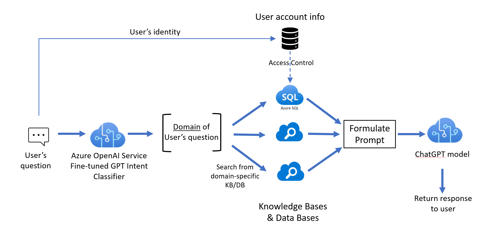
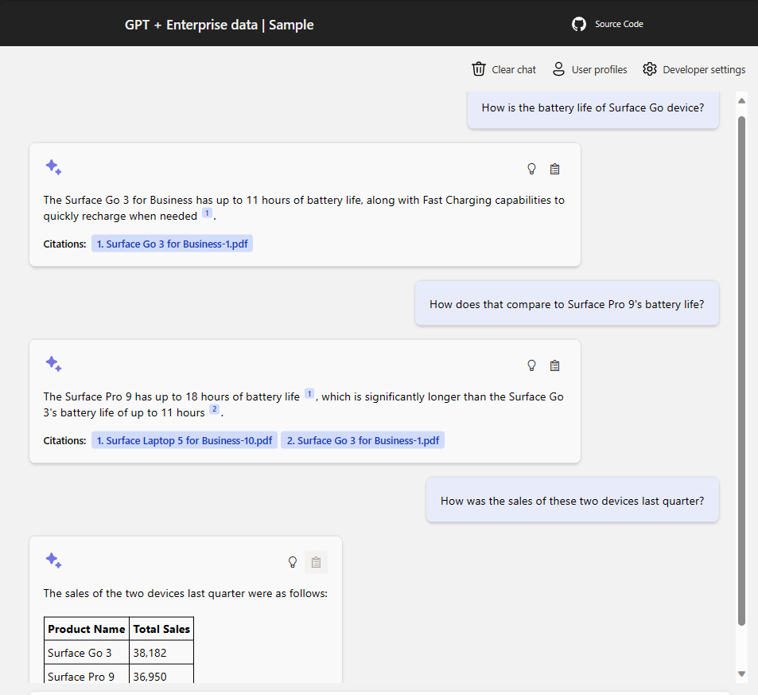
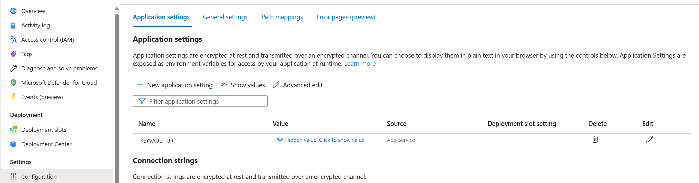

# ChatGPT + Enterprise data with Azure OpenAI and Cognitive Search

This sample demonstrates a few approaches for creating ChatGPT-like experiences over your own data using the Retrieval Augmented Generation pattern. It uses Azure OpenAI Service to access the GPT model - gpt-4(8k tokens), Azure Cognitive Search for data indexing and retrieval of unstructured content (pdf files) and SQL Server for retrieving data from SQL server tables.

The repo includes sample data so it's ready to try end to end. In this sample application we used two sources of data:

1. An Azure Cognitive Search Index, indexed with unstructured .pdf data consisting of publicly available documentation on [Microsoft Surface devices](https://learn.microsoft.com/en-us/surface/get-started)
2. A SQL database pre-loaded with some sample product availability, sales and merchant information about certain Surface devices

The experience allows users to ask questions about the Surface Devices specifications, troubleshooting help, warranty as well as sales, availability and trend related questions.

There are two pre-recorded voiceovers that shows how enterprises can use this architecture for their different users/audiences. The demo uses two different personas:
> 1. Emma is marketing lead [demo](./docs/Emma%20Miller_with%20voice.mp4)
> 2. Dave is regional sales manager [demo](./docs/Dave%20Huang_with%20voice.mp4)



## Features

* Chat on different data sources (structured and unstructured)
* Maintain context when chatting across data sources
* Explores various options to help users evaluate the trustworthiness of responses with citations, tracking of source content, etc.
* Shows approaches for data preparation, prompt construction, and orchestration of interaction between model (GPT) and retriever (Cognitive Search and SQL)
* Settings directly in the UX to tweak the behavior and experiment with options, ie. experiment with search results with or without semantic search, without or without vector search, etc.*
* Simulation of securing resources by user/role [RBAC](https://learn.microsoft.com/en-us/azure/role-based-access-control/overview). RBAC is built into Azure Resource Manager, however for the demo we have simulated user roles, so we have managed the intersection of role, scope and role assignments in a separate storage. Enterprise can leverage the same concept if bringing in external resources or leverage the built in RBAC if they have all their resources in Azure.
* Handling failures gracefully and ability to retry failed queries against other data sources
* Handling token limitations
* Using fine-tuned model for classification in the orchestrator
* > *Due to unavailability of fine-tuned models in certain regions, we have updated the code to use gpt-4 based few-shot classifer. Added a new section on how to test this classifier in [promptFlow](./docs/prompt_flow.md)*
* Using instrumentation for debugging and also for driving certain usage reports from the logs



## Getting Started

> **IMPORTANT:** In order to deploy and run this example, you'll need an **Azure subscription with access enabled for the Azure OpenAI service**. You can request access [here](https://aka.ms/oaiapply). You can also visit [here](https://azure.microsoft.com/free/cognitive-search/) to get some free Azure credits to get you started.

> **AZURE RESOURCE COSTS** by default this sample will create various Azure resources like: Azure App Service, Azure Cognitive Search, Azure SQL Server, Azure KeyVault, Azure Cosmos DB and Form Recognizer resource that has cost associated with them. You can switch them to free versions if you want to avoid this cost by changing the parameters file under the infra folder (though there are some limits to consider; for example, you can have up to 1 free Cognitive Search resource per subscription, and the free Form Recognizer resource only analyzes the first 2 pages of each document.)

### Prerequisites

#### To Run Locally

* [PowerShell 7+ (pwsh)](https://github.com/powershell/powershell)
  * **Important**: Ensure you can run `pwsh.exe` from a PowerShell command. If this fails, you likely need to upgrade PowerShell.
* [Azure PowerShell Az Module](https://learn.microsoft.com/en-us/powershell/azure/install-azure-powershell)
  * **Important**: Ensure you can run `Az` from PowerShell.
* [The AzureAD PowerShell module version 2.0.2.180 or above](https://learn.microsoft.com/en-us/powershell/module/azuread/?view=azureadps-2.0)
* [Azure Developer CLI 2.20.0 or greater](https://aka.ms/azure-dev/install)
  * **Important**: Ensure you can run `azd` from PowerShell.
* [Python 3+](https://www.python.org/downloads/)
  * **Important**: Python and the pip package manager must be in the path in Windows for the setup scripts to work.
  * **Important**: Ensure you can run `python --version` from console. On Ubuntu, you might need to run `sudo apt install python-is-python3` to link `python` to `python3`.
* [Node.js](https://nodejs.org/en/download/)
* [Git](https://git-scm.com/downloads)
* [ODBC Driver for SQL Server v18](https://learn.microsoft.com/en-us/sql/connect/odbc/download-odbc-driver-for-sql-server)


>NOTE: Your Azure Account must have `Microsoft.Authorization/roleAssignments/write` permissions, such as [User Access Administrator](https://learn.microsoft.com/azure/role-based-access-control/built-in-roles#user-access-administrator) or [Owner](https://learn.microsoft.com/azure/role-based-access-control/built-in-roles#owner).  

### Installation

#### Project Initialization

1. Clone this repo into a new folder and navigate to the repo root folder in the terminal.
2. Run `azd auth login`.

#### Use existing resources

Due to high demand, Azure OpenAI resources can be difficult to spin up on the fly due to quota limitations. For this reason, we've excluded the OpenAI resource provisioning from the provisioning script. If you wish to use your own Azure OpenAI resource, you can:

1. Run `azd env set {VARIABLE_NAME} {VALUE}` to set the following variables in your azd environment:
   - `AZURE_OPENAI_SERVICE {Name of existing OpenAI resource where the OpenAI models have been deployed}`.
   - `AZURE_OPENAI_RESOURCE_GROUP {Name of existing resource group where the Azure OpenAI service resource is provisioned to}`.
   - `AZURE_OPENAI_LOCATION {Name of Azure region where the OpenAI resource is deployed ie. eastus, canadaeast, etc.}`.
   - `AZURE_OPENAI_MODEL {Name of the Azure OpenAI model used for completion tasks other than classification}`.
   - `AZURE_OPENAI_MODEL_VERSION {Version of the Azure OpenAI model used for completion tasks other than classification}`.
   - `AZURE_OPENAI_DEPLOYMENT {Name of existing Azure OpenAI model deployment to be used for completion tasks other than classification}`.
   - `AZURE_OPENAI_CLASSIFIER_MODEL {Name of Azure OpenAI model to be used to do dialog classification}`.
   - `AZURE_OPENAI_CLASSIFIER_MODEL_VERSION {Version of the Azure OpenAI model to be used to do dialog classification}`.
   - `AZURE_OPENAI_CLASSIFIER_DEPLOYMENT {Name of existing Azure OpenAI model deployment to be used for dialog classification}`.
   - `AZURE_OPENAI_EMBEDDINGS_MODEL {Name of Azure OpenAI model to be used to vectorize document content when indexing documents as well as making search queries in Azure Cognitive Search}`.
   - `AZURE_OPENAI_EMBEDDINGS_MODEL_VERSION {Version of the Azure OpenAI model to be used for vectorization in Azure Cognitive Search}`.
   - `AZURE_OPENAI_EMBEDDINGS_DEPLOYMENT {Name of existing Azure OpenAI model to be used for vectorization in Azure Cognitive Search}`.
   - `AZURE_OPENAI_EMBEDDINGS_TOKEN_LIMIT {The maximum amount of tokens allowed in an embeddings request for the Azure OpenAI model to be used for vectorization in Azure Cognitive Search}`
   - `AZURE_OPENAI_EMBEDDINGS_DIMENSIONS {The number of dimensions a vector will have in an embeddings request response from the Azure OpenAI model to be used for vectorization in Azure Cognitive Search}`.
    * Ensure the model you specify for `AZURE_OPENAI_DEPLOYMENT` and `AZURE_OPENAI_MODEL` is a Chat GPT model, since the demo utilizes the ChatCompletions API when requesting completions from this model.
    * Ensure the model you specify for `AZURE_OPENAI_CLASSIFIER_DEPLOYMENT` and `AZURE_OPENAI_CLASSIFIER_MODEL` is compatible with the Completions API, since the demo utilizes the Completions API when requesting completions from this model.
    * You can also use existing Search and Storage Accounts.  See `./infra/main.parameters.json` for list of environment variables to pass to `azd env set` to configure those existing resources.
2. Go to `app/backend/bot_config.yaml`. This file contains the model configuration definitions for the Azure OpenAI models that will be used. It defines request parameters like temperature, max_tokens, etc., as well as the the deployment name (`engine`) and model name (`model_name`) of the deployed models to use from your Azure OpenAI resource. These are broken down by task, so the request parameters and model for doing question classification on a user utterance can differ from those used to turn natural language into SQL for example. You will want the deployment name (`engine`) for the `approach_classifier` to match the one set for `AZURE_OPENAI_CLASSIFIER_DEPLOYMENT`. You will also want the deployment name (`engine`) for `embeddings` to match the one set for `AZURE_OPENAI_EMBEDDINGS_DEPLOYMENT`. For the rest, you wil want the deployment name (`engine`) and model name (`model_name`) to match `AZURE_OPENAI_DEPLOYMENT` and `AZURE_OPENAI_MODEL` respectively. For the models which specify a `total_max_tokens`, you will want to set this value to the maximum number of tokens your deployed GPT model allows for a completions request. This will allow the backend service to know when prompts need to be trimmed to avoid a token limit error.
    * Note that the config for `approach_classifier` doesn't contain a system prompt, this is because the demo expects this model to be a fine-tuned GPT model rather than one trained using few-shot training. You will need to provide a fine-tuned model trained on some sample data for the dialog classification to work well. For more information on how to do this, checkout the [fine-tuning section](README.md#fine-tuning).
3. Run `azd up`

#### Starting from scratch

Execute the following command, if you don't have any pre-existing Azure services and want to start from a fresh deployment.

1. In [main.parameters.json](./infra/main.parameters.json), set the value of `deployOpenAIModels` to `true`. By default, no GPT models are deployed.
2. Go to `app/backend/bot_config.yaml`. This file contains the model configuration definitions for the Azure OpenAI models that will be used. It defines request parameters like temperature, max_tokens, etc., as well as the deployment name (`engine`) and model name (`model_name`) of the deployed models to use from your Azure OpenAI resource. These are broken down by task, so the request parameters and model for doing question classification on a user utterance can differ from those used to turn natural language into SQL for example. You will want the deployment name (`engine`) for the `approach_classifier` to match the one set for the classifier model deployed in the last step. You will also want the deployment name (`engine`) for `embeddings` to match the one set for the embeddings model deployed in the last step. For the rest, you will want the deployment name (`engine`) and model name (`model_name`) to match those for the GPT model deployed in the last step. For the models which specify a `total_max_tokens`, you will want to set this value to the maximum number of tokens your deployed GPT model allows for a completions request. This will allow the backend service to know when prompts need to be trimmed to avoid a token limit error.
    * Note that the config for `approach_classifier` doesn't contain a system prompt, this is because the demo expects this model to be a fine-tuned GPT model rather than one trained using few-shot training. You will need to provide a fine-tuned model trained on some sample data for the dialog classification to work well. For more information on how to do this, checkout the [fine-tuning section](README.md#fine-tuning)
3. Run `azd up`
    * For the target location, the regions that currently support the OpenAI models used in this sample at the time of writing this are **East US** or **South Central US**. For an up-to-date list of regions and models, check [here](https://learn.microsoft.com/en-us/azure/cognitive-services/openai/concepts/models)

#### azd up

Running `azd up` will:

* Install needed Node.js dependencies and build the app's front-end UI and store the static files in the backend directory.
* Package the different service directories and get them ready for deployment.
* Start a deployment that will provision the necessary Azure resources needed for the sample to run, as well as upload secrets to Azure Keyvault and save environment variables in your azd env needed to access those resources.
  * **Note**: You must make sure every deployment runs successfully. A failed deployment could lead to missing resources, secrets or env variables that will be needed downstream.
* Prepare and upload the data needed for the sample to run, including building the search index based on the files found in the `./data` folder and pre-populating some Cosmos DB containers with starter data for user profiles, access rules, resources, etc., as well as the SQL database containing the sample sales data.
* Deploy the services needed for the app to run to Azure. This will include a data-management micro-service as well as the backend service that the front-end UI will communicate with.

### Skipping vectorization
* Part of indexing the document chunks into Azure Cognitive Search will include vectorizing each chunk using an Azure OpenAI Embeddings model. The same is true for each search operation as well, as each search query will be vectorized using the same Embeddings model. If you would like to skip this step during indexing, go to [main.parameters.json](./infra/main.parameters.json) and set the value of `searchSkipVectorization` to `true` before running `azd up`. Keep in mind this will disable vectorized queries in search for the entire demo deployment, so if you wish you try vectorized queries, you will have to tear down the deployment with `azd down`, revert `searchSkipVectorization` to `false` and run `azd up again`.

#### After running azd up
* Once this is all done, the application is successfully deployed and you will see 2 URLs printed on the console. Click the backend URL to interact with the application in your browser.

It will look like the following:


* When doing fine-tuning for classification purposes, the Azure OpenAI resource used could be different than the one where gpt-4 model is deployed. Even if the same Azure OpenAI resource is used, do manually populate these two secrets created in the keyvault and restart both the web applications so they get the latest values.
```
AZURE-OPENAI-CLASSIFIER-SERVICE   This is the name of Azure OpenAI resource where the fine tuned model is deployed.
AZURE-OPENAI-CLASSIFIER-API-KEY   This is the API Key of the above Azure OpenAI resource.
```

> NOTE: It may take a minute for the application to be fully deployed. If you see a "Python Developer" welcome screen, then wait a minute and refresh the page.

### Handling Known failures:
1. Populating data in SQL Server fails due to IP restriction
The populate_sql.py in the scripts/prepopulate folder tries to register the client IP address as a firewall rule so connection to SQL Server can be established from the terminal. However sometimes, this IP address changes. So if you see an error like below:
```
cnxn = pyodbc.connect(args.sqlconnectionstring)
pyodbc.ProgrammingError: ('42000', "[42000] [Microsoft][ODBC Driver 18 for SQL Server][SQL Server]Cannot open server 'sql-server-name' requested by the login. Client with IP address 'client ip address' is not allowed to access the server.  
```

> Go to Azure portal --> resource group --> SQL Server

> In the left panel, under Security, click on "Networking" 

> Under Firewall Rules, click on "Add your client IPV4 address"

> Click Save

> From the Powershell terminal, re-run the prepdata script manually as shown below.
```
Connect-AzAccount (hit enter)

.\scripts\prepdata.ps1
```

2. When making a search on the web app, if you seen an error: 
```
The API deployment for this resource does not exist. If you created the deployment within the last 5 minutes, please wait a moment and try again.
```

> Ensure that the `AZURE-OPENAI-CLASSIFIER-SERVICE` and `AZURE-OPENAI-CLASSIFIER-API-KEY` secrets in the keyvault are pointing to the right resources.

> Ensure that model and engine name palceholders in the app/backend/bot_config.yaml file have be updated.

#### Deploying or re-deploying a local clone of the repo

* Simply run `azd up`
* Once all the resources have been deployed. Update the data and backend service configurations to include KeyVault URI.


### Running locally

1. Skip this step, if you have already ran `azd up`; otherwise run `azd provision`, if you wish to deploy all resources from scratch. Keep in mind the needed Azure OpenAI GPT models are skipped during deployment by default. Uncomment the Azure OpenAI deployments inside the main [Bicep template](./infra/main.bicep) if you wish to deploy them as part of this step. This step will also pre-populate the resources after they've been provisioned with all the necessary data for the demo to run. This includes indexing all the sample documents in the Azure Cognitive Search Index, uploading the sample table data to the SQL database, as well as uploading some necessary starter data for the Cosmos DB.
2. For the `app/backend` and `app/data` directories, copy the contents of `app/backend/.env.template` and `app/data/.env.template` into a new `.env` file in each directory. Fill in every blank environment variable with the keys and names of the resources that were deployed in the previous step, or with the resources you've deployed on your own.
3. Go to `app/backend/bot_config.yaml`. This file contains the model configuration definitions for the Azure OpenAI models that will be used. It defines request parameters like temperature, max_tokens, etc., as well as the the deployment name (`engine`) and model name (`model_name`) of the deployed models to use from your Azure OpenAI resource. These are broken down by task, so the request parameters and model for doing question classification on a user utterance can differ from those used to turn natural language into SQL for example. You will want the deployment name (`engine`) for the `approach_classifier` to match the one set for the classifier model deployed in the last step. For the rest, you will want the deployment name (`engine`) and model name (`model_name`) to match those for the GPT model deployed in the first step. For the models which specify a `total_max_tokens`, you will want to set this value to the maximum number of tokens your deployed GPT model allows for a completions request. This will allow the backend service to know when prompts need to be trimmed to avoid a token limit error.
    * Note that the config for `approach_classifier` doesn't contain a system prompt, this is because the demo expects this model to be a fine-tuned GPT model rather than one trained using few-shot training. You will need to provide a fine-tuned model trained on some sample data for the dialog classification to work well. For more information on how to do this, checkout the [fine-tuning section](README.md#fine-tuning)
4. Change dir to `app`.
5. Run `../scripts/start.ps1` or run the VS Code Launch - "Frontend: build", "Data service: Launch & Attach Server" and "Backend: Launch & Attach Server" to start the project locally.

### QuickStart

* In Azure: navigate to the Backend Azure WebApp deployed by azd. The URL is printed out when azd completes (as "Endpoint"), or you can find it in the Azure portal.
* Running locally: navigate to 127.0.0.1:5000

Once in the web app:

* Try different topics in chat or Q&A context. For chat, try follow up questions, clarifications, ask to simplify or elaborate on answers, etc.
* Explore citations and sources
* Click on "settings" to try distinct roles, search options, etc.

## Fine-tuning

You can find helpful resources on how to fine-tune a model on the Azure OpenAI website. We have also provided synthetic datasets we used for this demo application in the data folder for users who want to try it out.

* [Learn how to prepare your dataset for fine-tuning](https://learn.microsoft.com/en-us/azure/cognitive-services/openai/how-to/prepare-dataset)
* [Learn how to customize a model for your application](https://learn.microsoft.com/en-us/azure/cognitive-services/openai/how-to/fine-tuning?pivots=programming-language-studio)

## Resources

* [Revolutionize your Enterprise Data with ChatGPT: Next-gen Apps w/ Azure OpenAI and Cognitive Search](https://aka.ms/entgptsearchblog)
* [Azure Cognitive Search](https://learn.microsoft.com/azure/search/search-what-is-azure-search)
* [Azure OpenAI Service](https://learn.microsoft.com/azure/cognitive-services/openai/overview)

### Note
>
>Note: The PDF documents used in this demo contain information generated using a language model (Azure OpenAI Service). The information contained in these documents is only for demonstration purposes and does not reflect the opinions or beliefs of Microsoft. Microsoft makes no representations or warranties of any kind, expressed or implied, about the completeness, accuracy, reliability, suitability or availability with respect to the information contained in this document. All rights reserved to Microsoft.

## FAQ

***Question***: Why do we need to break up the PDFs into chunks when Azure Cognitive Search supports searching large documents?

***Answer***: Chunking allows us to limit the amount of information we send to OpenAI due to token limits. By breaking up the content, it allows us to easily find potential chunks of text that we can inject into OpenAI. This demo uses page-based chunking where each chunk is a page. For the purposes of this content, page-based chunking produced good results as it has enough context. Additional chunking strategies were also considered and you can find details of those in the [search optimization doc](docs/search_optimization.md)

***Question***: Have you considered other development frameworks like LangChain

***Answer***: Yes we did do a study of LangChain and have documented our architecture and other considerations in the [architecture considerations doc](docs/architecture_considerations.md).

***Question***: Do you have any suggestions for getting the right results from the content

***Answer***: Yes, we did this with two approaches:

1. There is a classifier upfront. Every user utterance goes thru this classifier to ensure demo can answer those user questions for which it has content for and gracefully answer what it can't do.
2. System prompts were also updated to ensure the response are generated based on the context and previous history. In addition, for natural language to SQL prompt, we also included instructions to only generate SELECT queries and restrict from making any updates to the data or schema.

***Question***: Are there examples of usage reports derived from the logging

***Answer***: Yes, as part of the development of the application, we included some basic logging to capture what is happening around a user conversation. Application Insights was used as the logging backend. The [log reports](docs/log_reports.md) document has some sample KQL queries and reports based on these logs

***Question***: Are there suggestions on how to develop and test prompts

***Answer***: Yes, we have included documentation on how you could leverage Prompt Flow for developing and testing prompts. An example of developing and performing bulk test on few-shot classifier is included in the [prompt flow](docs/prompt_flow.md) document.

### Troubleshooting

If you see this error while running `azd deploy`: `read /tmp/azd1992237260/backend_env/lib64: is a directory`, then delete the `./app/backend/backend_env folder` and re-run the `azd deploy` command.  This issue is being tracked here: <https://github.com/Azure/azure-dev/issues/1237>
