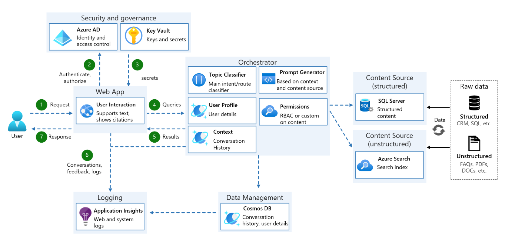

# Overview

This document will cover the following:

1. Current solution architecture
2. Other considerations

## Solution Architecture

Below are the main components of the solution:

1. UI
2. Orchestrator
3. Data management
4. Simulation of RBAC
5. Prompt Template and Token Management
6. Instrumentation and Logging

### UI

The UI not only enables interaction with the user but also provides certain metadata (like thought process and citations) to the user to help build confidence in the result they are seeing. It also supports other niceties like retrying failed requests, switching between user profiles to see the impact of RBAC on content sources and users and using different search options.

### Orchestrator

Orchestrator is the brain of the bot. It does all heavy lifting needed to execute a request. In the included sample, the orchestrator does the following:

1. Call the classifier for every utterance and see if the user's question can be answered by structured (SQL) or unstructured (Azure Cognitive Search) data source
2. Check if user has access to that data source
3. Update history using data management service
4. Call the right execution flow, passing prompt template, conversation history and model parameters
5. Push the user utterance and response into conversation history if the execution is successful.

### Data Management

Cosmos DB was used as the backend for our data management service, which stores the following:

1. UI configuration details
2. Stores conversation history
3. Maintains information about different resources, user profiles, their roles, groups, and permissions. This is how we are simulating RBAC in our demo.

### Simulation of RBAC

The demo Simulates of securing resources by user/role [RBAC](https://learn.microsoft.com/en-us/azure/role-based-access-control/overview). RBAC is built into Azure Resource Manager, however for the demo we have simulated user roles, so we have managed the intersection of role, scope, and role assignments in a separate storage. Enterprise can leverage the same concept if bringing in external resources or leverage the built in RBAC if they have all their resources in Azure.
In our simulation we are using Cosmos DB to store following:

1. User, Group and Resource (as entities)
2. User could belong to a group and so does resources (membership)
3. The intersection of Role, Scope, and Role Assignment (as permissions)  

### Prompt templates and Token Management

A custom prompt template format (stored as yaml file) was developed and used to keep code portions separate from prompts. This helped in isolating changes to just one file (yaml file) as prompts evolved during development of the project. The template included various System Prompts with certain place holders that needed to be filled in dynamically. During runtime, appropriate sections of the template are loaded and place holders like number of last conversation history, amount of search content, etc. are then filled in. Utility methods were also added to ensure that no time, we went overboard with the amount of token we were sending to AOAI. For example, when search results created tons of high relevant documents, then we excluded 5 results with lowest search relevance score before excluding 1 dialog from the history until the total amount of content could fit within the assigned number of tokens.

### Instrumentation and Logging

The application leverages [Application Insights](https://learn.microsoft.com/en-us/azure/azure-monitor/app/app-insights-overview?tabs=net) to do logging. As part of logging certain metrics are also logged. This helps with not only debugging issues on the servers but also in generating few basic usage reports. More details can be found in the [log reports doc](log_reports.md)

### High level design
Below is a high level architecture design

## Other Considerations

### Using LangChain for orchestration
The demo uses a classifier to detect the topic of every user input (structured vs. unstructured) and execute the appropriate code path accordingly. Execution of structured code path involves three key steps:

1. Convert user utterance to a SQL query
2. Execute the SQL query against SQL Server to get the results
3. Translate the SQL response (results) into natural language

And execution of unstructured code path involves these steps:

1. Create an optimized Search Query based on current user utterance and past conversation history using AOAI
2. Call search SDK with the search query and gather search results
3. Send search results to AOAI to compose the final result to show to customers

One option was to use LangChain to do the execution of these code paths. For example: for structured code path, create 3 tools - one for each step and create an agent that could put these tools in proper sequence dynamically during runtime and execute them.

When we tried above, what we found was:
1. The order of execution of the tools was indeterministic, causing poor user experience. Also, at times not all portions of the chain would execute, resulting in broken experiences.
2. LangChain's agent needs to call AOAI to create the plan to execute, which further adds cost and latency
3. Since the demo scenario is a user chat experience, end-to-end latency matters. Adding additional processing to compose plans on the fly and then execute them makes the whole experience very slow. We would rather want a fast and a very deterministic execution of sub-steps.

In short, we didn't find using LangChain very useful in our use case. Having said that, we think that orchestrating with tools like LangChain could be useful int he following cases:

1. When you have a bigger system with many independent tools that can handle at least a portion of the user’s request. Like a hand-off or a task completion use case. Each tool can use any large language model, not just AOAI.
2. LangChain has few nice concepts of templatizing prompts, dynamically filtering examples to put in a prompt, etc. These are some notable features that could be leveraged directly or could be implemented in your code base to ease with the development.
3. In our example, we try to find the best data source to use to answer the query using the classifier upfront. But if in case, you have to fulfill user's request no matter which source it comes from, then LangChain could possibly be used to chain these executions paths.

Considering the pros and cons of LangChain in the context of this demo, it was determined that LangChain was not the most suitable solution for the specific use case. However, it could still be effective in other scenarios where its strengths align better with the project requirements.