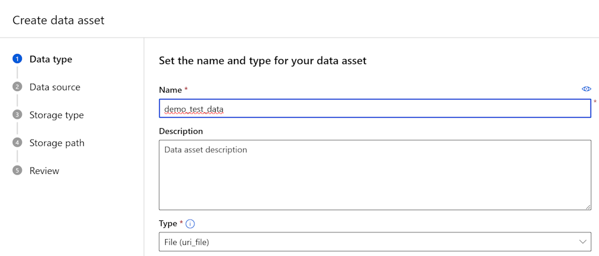
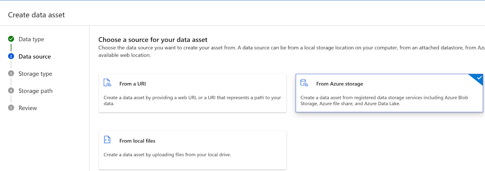
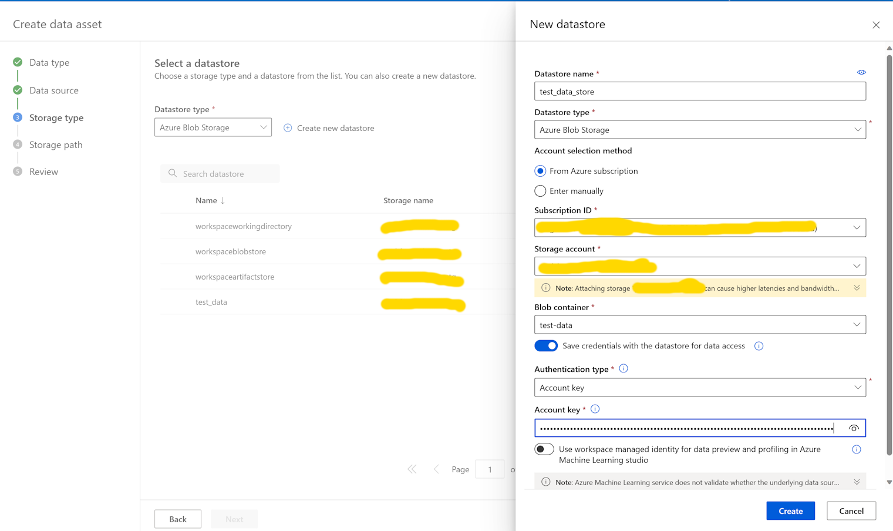
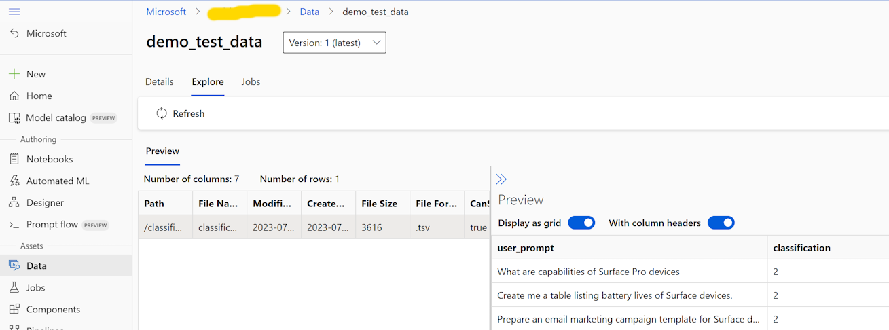
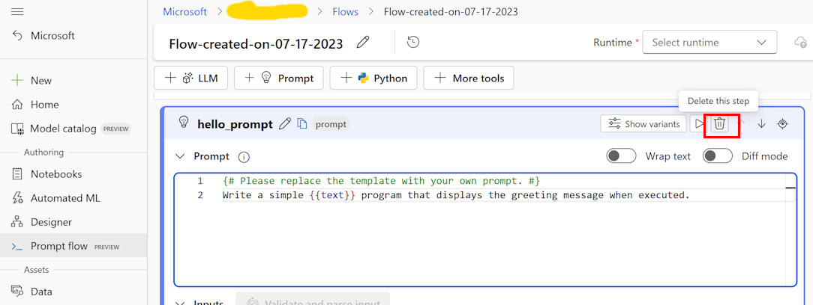
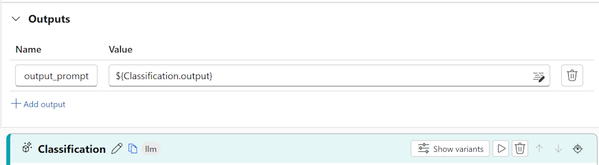
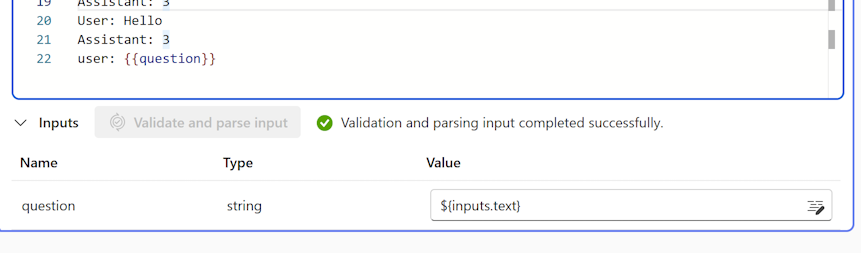
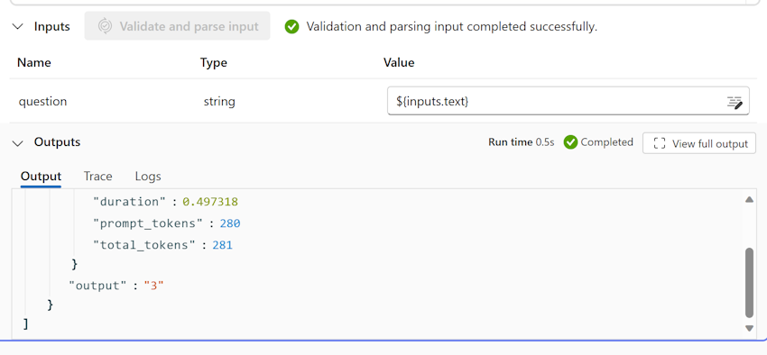

# Overview
This document guides you through creating and testing prompts (few-shot classifier) using Prompt flow.

NOTE: These steps are not needed for the demo to work. The demo repository already includes the few-shot classifier in the [code](../app/backend/bot_config.yaml). Use this document to update the classifier, build a new one, or perform a batch test on them.

## Assumptions:
1. An AML workspace has been created and [Prompt flow](https://github.com/MicrosoftDocs/azure-docs/blob/main/articles/machine-learning/prompt-flow/get-started-prompt-flow.md) is enabled on it. 

## Steps
There are 2 categories of work to be done:
1. Setup dataset to be used for batch testing of the classifier. A sample [test file](../data/classification_bulk_test.tsv) is included in the data/ folder.
2. Setup Prompt Flow to do few-shot classification using LLM.

### Setup Dataset
1. Upload the test file for bulk testing the flow to an Azure blob store. You could create a new container in the storage account that was created as part of the AML Workspace and upload the [test file](../data/classification_bulk_test.tsv) to that container. In this document, a new container named "test_data" has been created and the test file has been uploaded in the classifier folder there. 
2. Using AML Workspace, create a new data set of type "File (uri_file)". Name it "demo_data_set"



3. For Data Source, select "From Azure Storage"



4. For Storage Type, select "Azure Blob Storage" from blob store and click on "Create new datastore"
5. Provide Datastore name, select Subscription ID of the storage account where the test file has been uploaded, select the Storage account and the blob container. For Authentication type, provide "Account key" paste account key of the Azure blob store where the test file has been uploaded.



6. Select the newly created datastore and click Next
7. For Storage Path, select the path where the test file has been uploaded. The demo file is uploaded in the "classifier" folder in the "test_data" container. Select the test file – “classification_test_no_history.tsv" and click Next
8. Once all validations pass, click Create.
9. Once creation succeeds, click on Explore tab, to see the details in the file. It should look something like below



### Setup Prompt Flow to do few-shot classification
1. In you AML workspace, Click on Prompt Flow, click on Create and Create Standard Flow
2. Delete the "hello_prompt" and "echo_my_prompt" steps as we will add a LLM step to do classification



3. Click on LLM step to insert an LLM based step in the flow.
4. Rename the step to "Classification" and configure the connection to point to an Azure OpenAI resource with gpt-4 model deployed, already.



5. In the Prompt section, copy and paste the below prompt. More details on how to do prompt engineering, can be found [here](https://learn.microsoft.com/en-us/azure/ai-services/openai/concepts/advanced-prompt-engineering?pivots=programming-language-chat-completions)
```
system:
You are an intent classifier for Microsoft Surface product Sales and Marketing teams. The user will input a statement. You will focus on the main intent of the user statement, and you respond with only one of four values - '1', '2', '3' or '4'. You will not try to respond to the user's question, you will just classify the user statement0 based on the below classification rule:
If user statement is about past sales, prices, stores or stock of products/devices/laptops, you respond with 1
If user statement is on specifications of products/devices/laptops or marketing them, you respond with 2
If user statement is chit chat or about non-Microsoft products, you respond with 3
If user statement is asking for more details about a previous question, you respond with 4
Examples:
User: How much stock of this are we currently carrying?
Assistant: 1
User: Give me its specifications
Assistant: 2
User: How many MacBook Air do we have in stock?
Assistant: 3
User: Tell me more about it
Assistant: 4
User: Which Surface device is good for student's use:
Assistant: 1
User: What can you help me with:
Assistant: 3
User: Hello
Assistant: 3
user: {{question}}
```


6. Update the value of the output. From the dropdown select ${Classification.output}
7. Scroll down and click on "Validate and parse input" button and map user question field to Inputs.Text field



8. Click on the "Run" button to run the classifier on the Input.Text field. By default this will be "Hello World!" But you can edit it and run again. You should see the output of the classifier in the Outputs section.



9. Now you can perform a Bulk Test. Click on the "Bulk test" button
10. Select the data set (created above), and click Next
11. For evaluation method, select "Classification Accuracy Evaluation".
12. Map the groundtruth and the prediction fields. Groundtruth to "data.classification" and prediction to "output.output_prompt"
13. Click Next to review the mappings and then Submit the job.
14. Once the job completes, review the Metrics and details to see the performance of the classifier
NOTE: For now we are just calculating accuracy score for the entire batch test. This could be improved by selectig more balanced set of utterances across different classes for testing and performing for detailed analysis like:
> 1. Per class precision/recall/F1 scores
> 2. Confusion Matrix
> 3. Aggregated weighted/macro/micro scores