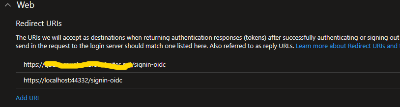
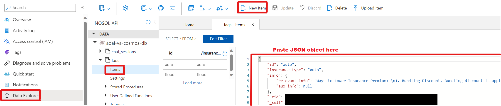
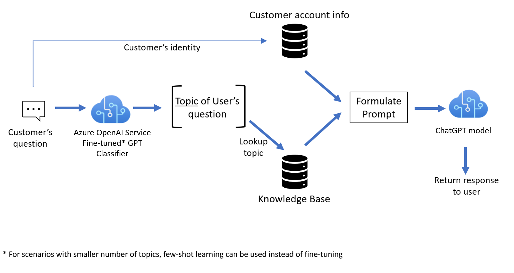
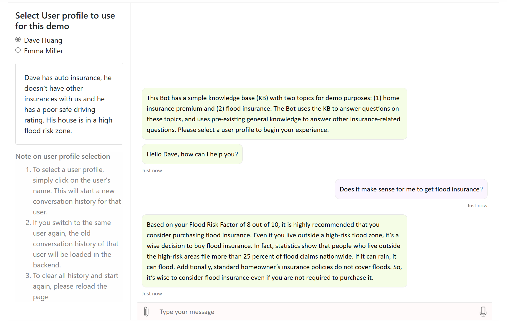

# <span style="color:red">Important Note</span>

Please expect frequent updates and development of this demo to adapt to the changes
and development of OpenAI offering in Azure. Your feedback and contributions are welcome!

<em>This demo doesn't have full coverage of the scenario, and is more highlighting ideas with how to work with AOAI in this setup. The VA enables a few 
scenarios and would function best within the boundaries of the script mentioned in this [document](./docs/Script.md)</em>

# News

We have released AOAI VA solution V0.1, which leverages ChatGPT in a multi-turn dialog enterprise scenario. 

## Introduction

This repository shows a simple approach to integration of GPT and ChatGPT in a multi-turn dialog solution. The solution entails the ability
to first identify the topic of the user input, and then the relevant knowledge source and user profile are used in ChatGPT to produce
a relevant and personalized response. This sample demonstrates how pre-existing enterprise information such as customer account details and FAQs can be used to enrich prompts for 
ChatGPT (i.e., prompt injection) and build a bot. The use case implemented by this sample is a bot for an insurance company call center. 

**This documentation is intended to outline how to set up this demo, alter the data and show how the overall architecture works.**

# Scenario
This demo is within the context of an insurance company's virtual assistant, that is addressing some customer questions about auto, and home flood insurance. It is aiming to 
upsell to the customers the services provided. Responses are personalized and the bot itself doesn't take actions, but rather makes a handoff to a real agent to process 
customer purchases. 

Multiple profiles have been provided as user data to allow for demonstration of how the model personalizes answers to user data.

**Implementation Notes** To get the best outcomes with customer response, ChatGPT technology requires some human supervision in call center scenarios. For example, in 
an implementation for production use, the bot's response may first go to a human agent who reviews it and responds to the customer, i.e. agent assist scenarios. The 
human agent may use the bot's response as-is or update it as they see fit before responding to the customer.

# Solution Components
The solution consists of the following components:

* src/botapp: This folder has the main components of the bot, which includes an orchestrator, session manager and model manager.
   -	The session manager uses CosmosDB as it’s underlying storage mechanism to store user’s sessions and chat history during that session.
   -	The model manager wraps Azure OpenAI APIs and has logic to compose prompts based on user’ profile information, chat history and FAQs. It produces the response that is sent to the user based on the user’s question
   -	The orchestrator is the one that looks at every user input, calls the classifier model, retrieves the necessary data and accordingly sends user profile, chat history and FAQ details to the model manager to generate the response for the given user input

* src/bot folder: This folder has a sample implementation of a bot using Microsoft Bot Framework. The solution is in python and uses the Bot Framework's python sdk, examples of which can be found on [GitHub](https://github.com/microsoft/BotBuilder-Samples/tree/main/samples/python). 

* src/botwebapp: This folder has a web app written in C#, that hosts [Web Chat control](https://learn.microsoft.com/en-us/azure/bot-service/bot-service-channel-connect-webchat?view=azure-bot-service-4.0) used for interacting with the user. The web app is also authenticated via Azure AD. Authentication has been added for securing the web app (your demo) when publishing the web to an azure web site. 
For local development and testing, using the [Bot Framework Emulator](https://learn.microsoft.com/en-us/azure/bot-service/bot-service-debug-emulator?view=azure-bot-service-4.0&tabs=csharp) will be much easier and is recommended.

   **The usage of Bot Framework and web chat control is only for demonstration purposes. All the logic is in the orchestrator (src/botapp) solution, so that any bot framework of your choice could be used to develop a bot using Azure OpenAI and ChatGPT.**

* src/notebooks: This folder includes notebooks with sample code on how to interact with Azure OpenAI services via API. The notebooks cover two scenarios: 
   - topic classifier implemented with a few-shot instruct text GPT model (text-davinci-003)

   - multi-turn conversational text understanding and generation using Azure OpenAI ChatGPT model (gpt-3.5-turbo)


# Setup (Local)
Here are the steps to run the solution locally:

1. Install Python 3.9 and setup a [python virtual environment](https://docs.python.org/3.9/library/venv.html) to use for this solution
2. Clone the repo
3. Create the required Azure Resources:
   - [Azure Bot](https://learn.microsoft.com/en-us/azure/bot-service/abs-quickstart?view=azure-bot-service-4.0&tabs=userassigned)
   - Azure Keyvault (to store secrets)
      * Give your account [Get] permissions for Key Vault: [how-To](https://learn.microsoft.com/en-us/azure/key-vault/general/assign-access-policy?tabs=azure-portal)
   - [Azure CosmosDb](https://learn.microsoft.com/en-us/azure/cosmos-db/nosql/quickstart-dotnet?tabs=azure-portal%2Cwindows%2Cpasswordless%2Csign-in-azure-cli#setting-up) (to store user conversation sessions, user profile and FAQs used for demo)
   - Azure OpenAI (for classification and user response generation)
      * GPT3.5 deployment
      * ChatGPT deployment
   - Azure Cognitive Services (for doing speech to text when using webchat control)
   - Azure [App registration](https://learn.microsoft.com/en-us/azure/app-service/configure-authentication-provider-aad#-step-1-create-an-app-registration-in-azure-ad-for-your-app-service-app) to authenticate web app (hosting the web chat control). Needed only when deploying your demo to Azure web app service

## 1. Setup Bot API
This bot has been created using [Bot Framework](https://dev.botframework.com), it shows how to create a simple bot that accepts input from the user and uses Azure OpenAI services to generate responses back for the user.

### How to run

1- Activate python virtual environment

2- Install required libraries
   - From the command prompt go to repo/src/bot and Run `pip install -r requirements.txt` to install all dependencies

3- Update environment variables in the repo/src/bot/.env file
   - ORCHESTRATOR_BASE_URL= "http://localhost:8080"
   - KEYVAULTNAME="Name of the keyvault created earlier" 

4- Run `python app.py`

5- Test the bot using Bot Framework Emulator

   - [Bot Framework Emulator](https://github.com/microsoft/botframework-emulator) is a desktop application that allows bot developers to test and debug their bots on localhost or running remotely through a tunnel.

   - Install the Bot Framework Emulator version 4.3.0 or greater from [here](https://github.com/Microsoft/BotFramework-Emulator/releases)

   - Connect to the bot using Bot Framework Emulator

   - Launch Bot Framework Emulator
   - Enter a Bot URL of `http://localhost:3978/api/messages`

If the bot api is running successfully on port 3978 and the Bot Framework Emulator is connected to this bot, you should be able to send messages via emulator and debug the code in the Bot API. At this point, the entire demo may not work as the orchestrator and other pieces of the solution have not been deployed yet.

## 2. Setup Bot Web App
The Bot Web App, is a web application that hosts webchat control and acts as an UI for user to interact with the bot. This is used only if you want to publish your app. For running and testing locally, this step can be skipped.

### How to run

1- Go to repo/src/botwebapp/Bot.Web and open the Bot.sln. This will open the solution in Visual Studio. The solution is set to use [.Net 7.0](https://dotnet.microsoft.com/en-us/download/dotnet/7.0)

2- Update the appsettings.Development.json file

   ```
   "WebchatSecret": "web chat secret from Azure Bot's web chat channel",
   "SpeechSubscriptionKey": "cognitive services subscription key",
   "SpeechServiceRegion": "region where cognitive services was deployed",
    "AzureAd": {
    "Instance": "https://login.microsoftonline.com/",
    "ClientId": "client ID of the Azure App registration created for authentication",
    "TenantId": "tenant ID where your Azure App registration was created for authentication",
    "CallbackPath": "/signin-oidc",
    "SignedOutCallbackPath ": "/signout-callback-oidc"
   }
   ```
3- Press F5 to run the app locally. The app will run on port: 44332. Ensure that https://localhost:44332 is included as a Redirect URI in the App registration


If all the configuration is correct, you should be prompted to authenticate with Azure AD and then the **Home** page should launch which includes the web chat control for users to interact with the bot.

## 3. Setup botapp (orchestrator and model manager)
The orchestrator and model manager are the core components of the bot. This project has all the logic to understand user conversation and uses Azre OpenAI services to generate the responses to the user's questions. It does use the information in the User Profile and FAQs to generate personalized responses. 

### How to run
1- Activate python virtual environment

2- Install required libraries
   - From the command prompt go to repo/src/botwebapp and Run `pip install -r requirements.txt` to install all dependencies

3- Update environment variables in the repo/src/bot/.env file
   - PORT= "8080"
   - KEYVAULTNAME="Name of the keyvault created earlier" 

4- Run `python main.py`
If the botapp is running successfully on port 8080 then at this point we have the entire solution running end to end locally.

To do a test end to end, make sure Bot API is runing on port 3978 **(1 Setup Bot API)**, connect the Bot Emulator to this bot and send a message. The message should be posted to Bot API and from there relevant data should be posted to the orchestrator.

## 4. Bot Demo Data 

Before running the bot, we will need to pre-populate the Cosmos DB containers that have been created by the setup script with the knowledge base and customer account information.

### Knowledge Base

- For the `faq` container, upload the JSON files [in this directory](./botapp/data/prepopulated/faq) as individual items in the Cosmos container.
- This sample has KB entries stores that should be populated in a Cosmos DB container. This knowledge base includes elements that are relevant to each topic the bot is designed to address and match to the user question. In practice, any other suitable storage can be used for this purpose. An enterprise may have an existing KB system which can be used for this purpose as well. The sample uses a small number of KB entries for illustration purposes. In practice, an enterprise may have an extensive KB used by their customer support teams and call center agents, and such pre-existing KBs can be used for an implementation. 

### Customer Account Info  

- For the `user_profile_flat` container, upload the JSON files [in this directory](./botapp/data/prepopulated/user_profiles_flat) as individual items in the Cosmos container.
- This sample allows for the selection of the customer identity from a set of pre-canned profiles upon launching the bot. Once selected the bot continues throughout the session using this profile. Changing the profile mid-session, while possible, will not produce reliable results. If you want to change the user profile, please refresh the bot webapp home page and start over. The current pre-canned user data is stored in an Azure Cosmos DB container and should be accessible through the bot to enable retrieving the information and using it in the prompt. In an enterprise setting, this data would be retained in already existing systems and could be linked to the bot.

### Uploading data to Cosmos container in Azure portal

- To pre-populate the data needed above through the Azure portal, simply navigate to the Cosmos DB Account created by running the setup script, then click on the "Data Explorer" tab, then click on the container, then "Items" and finally "New Item". Paste the JSON into the editor window.



### Session Data
- The session data doesn't need to be pre-populated as it will be created as users chat with the bot agent. It will be stored in the `chat_sessions` container.
- The session includes the user input, as well as the output of the topic classifier and the bot response. The session is determined using the conversationID generated by the Bot Framework.


# Workflow
- The following figure shows an overview of the solution 



## Workflow components   

* Topic Classifier: This is responsible to determine the topic of the user input. The topic not only includes the business-related concepts but extends to include identifying if the input is a chitchat and if it is irrelevant to the scope of this virtual assistant. It also can be tuned to determine state like when the conversation is coming to an end. The topic classifier is a few shot model that uses the text-davinci-003 GPT base model. This 
model is effective for classification tasks and is very powerful. It might be worth noting that a smaller, and cheaper model could be developed for a specific enterprise using their own data to perform the topic classification task.

* Text Generation: This component leverages ChatGPT to both understand the context and generate personalized responses to the current conversation. The exact prompt and how to form it will be discussed later in this file. The ChatGPT, using gpt-3.5-turbo as the base model, is used in this demonstration. It leverages the ability to both extract relevant information from the prompt and respond to a multi-turn conversation appropriately. The full context of the user and bot interaction, relevant to the current topic, is used in the prompt in addition to the relevant information surfaced from a knowledge base for the specific topic. 

In addition, a dynamic tone modulator could be added, to help guide the tone and dynamic responses (through changing the ChatGPT parameters) in response to the user input and the current state. This would be injected into the prompt to help tune the output accordingly. In the current prompt used in this demo the tone is preset in the prompt to be "friendly".

# Run Time Architecture

The following figure illustrates the architecture of the runtime solution that enables the virtual assistant solution.


## Architecture Details
The runtime architecture of the chatbot includes a few components that enable a chatbot implementation. The core components includes:

* Orchestration: This module interfaces with the bot layer to exchange the user input as well as the response. The orchestrator retains the conversation state that is assessed during the dialog. This includes the topic of the current input as well as the full 
transcript and session history. The transcript includes the response by ChatGPT in addition to the user input. This history is used in the generation of the prompt with the relevant context. The orchestrator also has access to the appropriate knowledge base to include in the prompt. With the relevant data, the orchestrator calls the model manager module to perform the API call to GPT or to ChatGPT.

* Model Manager: This module is responsible for forming the prompt, with the information elements passed to the model manager as well as the context and prompting information. The model manager combines the different pieces to provide a personalized prompt with the right context and transcript. The model manager also understands how to parse the ChatGPT response, and extract only one response that it would share with the orchestration layer to send to the user and retain in the session memory store.

* Cognition: This handles the GPT or ChatGPT API calls based on the prompt passed from the model manager. It returns the response to the manager to parse.

* Bot layer: This is a shell layer for managing the user interaction. For the purpose of this demonstration, this bot shell is based on the Bot Framework.

* User Interaction layer: This is a web app that hosts web chat control that is connected to the bot layer via web chat channel. User uses the web chat control to interact with the bot. The web app also has minimal controls to aid in this demo.

* Data Store: The user data and the knowledge base is stored in a Azure Cosmos DB, and is retrieved based on the user selected and/or the topic of the user input.

* Session history: The session history, for each user for a current session (identified by a consistent conversationID) is retained in an Azure Cosmos DB. The user input, in addition to the topic identified, as well as the bot response are all retained in the session history. This history is used in multiturn conversation to provide ChatGPT with context if needed.

# Example Usage



For the above dialog and the current user input, the orchestrator fetches the user profile as well as the relevant information about home flood insurance, which include the 

    * Reasons to buy flood insurance:  
        1. Standard homeowner's insurance policies do not cover floods. So, it's wise to consider flood insurance even if you are not required to purchase it.  
        2. Even if you live outside a high-risk flood zone, it's a wise decision to buy flood insurance. In fact, statistics show that people who live outside the high-risk areas file more than 25 percent of flood claims nationwide. If it can rain, it can flood. Flood zones are areas where there is a higher statistical probability of a flood occurring  
        3. The Federal Emergency Management Agency calculations show that 1 inch of water can cause $25,000 worth of damage to your home. 18 inches or more of water could mean repairs to the electrical system and the heating and cooling system. It also means replacing doors, appliances and cabinetry.
and 

    * Reasons to not buy flood insurance:  
        1. You may live somewhere with a low risk of flooding  
        2. Flood insurance only covers up to $250,000 for your property and $100,000 for your personal belongings  
        3. The average cost of flood insurance was $780 per year in 2022
 
 Using this data, the prompt is formed in the following manner

```
[
  { "token": "<|im_start|>" },
  "system\nAssistant is a home flood insurance advisor in a call center for the insurance company Premier Insurance.",
  "Assistant helps users by answering their questions about home flood insurance plans",
  "Assistant provides personalized recommendations to users by considering user's account information and matching",
  "that against other information relevant to the topic.",
  "Assistant works for Premiere Insurance and should not refer user to any other insurance companies.",
     
  "Assistant refers to the content (A, B, C) below when reply to user questions:"
     
  "Content A: User Account Information",

  "<USER PROFILE DATA>",
  
  "Content B: Reasons to buy flood insurance:",
     "1. Standard homeowner's insurance policies do not cover floods. So, it's wise to consider flood insurance even if you",
        "are not required to purchase it.",
     "2. Even if you live outside a high-risk flood zone, it's a wise decision to buy flood insurance. In fact, statistics ",
        "show that people who live outside the high-risk areas file more than 25 percent of flood claims nationwide. If it can ",
        "rain, it can flood. Flood zones are areas where there is a higher statistical probability of a flood occurring",
     "3. The Federal Emergency Management Agency calculations show that 1 inch of water can cause $25,000 worth of damage to ",
        "your home. 18 inches or more of water could mean repairs to the electrical system and the heating and cooling system.",
        "It also means replacing doors, appliances and cabinetry.",
  "Content C:Reasons to not buy flood insurance:",
     "1. You may live somewhere with a low risk of flooding",
     "2. Flood insurance only covers up to $250,000 for your property and $100,000 for your personal belongings",
     "3. The average cost of flood insurance was $780 per year in 2022",
  "How assistant respond to user's question:",
     "1: Assistant replies to the user's question by using relevant information on the topic from Content B and C.",
     "2: Assistant provides personalized recommendations to user based on user's account information (Content A). ",
        "If a user asks about flood insurance, include the details of the home address and flood factor in the reply.",
     "3: Assistant should prioritize recommending bundling if user's account information (Content A) indicates that",
  "user does not currently have bundling.",
     "4: Only when a user asks about cost of insurance plans, reply with \"For that, let me connect you with a quote ",
  "specialist who can then help you further. Please hold while I connect you\".",
     "5: Assistant doesn't repeat previously provided information.",
     "6: Assistant uses a friendly tone.",
  { "token": "<|im_end|>" },
  "\n",
  { "token": "<|im_start|>" },
  "user\nHow are you",
  { "token": "<|im_end|>" },
  "\n",
  { "token": "<|im_start|>" },
  "assistant\nI am doing well!",
  { "token": "<|im_end|>" },
  "\n",
  { "token": "<|im_start|>" },
  "user\nI have a question about home insurance: can I also get flood insurance with it?",
  { "token": "<|im_end|>" },
  "\n"
]
```
       
## Further reading
- [Azure OpenAI Service](https://learn.microsoft.com/en-us/azure/cognitive-services/openai/overview)
- [ChatGPT](https://learn.microsoft.com/en-us/azure/cognitive-services/openai/chatgpt-quickstart?tabs=command-line&pivots=programming-language-studio)
- [Compose Prompts](https://learn.microsoft.com/en-us/azure/cognitive-services/openai/how-to/chatgpt)
- [Bot Basics](https://docs.microsoft.com/azure/bot-service/bot-builder-basics?view=azure-bot-service-4.0)
- [Bot Framework SDK](https://docs.microsoft.com/azure/bot-service/bot-service-overview-introduction?view=azure-bot-service-4.0)
- [Azure Bot Service Documentation](https://docs.microsoft.com/azure/bot-service/?view=azure-bot-service-4.0)
- [Channels and Bot Connector Service](https://docs.microsoft.com/azure/bot-service/bot-concepts?view=azure-bot-service-4.0)
- [Azure Portal](https://portal.azure.com)
