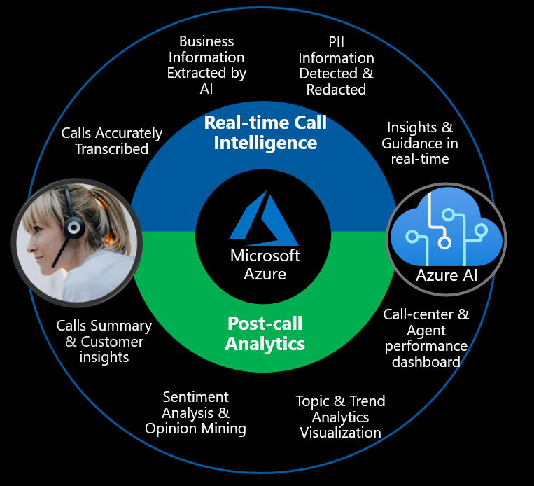

# AI Powered Call Center Intelligence Accelerator
The Call Center Intelligence Accelerator drives huge cost saving in call center operations while improving call center efficiency & customer satisfaction.

It uses Azure Speech, Azure Language and Azure OpenAI (GPT-3) services to analyze call center transcrips, extract and redact personally identifiable information (PII), summarize the transcription, and provides rich business insights that could be used in real-time. It delivers deeper business insights for managers and enables them to evaluate call center performance far more efficiently and effectively in real-time and batch scenarios. Data insight on customer sentiment, topic analysis, and other valuable call attributes are served up in a user-friendly visual dashboard in Power BI.

The diagram below depicts key business outcomes that this solution could help accelerate 

This is a sample accelerator for Call Center Intelligence powered by Azure AI. It shows how Azure AI services could be used both in real-time and post-call analytics scenarios for an Intelligent Contact Center.

[Read more](https://github.com/amulchapla/AI-Powered-Call-Center-Intelligence)
