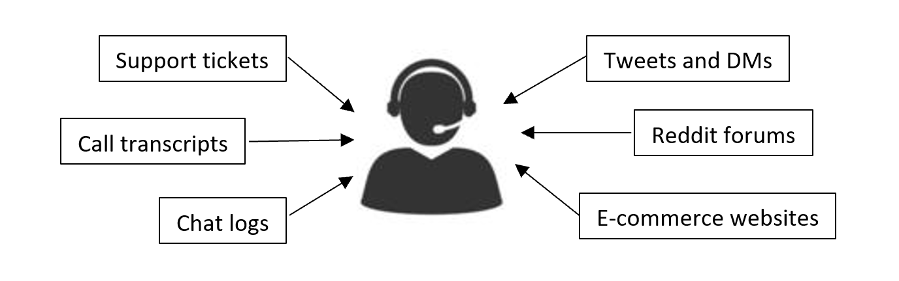

# Insights Generator

## Overview
With Open AI GPT models, it is now possible to intake user queries and intents in natural language and provide a coherent formulated response. While traditional GPT explorations are focused on creating new content based on simple user prompts (email generation, tweet replier etc.), Insight Generator aims to go a step further. With IG, we aim to provide actionable outputs and knowledge on top of customer data.

In modern businesses, data and analytics are crucial in defining business direction and strategy. Currently businesses rely on multiple tools and methods to garner insights from unstructured and raw data. This raw data can also have multiple forms like sales numbers, employee performance stats, customer feedback, customer support logs etc. It is a humongous task to collate all this diverse information, assimilate it, understand patterns, and then come up with insights that are actionable and useful. Incoherent understanding or incomplete analysis can also lead to incorrect and detrimental decisions.

The broad segment of customers who face this regularly are the managers and decision makers in the organization. They are responsible for having a big-picture view and creating strategy. Consider the persona of a customer support manager or a customer relationship manager. They are responsible for the overall CSAT rate and NPS figures for a product, and they need to look at multiple points of data in their day-to-day work. 



This is all feedback data incoming from various sources in multiple formats. They look at the call transcripts and support tickets addressed by their agents and try to ascertain the overall sentiment of the customer. They aim to identify the key areas of concern correlate it with any product improvement plans. They also rely on these logs to judge the performance of their agents. Apart from this, they also regularly monitor social media networks for any murmurs from their customers and peruse product listing pages to identify key feedback areas. Having this 360-degree view is essential for them to ensure that they have an idea of what the overall customer sentiments are regarding the product and what are the primary areas of concern.

However, often despite having loads of data on their fingertips they face analysis paralysis where they cannot form a conclusive insight. They are also not very proficient in code and other ways of data analysis and they have to rely on others for this information. This leads to a loss of executive time and brings in inherent inaccuracies. Insight generator aims to short circuit this process which requires months of analysis and data monitoring. With insight generator, a customer support 	manager will be able to get automatically generated insights and reports on data of their choice. They would also be able to interact with the system in natural language and get deeper and pointed information on demand.   

## In this folder

This folder contains prompt templates and code samples that can be used to get insights and knowledge from raw unstructured data. 
These IG samples comes in two flavours:
* IG for product reviews
* IG for group chats
IG extracts high level summaries and dominant topics from the text corpus.
Various detailed insights are accompanied with supporting references, action items and statistics.
The tool scales to large number of documents, and will handle more documents than can fit in a prompt.

Insights generator is a proof of concept code sample. A list of limitations is included.
The helper functions and intermediate outputs are exposed and the notebooks can be extended beyond the current use cases easily.

## Requirements
Python 3.5.2+

## Usage
Install the insights\_generator package by following the following commands.
From within the root directory:

```
pip install -r requirements.txt
pip install .
```

Then run:
1. Insights Generator Notebook.ipynb (product reviews use case)
2. InsightsGeneratorMinecraftSynthetic.ipynb (group chat use case)

> **Note:** Any references to Minecraft are purely for illustration and do not represent any relation to the actual Minecraft game. The sample reviews data provided is fictional.

## Data Format

For InsightsGeneratorMinecraft.ipynb, please use the file sample_reviews/minecraft_massage.py to create data for use by the notebook.

## Best Practices

### Staging
A straightaway prompt to GPT models doesn’t always lead to the best results. Simply asking the model to “summarize the text” can lead to inadvertent errors and hallucinations. Using staging, the model can be coaxed to provide better responses through step by step guides. Hence, break down any complex task into sub tasks. Ask the model to perform sub task #1 and then use its output for sub task #2.

### Grounding
Grounding the model to display results only from the provided context ensures that hallucinations are limited. Judicious use of prompts like “Answer questions using only the facts in the text mentioned above” can allow outputs drawn from the provided context only. 

## Limitations

The chief errors are due to hallucinations by GPT.
This can be controlled by a human-in-the-loop approach,
eg checking the topic summaries against the references in InsightsGeneratorMinecraft.ipynb

The second mode of errors is due to omissions of topics / content in the insights.
This can be controlled by examining the intermediate outputs eg the batchwise summaries in InsightsGeneratorMinecraft.ipynb

In the Insights Generator Notebook.ipynb, only aspects that are signficantly positive or significantly negative
are summarized. Aspects that are mixed are not summarized.
