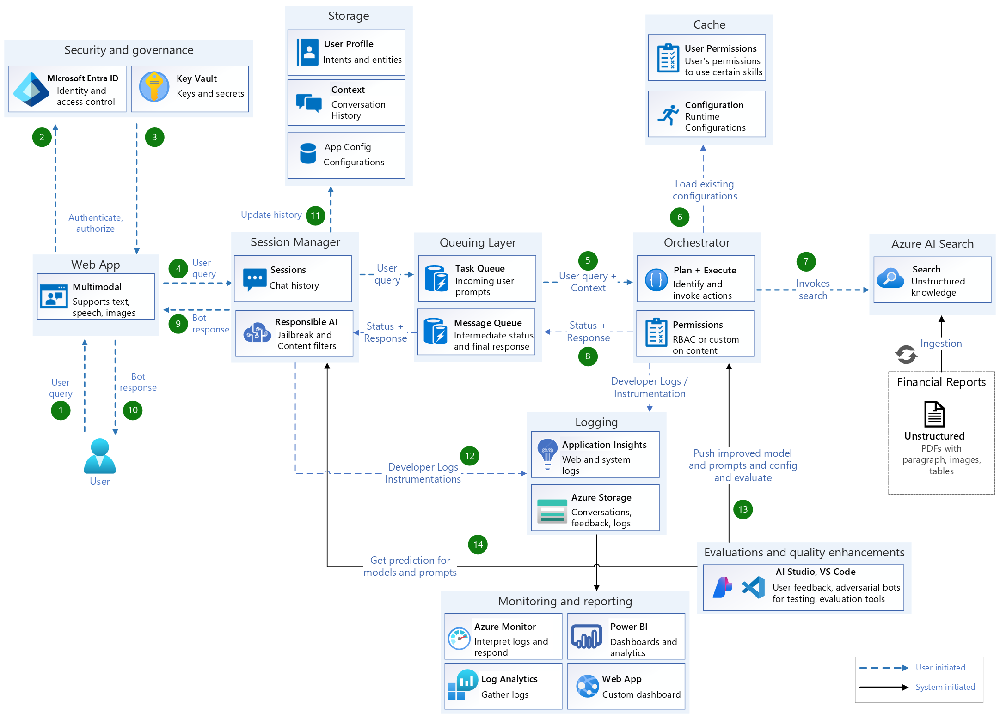
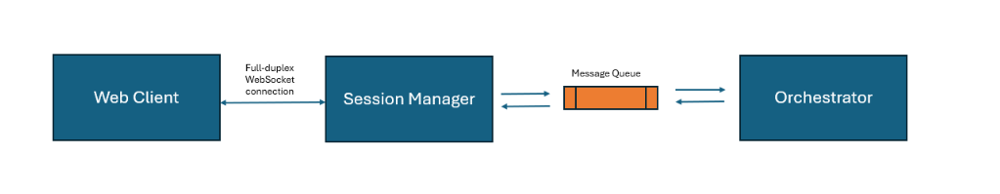
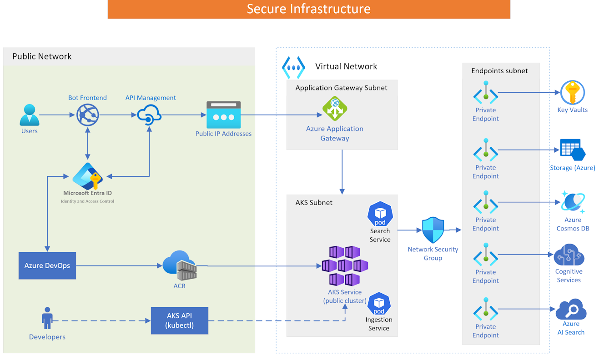

## SOLUTION CAPABILITIES

## Table of Contents

- [System Architecture](#system-architecture)
- [Microservice and AI Skills](#microservice-and-ai-skills)
  - [Ingestion Service](#ingestion-service)
  - [Search Service](#search-service)
  - [Session Manager](#session-manager) 
  - [Orchestrator](#orchestrator)
  - [Configuration Service](#configuration-service)
  - [Data Service](#data-service)
- [Sharing Intermediate Results](#sharing-intermediate-results)
- [Architecture Features](#Architecture-features)
- [Secure Runtime and Deployment of Copilot](#secure-runtime-and-deployment-of-copilot)
  - [Security](#security)
  - [Composability](#composability)
  - [Iterability](#iterability)
  - [Logging and Instrumentation](#logging-and-instrumentation)

### SYSTEM ARCHITECTURE

### Microservice and AI Skills

#### Ingestion Service
Ingestion service is a generic service that use different Azure AI services to enrich the content (chunks) as it indexes them to improve search quality.
For example, when indexing financial documents, the service has the capability to extract and add additional metadata to the chunks.

The ingestion process primarily consists of three steps: Document Loading, Document Parsing, and Document Indexing.

For more details refer ingestion service documentation [Ingestion Service](./src/skills/ingestion/README_FINANCIAL.md).

#### Search Service

Once the Ingestion pipeline is executed successfully resulting in a valid, queryable Search Index, the Search service can be configured and integrated into the end-to-end application. 

The Search Service exposes an API that enables users to query a search index in Azure AI Search. It processes natural language queries, applies requested filters, and invokes search requests against the preconfigured search configuration using the Azure AI Search SDK.  

For more details refer search service documentation [Search Skill](./src/skills/search/README.md).

#### Session Manager

Maintains the context of ongoing interactions by tracking conversation history and unique session IDs, ensuring continuity and coherence in multi-turn interactions. This is useful when user has follow up questions. Example: User has already honed down a product and would now like to get matching pair of clothing or accessory.

#### Orchestrator

The orchestrator service acts as the central controller, coordinating between various components: 

- Rephraser and Generate Search Queries: Analyzes the conversation history to rephrase the user’s query, maintaining context and coherence.
Enhances search queries by breaking them into multiple subqueries. For example, if the user requests information for multiple time periods, a distinct query is generated for each period to improve search accuracy.

- Skill Executor: Invokes the search skill using the refined queries from the previous step. 

- Final Answer Generator: Compiles the final answer based on the results from various skills and returns it to the user. 
 

#### Configuration Service

The runtime configuration service enhances the architecture's dynamicity and flexibility. It enables core services and AI skills to decouple and parameterize various components, such as prompts, search data settings, and operational parameters. These services can easily override default configurations with new versions at runtime, allowing for dynamic behavior adjustments during operation. The biggest benefit of the configuration service is its ability to expose different configurations for various microservices during runtime, making processes like evaluations much easier - no need for any more deployments. This could also be used to demo against different search indexes as well. Example: default index is the one that is with this repo. However you can bring your own product catalog and create a new Index and use that via runtime configuration. More details on how to configure the entire demo for your data is [here](./SETUP.md/#build-your-own-copilot)

For more details refer config service documentation [Configuration Service](./src/config_hub/README.md).

#### Data Service

The Data Service is responsible for managing all database interactions related to chat sessions and user profiles. Its primary functionalities include:

- Chat Session Management:
  - Create: Initializes new chat sessions in the database.
  - Update: Updates ongoing chat sessions with new data, such as user inputs or system responses.
  - Get: Retrieves existing chat sessions based on session identifiers.
- User Profile Management:
  - Create: Adds new user profiles to the database, including user-specific information such as preferences or settings.
  - Get: Fetches details for a specific user profile based on user identifiers.
  - Get All: Retrieves a list of all user profiles stored in the system.

### Sharing Intermediate Results

The solution also supports sharing intermediate bot results, giving users insight into the bot's progress after submitting a query. This feature is particularly valuable for queries that take a long time to process. As soon as the user sends a query, the orchestrator provides updates like “Searching for...,” or “Retrieved XX results...” before delivering the final answer.

The custom copilot project is designed to handle various tasks using a robust and scalable architecture. The architecture includes the following key aspects:

### Architecture Features

#### Security

- **User Authentication**: The solution uses Microsoft Entra ID for user authentication, ensuring secure access to the system.
- **Network Security**: All runtime components are locked behind a Virtual Network (VNet) to ensure that traffic does not traverse public networks. This enhances security by isolating the components from external threats.
- **Managed Identities**: The solution leverages managed identities where possible to simplify the management of secrets and credentials. This reduces the risk of credential exposure and makes it easier to manage access to Azure resources.

#### Composability

- **Modular Design**: The solution is broken down into smaller, well-defined core microservices and skills that act as plug-and-play components. This modular design allows you to use existing services or bring in new ones to meet your specific needs.
- **Core Microservices**: Backend services handle different aspects of the solution, such as session management, data processing, runtime configuration, and orchestration.
- **Skills**: Specialized services provide specific capabilities, such as Azure AI search and image processing. These skills can be easily integrated or replaced as needed.

#### Iterability

- **Configuration Service**: The solution includes a configuration service that allows you to create runtime configurations for each microservice. This enables you to make changes, such as updating prompts or search indexes, without redeploying the entire solution.
- **Per-User Prompt Configuration**: You can use the configuration service to apply different configurations for each user prompt, allowing for rapid experimentation and iteration. This flexibility helps you quickly adapt to changing requirements and improve the overall system.
- **Testing and Evaluation**: The solution also comes with the ability to run dummy/simulated conversations in the form of nightly runs, end-to-end integration tests on demand, and an evaluation tool to perform end-to-end evaluation of the copilot.

#### Logging and Instrumentation

- **Application Insights**: The solution integrates with Azure Application Insights for logging and instrumentation, making it easy to debug by reviewing logs.
- **Traceability**: You can trace what is happening in the backend using the `conversation_id` and `dialog_id` (unique GUIDs generated by the frontend) for each user session and interaction. This helps in identifying and resolving issues quickly.

### Secure Runtime and Deployment of Copilot

The architecture ensures that all components are protected within a virtual network, leveraging Azure services to maintain high security and performance. Key elements include:

- **Public Network Interaction**: Users access Copilot through a Bot Frontend, with API Management handling requests.
- **Microsoft Entra ID**: Helps manage identity and access control, ensuring secure authentication.
- **Azure DevOps**: Facilitates continuous integration and deployment, with Docker images stored in Azure Container Registry (ACR).
- **Secure Virtual Network**: The Azure Application Gateway manages incoming traffic, routing it to the Azure Kubernetes Service (AKS) cluster. The AKS cluster hosts essential services like Search and Ingestion, protected by a Network Security Group (NSG).
- **Endpoint Security**: Private endpoints connect to critical services like Key Vaults, Azure Storage, Cosmos DB, and Azure AI Services, ensuring data remains secure and private.

More details on the securing the runtime infrastructure, check out the [secure_runtime_architecture.md](docs/secure_runtime_architecture.md) in the `/docs` folder.
