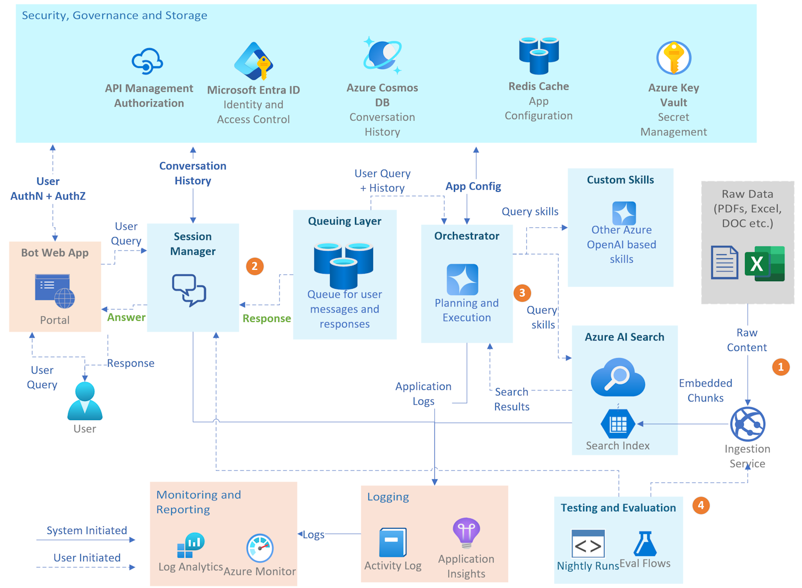

# Advanced RAG Solution Accelerator

This is a solution accelerator that supports advanced techniques for ingesting, formatting and intent extraction from structured and non-structured data and querying the data through simple web interface to achieve improved accuracy and performance rates than baseline RAG.

To read more about the underlying design principles and architecture, and solution capabilities, please refer to the solution documentation here: [Advanced RAG Solution Accelerator Documentation](./docs/advanced_rag_solution_accelerator_documentation.docx).

#### ❗Important❗

* Content in this repository are for demo purposes only and not intended for 'production-ready' workloads. It focuses on showcasing the advanced RAG techniques used to improve baseline accuracy and performance of standard RAG techniques.
* In the context of a financial demo, it's important to understand the distinction between Microsoft's fiscal year and the calendar year. Microsoft's fiscal year runs from July 1st to June 30th of the following year, whereas the calendar year follows the traditional January 1st to December 31st timeline. 
* For more information on best practices on evaluation, architecture or validation of the solution design and outputs, please see the 'Additional Resources' section in solution documentation: [Advanced RAG Solution Accelerator Documentation](./docs/advanced_rag_solution_accelerator_documentation.docx).

## Table of Contents
- [Use Case: Copilot for Financial Reports](#use-case-copilot-for-financial-reports)
- [Features](#Features)
- [Architecture](#Architecture)
- [Getting Started](#getting-started)
- [Code of Conduct](#code-of-conduct)
- [Responsible AI Guidelines](#responsible-ai-guidelines)
- [Dataset License](#dataset-license)
- [License](#license)

## Use Case: Copilot for Financial Reports
A custom Retrieval-Augmented Generation (RAG) application can be highly beneficial when dealing with large financial datasets like quarterly reports and multi-year company performance records. Here's why such a custom solution may be necessary:

- Efficient Handling of Large Data Volumes: Financial data accumulated over multiple years can be massive. Standard off-the-shelf solutions might struggle with performance issues when indexing, retrieving, and processing such extensive datasets. A custom RAG application can be optimized to handle large volumes efficiently, ensuring quick response times.

- Domain-Specific Knowledge and Contextual Understanding*: Financial data is rich with industry-specific terminology, acronyms, and complex concepts. A custom RAG model can be trained on domain-specific corpora to better understand and generate accurate responses related to financial statements, performance metrics, and regulatory filings.

- Enhanced Query Capabilities*: Financial professionals may need to ask complex queries that involve conditional logic, comparisons over time, or aggregations across different data dimensions. A custom solution can support advanced querying capabilities, natural language understanding tailored to financial contexts, and more accurate interpretation of user intent.

To showcase the solution’s capabilities, a pre-recorded voiceover demonstrates its functionality, ranging from simple queries to complex multimodal interactions. [Insert demo link here.]

## Features
The repository includes a complete end-to-end solution, comprising:

- **A frontend application** for seamless user interaction
- **Backend microservices** to handle core functionalities
- **A dataset** of financial reports to quickly set up and test the solution
- **A generic ingestion service** that enhances chunks with metadata to drastically improve search results

## Architecture
The solution includes the following key components:

1. **Ingestion Service**: The ingestion service includes various enhancements to ensure that when raw content is ingested, there is minimum loss of information. Additional metadata is added to the chunks to the index to make search results more relevant.

2. **Enhanced User Interaction**: This includes a frontend for users to interact with the bot and an implementation of a queuing layer in the backend. This allows users to send multiple questions to the copilot, and the copilot can produce multiple responses to a user query, making the overall experience more engaging.

3. **Core Microservices and Skills**: This includes the Orchestrator, which executes various skills to best address the user query. The core microservices handle different aspects of the solution, such as session management, data processing, runtime configuration, and orchestration. Specialized skills provide specific capabilities, such as search skill designed specifically for financial domain.

4. **Testing and Evaluation**: This includes the ability to simulate conversations with the copilot, run certain end-to-end tests on demand, and an evaluation tool to help perform end-to-end evaluation of the copilot.

Detailed architecture for the eCommerce Copilot can be found [here](ARCHITECTURE_RAG.md)

## Getting Started  
To set up and start using this project, follow our [Getting Started Guide](SETUP_RAG.md). It provides step-by-step instructions for both Azure resources and local environments.

## Code of Conduct

This project has adopted the [Microsoft Open Source Code of Conduct](https://opensource.microsoft.com/codeofconduct/).

Resources:

- [Microsoft Open Source Code of Conduct](https://opensource.microsoft.com/codeofconduct/)
- [Microsoft Code of Conduct FAQ](https://opensource.microsoft.com/codeofconduct/faq/)
- Contact [opencode@microsoft.com](mailto:opencode@microsoft.com) with questions or concerns

For more information see the [Code of Conduct FAQ](https://opensource.microsoft.com/codeofconduct/faq/) or
contact [opencode@microsoft.com](mailto:opencode@microsoft.com) with any additional questions or comments.

## Responsible AI Guidelines

This project follows below responsible AI guidelines and best practices, please review them before using this project:

- [Microsoft Responsible AI Guidelines](https://www.microsoft.com/en-us/ai/responsible-ai)
- [Responsible AI practices for Azure OpenAI models](https://learn.microsoft.com/en-us/legal/cognitive-services/openai/overview)
- [Safety evaluations transparency notes](https://learn.microsoft.com/en-us/azure/ai-studio/concepts/safety-evaluations-transparency-note)

## Dataset License

This dataset is released under the Community Data License Agreement – Permissive, Version 2.0 - CDLA, see the [LICENSE-DATA](LICENSE-DATA.md) file.

## License

This project is licensed under the MIT License. See the [LICENSE](./LICENSE) file for details.