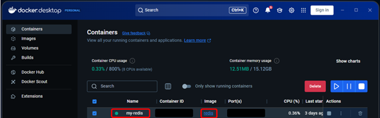

# Getting Started

## Table of Contents

- [Setting Up Azure Resources](#setting-up-azure-resources)
  - [Prerequisites](#prerequisites)
  - [Deployment Steps](#deployment-steps)
  - [Azure Manual Configuration](#azure-manual-configuration)
    - [Azure OpenAI](#azure-openai)
    - [Azure AI Search](#azure-ai-search)
    - [Creating App registration for user Authentication with EntraID](#creating-app-registration-for-user-authentication-with-entraid)
- [Deploying Services](#deploying-services)
  - [Running Services Locally](#running-services-locally)
    - [Prerequisites](#prerequisites)
    - [Verify Azure Resources](#verify-azure-resources)
    - [Setup CosmosDB Emulator](#setup-cosmosdb-emulator)
    - [Project Initialization](#project-initialization)
      - [Frontend](#frontend)
      - [Core Microservices](#core-microservices)
    - [Ingesting Financial data for testing](#ingesting-financial-data-for-testing)
    - [Testing](#testing)
    - [Instrumentation and application logs](#instrumentation-and-application-logs)
  - [Deploying Services to Azure Kubernetes](#deploying-services-to-azure)
- [Build Your Own Copilot](#build-your-own-copilot)
- [Guidance](#guidance)
- [Additional Resources](#additional-resources)

# Setting Up Azure Resources

    Note: This is a mandatory step to configure all required Azure resources.


### Prerequisite
The deployment automation is based on [Azure Developer CLI](https://learn.microsoft.com/en-us/azure/developer/azure-developer-cli/reference). Follow steps [here](https://learn.microsoft.com/en-us/azure/developer/azure-developer-cli/install-azd?tabs=winget-windows%2Cbrew-mac%2Cscript-linux&pivots=os-windows) to install/update Azure Developer CLI
> Run Install-Module Az.Accounts\
> Run Install-Module Az.Resources

You will also need docker running locally if you want to build and deploy the solution to an AKS Cluster

Installation Instructions: https://docs.docker.com/desktop/setup/install/windows-install/

### Deployment Steps
1. Login to [portal.azure.com](https://portal.azure.com). If you do not have an Azure account, you should create one. Visit [here](https://azure.microsoft.com/en-us/pricing/purchase-options/azure-account/)

2. Create a new Resource Group (similar to a folder in windows explorer) where all the azure resources for this PoC would be created. Select the region where these resources needs to be created.

3. Note the Resource Group name, Region and your Azure subscription ID. These will be needed for the later steps

4. Open Windows powershell window and change directory to root of this repo: `<repo root>\Advanced_RAG`

5. Type `azd init` and hit enter. This will ask for an environment name. Provide a name - say `rag_demo`. You should see a success message that the environment was initialized.

6. Open windows explorer and go to folder `<repo root>\Advanced_RAG\.azure`. The `.azure` will have `rag_demo` folder with a .env file.

7. Open text editor and open .env file and, then add your resource group, location, and subscription to the .env file.

      The .env file should look something like this:

      ```
      AZURE_ENV_NAME="rag_demo"
      AZURE_RESOURCE_GROUP="demotest"
      AZURE_LOCATION="west us 2"
      AZURE_SUBSCRIPTION_ID="SubscriptionID_GUID"
      ```

8. Open the `<repo root>\Advanced_RAG\infra\main.parameters.json` in a file editor. This file has parameters that can be passed to the various azure resources when creating them.
    * Create a web app for the frontend, name of which is as below. Change Line 72 to title your web app, in this case "value": "rag-demo-fe":

          ```
          "frontendWebAppName": {
              "value": "rag-demo-fe"
            },
          ```

      Your deployed front end web app will reside in this link- https://rag-demo-fe.azurewebsites.net will be created. Save this link. Note: This link will not work until front end is deployed to Azure Web App Service resource.

      >Note: These web app names should be unique across azurewebsites.net domain.

    * Review/update the AKS region and VMs used for AKS to ensure those VMs are available in your region, update Line 80 thru Line 89 to reflect your Azure resources:

        ```
        "aksClusterLocation": {
              "value": "${AZURE_LOCATION}"
            },
        "aksVersion": {
              "value": "1.29.7"
            },
        "aksAgentPoolVMSize": {
              "value": "standard_a2m_v2"
            },
        "aksUserPoolVMSize": {
              "value": "standard_a2m_v2"
            },
        ```

    * Review/update the CIDRs for virtual networks and subnets, Line 92 and Line 95.

        ```
            "virtualNetworkAddressPrefix": {
              "value": "10.255.0.0/16"
            },
            "subnetPrefixes": {
              "value": {
                "aksSubnetPrefix": "10.255.1.0/24",
                "endpointsSubnetPrefix": "10.255.101.0/24",
                "appGatewaySubnetPrefix": "10.255.201.0/24"
              }
            }
        ```

    * You can also set tag (a dictionary of key value pairs) with each resource created. To set that, update Line 102 the value of the tag parameter:
        ```
        "tag": {
              "value": {
                "Purpose": "Resources for copilot demo"
              }
            }
        ```
      >Note: If you have access to multiple azure subscriptions you could set the context to the right subscription by running `az account set --subscription <subscription ID>` command first on the powershell prompt.

    * Save `<repo root>\Advanced_RAG\infra\main.parameters.json` file

    * OPTIONAL:
      To specify your existing Azure resource see: FAQ.md, "How can I use my own Azure Resources"

9. Deploy your Azure resources, open powershell window and type `azd provision`, hit enter.

    ```
          (venv) PS C:\Repo\Advanced_RAG> azd provision
    ```
    `azd provision` will install all the resources in the selected resource group. It will open your browser to authenticate you to the azure portal and then continue with the deployment. If all goes well, you should see a message on the command prompt that the application was provisioned, otherwise try to fix the resource deployment issues before proceeding to the next steps of doing some manual updates and configurations.


    > **Note:** The most common reason the script fails is due to the unavailability of a resource in the specified region. If failures occur, especially during the creation of vNets and subnets, it is best to delete the resources and start again. However, some resources like Key Vault and CosmosDB have specific deletion processes:
    > - **Key Vault:** Key Vault has delete protection, so you may need to purge it completely if you want to delete it. Use the following command in Azure Cloud Shell:
    >   ```
    >   az keyvault purge --name <YourKeyVaultName> --location <YourKeyVaultLocation>
    >   ```
    > - **CosmosDB:** CosmosDB can take time to be deleted and recreated with the same name. Ensure it is fully deleted before attempting to recreate it. You can check the deletion status in the Azure portal.

### Azure Manual Configuration

#### Azure OpenAI
1. To work with Azure OpenAI, developers need the `Azure AI Developer` role permission granted via Access control tab.
2. In order to access Azure OpenAI resource from other resources such as services running within AKS, one of the following roles need to be assigned:
    1. Cognitive Services OpenAI User - view model deployments that can be used for inference
    2. Cognitive Services OpenAI Contributor - full access including ability to fine-tune and deploy models
3. Deploy various model deployment for Azure OpenAI Resource. This can be done by going to [oai.azure.com](https://oai.azure.com/portal), selecting the Azure OpenAI resource that was created in the previous step and clicking on Deployment. For the PoC we need two models deployed:
    - GPT 4o model: The solution utilizes the structured "Response Format" for the OpenAI service. Please ensure that a GPT-4o deployment is created with the "2024-08-06" version.

        
    - Text embedding model

        
4. Add Secret to Key Vault
      ```
      Name: AZURE-OPENAI-ENDPOINT
      Value: <endpoint-to-your-azure-openai-resource>
      ```

#### Azure AI Search
1. To work with Azure AI Search, following permissions are needed which could be added via the Access control tab in the Azure portal:
    ```
    Search Index Data Reader - read access to index data
    Search Index Data Contributor - full access index
    ```

2. Create an index in your search service. This can be done by going to the Azure AI Search service in the Azure Portal; choose Add index -> Add index (JSON). Use JSON file provided [here.](./infra/search_index/microsoft_financial_index.json) This file has all needed fields just make sure to update name of index then update index name in all needed places, including following files:
    - [rag.config.json](./src/skills/search/src/components/templates/rag.config.json)
    - [ingestion_service_rag.http](./docs/services/ingestion_service_rag.http)


#### Creating App registration for user Authentication with EntraID
1. Navigate to *Microsoft Entra ID* via the Azure Portal as at least a Cloud Application Administrator.
2. Select *App registrations* under the *Manage* tab and begin a new registration with an appropriate display name.
3. Upon successful creation of the resource, navigate to the app registration and make a note of the `Application ID` and `Directory ID`.
4. Navigate to the frontend web app. Add or update the environment variables `VITE_AUTH_CLIENT_ID` and `VITE_AUTH_AUTHORITY` to `<Application ID>` and `https://login.microsoftonline.com/<Directory ID>`, respectively.
5. Navigate to your app registration and Manage > Authentication. Click on "Add a Platform" and select "Single Page Application". Here you will have to enter your redirect URI. First URI to enter will be http://localhost:3000. This is for running the application locally. Click on "Condifigure" to save the changes.
6. Now you can add another URI pointing to the deployed frontend Web Application as part of the set up process, by click "Add URI" under the Single Page Application Section.


# Deploying Services

    Note: Choose between running services locally or deploying them to Azure Kubernetes.

## Running Services Locally
<!-- From README -->
### Prerequisites

Before you begin, ensure you have the following prerequisites installed:

- [Python 3+](https://www.python.org/downloads/)
  - **Important**: Python and the pip package manager must be in the path in Windows for the setup scripts to work.
  - **Important**: Ensure you can run `python --version` from the console. You should see the version of python that you installed without any errors. On Ubuntu, you might need to run `sudo apt install python-is-python3` to link `python` to `python3`.
- [Node.js](https://nodejs.org/en/download/)
  - Verify Node.js type: `node -v` in a terminal
- [Git](https://git-scm.com/downloads)
- [PowerShell 7+ (pwsh)](https://learn.microsoft.com/en-us/powershell/scripting/install/installing-powershell-on-windows?view=powershell-7.5)
  - **Important**: Ensure you can run `pwsh.exe` from a PowerShell command. If this fails, you likely need to upgrade PowerShell.
- [Visual Studio Code](https://code.visualstudio.com/download)
- [Azure CLI](https://learn.microsoft.com/en-us/cli/azure/install-azure-cli-windows?tabs=azure-cli)
  - Verify Azure CLI type: `az version` in a terminal
- [Azure Developer CLI (azd)](https://learn.microsoft.com/en-us/azure/developer/azure-developer-cli//install-azd)
  - Type: `azd version` to know your version
- Open VSCode editor. At the terminal type following commands to access Azure Developer login and enter your Azure credential:
    ```
    azd auth login
    az login --use-device-code
    ```
-  [Docker Desktop](https://www.docker.com/products/docker-desktop)
    - After installation verify Docker running, see Windows tray:

        
- [Cosmos DB Emulator](https://learn.microsoft.com/en-us/azure/cosmos-db/how-to-develop-emulator?tabs=windows%2Ccsharp&pivots=api-nosql)
    - [Install Cosmos DB Emulator](https://learn.microsoft.com/en-us/azure/cosmos-db/how-to-develop-emulator?tabs=windows%2Ccsharp&pivots=api-nosql#install-the-emulator)


### Verify Azure Resources

When you begin to setup the AI Assistant deployment, you must must have `Microsoft.Authorization/roleAssignments/write` permissions, such as [User Access Administrator](https://learn.microsoft.com/azure/role-based-access-control/built-in-roles#user-access-administrator) or [Owner](https://learn.microsoft.com/azure/role-based-access-control/built-in-roles#owner) within your Azure Account.


If you have successfully completed the [Azure Resources setup](#setting-up-azure-resources), the required resources for end-to-end local setup should already be provisioned. You can proceed by verifying the existence of the following resources in your Azure Resource Group:

- Azure Key Vault
- Azure OpenAI
- Azure AI Search
- Azure AI Service
- Document Intelligence
- Azure Cosmos DB (can be replaced with Cosmos DB Emulator for local setup)
- Azure Storage

Additionally, your Azure Key Vault should already have the required secrets set up.
  


### Setup CosmosDB Emulator

Since CosmosDB deployed by the script would be locked inside a vNet, its easier to deploy CosmsosDB Emulator locally. Follow steps below to configure your CosmoDB Emulator:

  1. Start the CosmosDB emulator locally.

      
  2. Select `Explorer` on the left column panel.

      
  3. Click `New Container`

      
  4. Enter New Container information:
      - Click "Create New"
        - Enter "chat-scenario-cosmos-db"
      - Container id: "entities"
      - Partition key: "/user"
      - Click "OK" to complete the infomation

      
  5. Select `chat-scenario-cosmos-db`

      
  6. Click `New Item` at the top menu ribbon

      
  2. Add the following user account information below to the text then click `Save`:
      ```json
      {
          "user_name": "Anonymous",
          "description": "No user information.",
          "gender": "Other",
          "id": "anonymous",
          "partition_key": "user"
      }
      ```
      


### Project Initialization

1. Clone this repo into a new folder and open the root folder in VS Code.

2. On VSCode termnial, login to Azure by running following commands:

   - Enter `azd auth login` and a browser should open
   - Select your Azure account:
      - 
   - Enter `az login --use-device-code` and follow the sign-in instructions from the terminal
      - 


The project is divided into three main components:
1. Frontend
2. Core Microservices
3. Skills


#### Frontend
Frontend is a reactjs/typescript project.
Path: `<repo root>/Advanced_RAG/src/frontend_rag`

To run the front end locally follow the steps below:

1. Make a copy of the `.env.template` file and paste in a new `.env` file.
    - 
2. Update the .env file with the following env variables:

    ```
    VITE_BACKEND_URI=http://localhost:5000 # URI of Session Manager Microservice
    VITE_AUTH_REDIRECT_URI=http://localhost:3000 # URI of the frontend webapp
    VITE_CONFIGURATION_SERVICE_URI=http://localhost:5003 # URI of Configuration Microservice
    ```
3. Update the following environment variables your Azure resource that you created.

    ```
    VITE_AUTH_CLIENT_ID=""
    VITE_AUTH_AUTHORITY=""
    ```
    - 

4. On the command prompt, in the `<repo root>/Advanced_RAG/src/frontend_rag` folder, run `npm install`.
5. Run `npm run dev`. This should start the frontend at port 3000. You can browse the frontend (web app) by going to `http://localhost:3000`.


#### Core Microservices
1. **Setup Secrets and Environment Variables**:

    RAG Bot requires the following Microservices:

    - `src/session_manager`
    - `src/data`
    - `src/config_hub`
    - `src/orchestrator_rag`
    - `src/skills/search`

    For each Microservice copy the `src/*/.debug.env.template` and paste it in the same directory and rename it to `.debug.env`.


    >NOTE for AKS CLOUD HOSTING:
    >- The webapp may not work end to end, until the Microservices are running
    >-  Once deployed, use the web app configuration to update the VITE_BACKEND_URI to point to the deployed session manager endpoint like shown here:
    


2. **Update the Environment Variables**:

      - `src/session_manager/.debug.env`
      - `src/data/.debug.env`
      - `src/config_hub/.debug.env`
      - `src/orchestrator_rag/.debug.env`
      - `src/skills/search/.debug.env`

    Check Microservice Redis by reviewing each */.debug.env for the following environment variables, add if necessary:
    ```
    REDIS-HOST="localhost"
    REDIS-PORT="6379"
    REDIS-PASSWORD="redis_password"
    ```

   > **NOTE**: Core Microservice with a `.debug.env` will be fetched from the KeyVault. So `KEYVAULT-URI` configuration is required and update as needed.


3. **Run and debug services locally inside VS Code**:
    - Open the folder `<repo root>\Advanced_RAG` in VSCode:
    - Click on `Run and Debug` or Ctrl+Shift+D
    - Click on the `Drop Down Menu` at the top of VSCode
    - Select a Microservice from below then click `Play Button` to start the instance

        1. "Data service: Launch & Attach Server"
        2. "Configuration service: Launch & Attach Server"
        3. "Session Manager: Launch & Attach Server"
        4. "Orchestrator_Rag: Launch & Attach Server"
        5. "Search Skill: Launch & Attach Server"
    -  Repeat for each of the Microservice

    - Optional: Click on `Run RAG Backend` to start all the services at once.

    > **Note**: As part of starting the service, VSCode will create python virtual environments in folder `.venv` and install all project-level dependencies. It will also try to start Redis container locally. Ensure that Docker Desktop is running; otherwise, these services may not start.


#### Redis
- [Optional] If you run into any Redis related issues, open Docker Desktop and verify Redis image is running.



### Ingesting Financial Data for Testing
- Details on how to use ingestion service to ingest financial data can be found in the [ingestion service readme](../Advanced_RAG/src/skills/ingestion/README_FINANCIAL.md#running-ingestion-service-locally) file.


### Testing

#### Integration Testing

The solution includes a couple end-to-end tests to ensure that all microservices are functioning as expected. For more information on how to use the existing tests or add new ones, please refer to the [readme for integration test](./src/tests/int_test/README_RAG.md)

#### Simulated Conversation based Testing

Simulated conversations are needed to ensure the copilot is responding in an expected manner even when users' questions are coming in different formats and tones. Since humans can only test in limited ways, simulated conversation testing helps test on a wider scope of topics, styles, and tones.

More details on how to use simulated conversation based testing can be found in the [readme](../Advanced_RAG/src/tests/e2e_test_agent/README.md) file

#### End-to-end Accuracy Evaluation

Testing for accuracy (especially user-perceived accuracy or end-to-end accuracy of the response produced by the copilot) is crucial for the successful adoption of the copilot by its users. Accuracy testing is also very iterative as improving accuracy is an iterative process. It could involve finding better ways to ingest data, chunk and index them, improving how search is configured, how user queries are restated for efficient searching, and how the final answer is curated and presented to the user.

To perform accuracy testing, one needs ground truth (question/answer pairs). This dataset is then used against the copilot to produce responses, and the responses are compared against the ground truth. To make evaluations easy, the team invested in building out an evaluation tool.
More details on how to use the tool can be found in the [evaluation tools readme](./src/evals/README.md)


### Instrumentation and Application Logs
- Instrumentation and logging are very important to be able to trace and debug issues on the server. They are also important to log key metrics that can then be used for measuring various optimization techniques. More details on this topic can be found in the [logging document](./docs/logging.md)

## Deploying Services to Azure

### Azure Kubernetes Setup
**Note:**
Setting up the Azure Kubernetes Service (AKS) and application gateway is only needed if you want the services to be deployed to cloud. Users can proceed with setting up the keyvault and then follow the instructions to [run the solution locally in VSCode](#running-services-locally). Once that succeeds, they can then come and setup the AKS.

1. To work with the AKS cluster, developers will need `Azure Kubernetes Service RBAC Admin` role assigned.

2. Open powershell, run the get-credential command and authenticate using kubelogin
    ```
    az aks get-credentials --resource-group <RESOURCE GROUP NAME> --name <CLUSTER NAME>
    kubelogin convert-kubeconfig -l azurecli
    ```

3. Update the secrets_provider.yaml file in the `<repo root>\Advanced_RAG\infra\aks_post_provision` folder  to update `KEYVAULTNAME` name and `TENANTID`, which can be found from your recent deployment of the azure resources. Save the file.

4. Run kubectl apply command to apply these changes to AKS cluster. Change directory to `<repo root>\Advanced_RAG\infra` and run:
    ```
    kubectl apply -f .\aks_post_provision\secrets_provide.yaml
    ```

5. Deploy redis pods to AKS.
    1. Review the `<repo root>\Advanced_RAG\infra\aks_post_provision\redis_deployment.yaml` file for redis password used
    2. Change directory to `<repo root>\Advanced_RAG\infra` and run:\
      `
      kubectl apply -f .\aks_post_provision\redis_deployment.yaml
      `
    3. Add following secret name and values to the keyvault:

          | Secret Name     | Value            |
          |-----------------|------------------|
          | `REDIS-HOST`    | `redis`      |
          | `REDIS-PORT`    | `6379`           |
          | `REDIS-PASSWORD`| `redis_password` |

6. Attach AKS to appropriate Azure Container Registry (ACR) either through the portal(overview tab of AKS) or by the below commands:

    1. Get ACR Resource ID (NOTE: Use the ACR in the prod resource group)

        ```
        az acr show --resource-group <PROD RESOURCE GROUP> --name <PROD ACR NAME> --query id -o tsv
        ```

    2. Attach AKS to ACR (ACR is from the prod resource group)
        ```
        az aks update --name <CLUSTER NAME> --resource-group <RESOURCE GROUP NAME> --attach-acr /subscriptions/SUBSCRIPTION-ID/resourceGroups/<PROD RESOURCE GROUP>/providers/Microsoft.ContainerRegistry/registries/<PROD ACR NAME>
        ```

7. Grant userpool Virtual Machine Scale Set (VMSS) system identity to GET and LIST secrets from keyvault using keyvault access policies

    1. Find the resource group created by AKS Provisioning Process, you can find this under "Properties" in the AKS Resource.
    
    2. Find the userpool virtual machine scale set resource in this resource group (Note: there are two VMSS created - agentpool and userpool. These changes apply to userpool)
    
    3. In this resource group click on identity in the left panel and set System Identity to "ON"
    
    4. Copy the Object Principal ID that is created. Navigate to the Main Resource Group and find keyvault from the list of resources.
    In Keyvault, Go to "Access Policies" > "Create" > Select "Get" and "List" under "Secret Permissions" > Click "Next" > Find the Principal using the Object Principal ID we copied earlier > Click "Create" under "Review + Create"

### Application Gateway
1. Navigate to the AKS Resource Group and find the Public IP address created by the provisioning process

In the Public IP resouce navigate to configuration and set a DNS name label


2. Install Cert Manager in the AKS Cluster by following instructions [here](https://cert-manager.io/docs/tutorials/getting-started-aks-letsencrypt/#install-cert-manager)

3. Create a Cert Manager cluster issuer in the AKS Cluster, to do this apply the following YAML to the cluster `/infra/aks_post_provision/cluster_issuer.yaml`. Make sure to add your email address in the cluster_issuer.yaml file.

4. Create a App Gateway ingress in your cluster, to do this apply the following YAML to the cluster `/infra/aks_post_provision/aks_app_gateway_ingress.yaml`. Make sure replace "host" with the full DNS name label set in the previous set.

### CosmosDB
1. To work with CosmosDB and it's data plane, developers need to enable their public IP address through the networking tab. Once below updates are done, public IP address can be disabled.
Additionally, developers would need `Cosmos DB Built-in Data Contributor` role which can be assigned using either the built-in role directly or registering a custom role.
  - Option A : Built-in role

    Run
    ```
    az cosmosdb sql role assignment create --account-name <cosmos account name> --resource-group <resource group> --principal-id <principal id> --role-definition-id 00000000-0000-0000-0000-000000000002 --scope "/"
    ```

- Option B : Custom role

  Run
  ```
  az cosmosdb sql role definition create --resource-group "<name-of-existing-resource-group>" --account-name "<name-of-existing-nosql-account>" --body ".\custom_roles\cosmosReadWrite.json"
  az cosmosdb sql role assignment create --resource-group "<name-of-existing-resource-group>" --account-name "<name-of-existing-nosql-account>" --role-definition-id "<id-of-new-role-definition>" --principal-id "<id-of-existing-identity>" --scope "/subscriptions/aaaa0a0a-bb1b-cc2c-dd3d-eeeeee4e4e4e/resourceGroups/msdocs-identity-example/providers/Microsoft.DocumentDB/databaseAccounts/msdocs-identity-example-nosql"
  ```

2. In order to access CosmosDB resource from other resources such as services running within AKS, `Cosmos DB Built-in Data Contributor` role needs to be assigned using one of the above mentioned options.

3. Manually add the following `anonymous` user profile in entities container in the CosmosDB database
    ```
    {
        "user_name": "Anonymous",
        "description": "No user information.",
        "gender": "Other",
        "id": "anonymous",
        "partition_key": "user"
    }
    ```

### Keyvault
1. To work with keyvault, developers will need GET, LIST and SET permissions to keyvault secrets. Refer [AKS](#azure-kubernetes-setup) to grant these permissions via access policies tab.
2. Navigate through `config.py` files across micro-services in the `<repo root>\Advanced_RAG\src` folder: config_hub, skills\search, orchestrator_rag, data, session_manager and add any un-populated secrets with appropriate values in the keyvault. Examples:
    ```
    az keyvault secret set --vault-name <key vault name> --name "KEYVAULT-URI" --value "https://<keyvault name>.vault.azure.net/"

    az keyvault secret set --vault-name <key vault name> --name "AZURE-BLOB-CONTAINER-NAME-E2E-TEST" --value "e2e-tests"

    az keyvault secret set --vault-name <key vault name> --name "AZURE-OPENAI-SEED" --value "42"

    az keyvault secret set --vault-name <key vault name> --name "SESSION-MANAGER-URI" --value "https://<application gateway DNS name>.<region>.cloudapp.azure.com"

    az keyvault secret set --vault-name <key vault name> --name "CONVERSATION-DEPTH" --value "2"

    az keyvault secret set --vault-name <key vault name> --name "REDIS_HOST" --value "redis"

    az keyvault secret set --vault-name <key vault name> --name "REDIS_PORT" --value "6380"

    az keyvault secret set --vault-name <key vault name> --name "REDIS_PASSWORD" --value "redis_password"

    az keyvault secret set --vault-name <key vault name> --name "DATA-SERVICE-URI" --value "http://data:5001"

    az keyvault secret set --vault-name <key vault name> --name "RAG-ORCHESTRATOR-SERVICE-URI" --value "http://orchestrator-rag:5002"

    az keyvault secret set --vault-name <key vault name> --name "RETAIL-ORCHESTRATOR-SERVICE-URI" --value "http://orchestrator-retail:5102"

    az keyvault secret set --vault-name <key vault name> --name "SEARCH-SKILL-URI" --value "http://search:6002"

    az keyvault secret set --vault-name <key vault name> --name "CONFIGURATION-SERVICE-URI" --value "http://confighub:5003"

    az keyvault secret set --vault-name <key vault name> --name "SESSION-MANAGER-URI" --value "http://session-manager:5000"

    az keyvault secret set --vault-name <key vault name> --name "AZURE-COSMOS-DB-CONFIGURATION-CONTAINER-NAME" --value "configurations"

    az keyvault secret set --vault-name <key vault name> --name "REDIS-TASK-QUEUE-CHANNEL" --value "chat_request_task_queue"

    az keyvault secret set --vault-name <key vault name> --name "MULTIMODAL-BOT-REDIS-MESSAGE-QUEUE-CHANNEL" --value "chat_response_message_queue_retail"

    az keyvault secret set --vault-name <key vault name> --name "MULTIMODAL-BOT-REDIS-TASK-QUEUE-CHANNEL" --value "chat_request_task_queue_retail"

    az keyvault secret set --vault-name <key vault name> --name "REDIS-MESSAGE-QUEUE-CHANNEL" --value "chat_response_message_queue"

    az keyvault secret set --vault-name <key vault name> --name "ORCHESTRATOR-CONCURRENCY" --value "3"

    az keyvault secret set --vault-name <key vault name> --name "PRUNE-SEARCH-RESULTS-FROM-HISTORY-ON-PRODUCT-SELECTION" --value "false"

    az keyvault secret set --vault-name <key vault name> --name "CHAT-MAX-RESPONSE-TIMEOUT-IN-SECONDS" --value "300"

    az keyvault secret set --vault-name <key vault name> --name "AZURE-OPENAI-EMBEDDINGS-ENGINE-NAME" --value "text-embedding-ada-002"

    az keyvault secret set --vault-name <key vault name> --name "DEFAULT-DOCUMENT-LOADER" --value "azuredocumentintelligence"

    az keyvault secret set --vault-name <key vault name> --name "DEFAULT-DOCUMENT-SPLITTER" --value "markdown"

    az keyvault secret set --vault-name <key vault name> --name "MARKDOWN-HEADER-SPLIT-CONFIG" --value "Header 1 | Header 2 | Header 3"

    az keyvault secret set --vault-name <key vault name> --name "DOCUMENT-MAX-CHUNK-SIZE" --value "8000"

    az keyvault secret set --vault-name <key vault name> --name "MARKDOWN-CONTENT-INCLUDE-IMAGE-CAPTIONS" --value "True"

    az keyvault secret set --vault-name <key vault name> --name "AZURE-DOCUMENT-SEARCH-INDEX-NAME" --value "ragindex"

    az keyvault secret set --vault-name <key vault name> --name "REDIS-DOCUMENT-PROCESSING-TASK-QUEUE-CHANNEL" --value "document-processing-channel"

    az keyvault secret set --vault-name <key vault name> --name "DOCUMENT-PROCESSING-MAX-WORKER-THREADS" --value "5"

    az keyvault secret set --vault-name <key vault name> --name "REDIS-CATALOG-PROCESSING-TASK-QUEUE-CHANNEL" --value "catalog-processing-channel"

    az keyvault secret set --vault-name <key vault name> --name "CATALOG-PROCESSING-MAX-WORKER-THREADS" --value "1"
    ```


    >Note: For devloping and testing purpose, local emulator is recommended - [ComosDB Emulator](https://learn.microsoft.com/en-us/azure/cosmos-db/how-to-develop-emulator?tabs=windows%2Ccsharp)

### Azure Kubernetes Deployment

Build and Deploy services to AKS. This step requires that you have docker engine running locally. From the Previous step note the follow: \<SUBSCRIPTION-ID> (Azure Subscription where resources are deployed), \<AKS-RESOURCE-GROUP-NAME> (Resource group where AKS cluster is deployed), \<AKS-CLUSTER-NAME>, \<ACR-NAME> (Name of Azure Container Registry attached to the AKS Cluster). Run the following command to build and deploy all services to AKS:

> scripts/aksBuildDeployRAG.ps1 -SUBSCRIPTION_ID \<SUBSCRIPTION-ID> -AKS_RESOURCE_GROUP_NAME \<AKS-RESOURCE-GROUP-NAME> -AKS_CLUSTER_NAME \<AKS-CLUSTER-NAME> -ACR_NAME \<ACR-NAME>

### Frontend Deployment

To run the front end on Azure follow the steps below:

1. Clone this repository on your local machine (if you haven't already).
2. Install Node JS: https://nodejs.org/en/download
3. Run this command from the root folder (From Azure Portal - find the resource group and the webapp name):

> scripts/frontendBuildDeploy.ps1 -resourceGroup <RESOURCE-GROUP> -webAppName <WEB-APP-NAME> -frontendPath 'src/frontend_rag'

Navigate to the web app in Azure > Settings > Environment variables and add the following variables:

- `VITE_BACKEND_URI` - This full DNS name label set in the Application Gateway
- `VITE_AUTH_CLIENT_ID` - From Azure Resource you created
- `VITE_AUTH_AUTHORITY` - From Azure Resource you created
- `VITE_AUTH_REDIRECT_URI` - URI of the app service been deployed
- `VITE_CONFIGURATION_SERVICE_URI` - This full DNS name label set in the Application Gateway
- `VITE_SPEECH_INPUT_LOCALES="en-US"`
- `VITE_SPEECH_OUTPUT_MAPPING="en-US"`

Navigate the the Frontend App URL to check if the application is running.

## Build Your Own Copilot
You can easily modify system based on your needs to create your own copilot, from adding your own data for ingestion to adding skills.
- Ingestion Service:
  You can bring your own data with your own fields. For this just make sure to update storage container so that index has desired fields. Also update the payload format (currently DocumentPayload) to align with your data structure.

  Modify the enrichment processes as needed to generate AI-powered metadata tailored to your dataset. This could include custom attributes, descriptions, or other relevant fields specific to your data domain.

  For both payload format and enrichment make sure to apply changes to this [file](./src/skills/ingestion/models/api_models.py) to define your data structure and payload format for usage throughout the code. Update ingestion service so that it uses your data.

  For details on how to bring your own data to the solution, following guidance [here](src/skills/ingestion/README_FINANCIAL.md).

- Updating or Adding Skills:

    - Customize Skills:
  To adapt the solution to your specific requirements, you can modify or add skills tailored to your use case. This customization ensures the bot provides precise, context-aware results that align with your domain.

  - Update the Orchestrator Service:
  Ensure the orchestrator service is updated to effectively consume the newly added or modified skills.

  - Configure Skill Prompts:
  Adjust the prompts in the prompt_config.yaml file to refine the behavior and output of the skills. You can also configure the AI model used by each skill in this file to suit your desired performance and accuracy.

- To configure the Azure OpenAI models, follow these steps:

  - Open the Configuration File: Navigate to `src/orchestrator_rag/app/static/static_orchestrator_prompts_config.yaml.` This file contains the necessary model configuration definitions.

  - Model Parameters: The configuration file defines various parameters for the language models (LLMs), such as:

    1. temperature
    2. max_tokens
    3. deployment_name

  - Deployment Name: Ensure that the deployment_name parameter matches the name of the GPT model you have deployed. The PoC code has been tested with the gpt-4o model, version 2024-08-06, for both orchestration steps: fan out and final answer generation.

  - Total Max Tokens: For models that specify a total_max_tokens parameter, set this value to the maximum number of tokens your deployed GPT model allows for a completions or embeddings request. This ensures that the orchestrator service can trim prompts or embedding inputs as needed to avoid exceeding the token limit.

  By following these steps, you will ensure that the orchestrator service is properly configured to use the Azure OpenAI models effectively.

For common issues and troubleshooting, please refer to our [FAQ guide.](FAQ.md)


## Guidance

### Region Availability

This template uses `gpt-4o` which may not be available in all Azure regions. Check for [up-to-date region availability](https://learn.microsoft.com/azure/ai-services/openai/concepts/models#standard-deployment-model-availability) and select a region during deployment accordingly

### Costs

You can estimate the cost of this project's architecture by leveraging [Azure's pricing calculator](https://azure.microsoft.com/pricing/calculator/)

After setting up the solution end-to-end and running a few queries, you can analyze the costs by reviewing logs in Application Insights. These logs provide insights into:

**Azure OpenAI Calls:** Track the number of API calls and the corresponding token usage per request.
**Query Completion Time:** Measure the time taken for each query to complete.

For detailed logging information, refer to the [logging.md](docs/logging.md) file.

To optimize costs, consider adjusting the models used in your solution. Smaller models are more cost-effective but may impact accuracy, so it's important to find the right balance based on your specific requirements.


### Security

To ensure best practices in your repo we recommend anyone creating applications based on our solution ensure that the [Github secret scanning](https://docs.github.com/code-security/secret-scanning/about-secret-scanning) setting is enabled in your repos.


## Additional Resources

- [Azure Cosmos DB](https://azure.microsoft.com/en-us/services/cosmos-db/)
- [Redis](https://redis.io/docs/latest/)
- [Azure AI Services](https://learn.microsoft.com/en-us/azure/ai-services/)
- [Azure Application Insights](https://azure.microsoft.com/en-us/services/monitor/)
- [Azure AI Content Safety](https://learn.microsoft.com/en-us/azure/ai-services/content-safety/)
- [Azure OpenAI](https://learn.microsoft.com/en-us/azure/ai-services/openai/)
- [Authentication in SPA](https://learn.microsoft.com/en-us/entra/identity-platform/quickstart-single-page-app-react-sign-in)