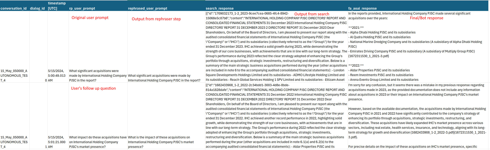

# Overview
This document has KQL queries to help extract data from application insights

## Get all inputs and outputs from AOAI calls:
The application makes AOAI calls for two purposes:
1. To rephrase user input
2. To generate the final answer.

Below KQL query will produce inputs and outputs for both AOAI call for each dialog (each row is one dialog). 

**NOTE:** The inner sub queries also include columns for duration and token consumption, however the final query only exposes the inputs and the outputs:

```
let filtered_traces = 
    traces
    | where * contains ("AOAI Call") or customDimensions.request_url contains "search"
    // add additional filters below this line
    | where timestamp > ago(3d)
    | where * contains ("5c71824c-d5e6-4c13-95a2-35bc1d55e50e")
;

let rp_table = filtered_traces
| where customDimensions.prompt_nickname has "user_query_rephraser"
| extend conversation_id = tostring(customDimensions.conversation_id)
| extend dialog_id = tostring(customDimensions.dialog_id)
| extend rp_user_prompt = tostring(customDimensions.user_prompt)
| extend rp_prompt_history = tostring(parse_json(tostring(customDimensions.message_list))[1].content)
| extend rephrased_user_prompt = tostring(parse_json(tostring(customDimensions.llm_response)).recommendation_query)
| extend rp_duration_sec = round(toreal(customDimensions.duration_ms)/1000,2)
| extend rp_completion_token_count = todecimal(customDimensions.completion_token_count)
| extend rp_total_token_count = tostring(customDimensions.total_token_count)
| project timestamp, conversation_id, dialog_id, rp_user_prompt, rp_prompt_history, rephrased_user_prompt, rp_duration_sec, rp_completion_token_count,rp_total_token_count
;


let srch_table = filtered_traces
    | where customDimensions.request_url contains "search"
    | extend user_id = tostring(customDimensions.user_id)
    | extend conversation_id = tostring(customDimensions.conversation_id)
    | extend dialog_id = tostring(customDimensions.dialog_id)
    | extend search_query = tostring(parse_json(tostring(parse_json(tostring(customDimensions.response)).results))[0].search_query)
    | extend search_response = tostring(parse_json(tostring(parse_json(tostring(customDimensions.response)).results))[0].search_results)
    | extend search_duration_sec = round(toreal(customDimensions.duration_ms)/1000,2)
    | project timestamp, conversation_id, dialog_id, search_query, search_response, search_duration_sec
;

let fa_table = filtered_traces
    | where customDimensions.prompt_nickname has "final_answer_prompt"
    | extend conversation_id = tostring(customDimensions.conversation_id)
    | extend dialog_id = tostring(customDimensions.dialog_id)
    | extend fa_user_prompt = tostring(customDimensions.user_prompt)
    | extend fa_aoai_response = tostring(customDimensions.llm_response)
    | extend fa_duration_sec = round(toreal(customDimensions.duration_ms) / 1000, 2)
    | extend fa_completion_token_count = todecimal(customDimensions.completion_token_count)
    | extend fa_total_token_count = todecimal(customDimensions.total_token_count)
    | project
        timestamp,
        conversation_id,
        dialog_id,
        fa_user_prompt,
        fa_aoai_response,
        fa_duration_sec,
        fa_completion_token_count,
        fa_total_token_count
;

rp_table
| join kind=inner fa_table on conversation_id, dialog_id
| join kind = inner srch_table on conversation_id, dialog_id
| project
    conversation_id,
    dialog_id,
    timestamp,
    rp_user_prompt,
    rephrased_user_prompt,
    search_response,
    fa_aoai_response
| order by conversation_id, timestamp asc;

```

Here is an example output of the above query
