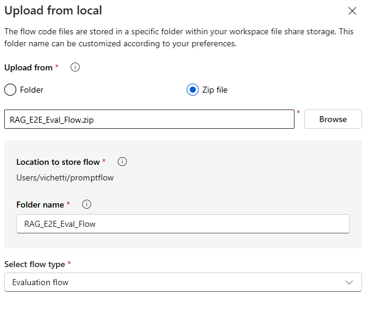
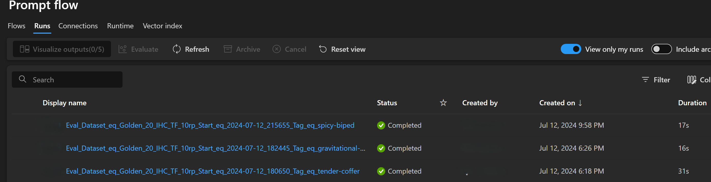
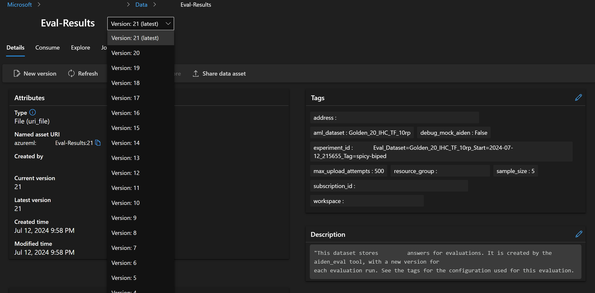
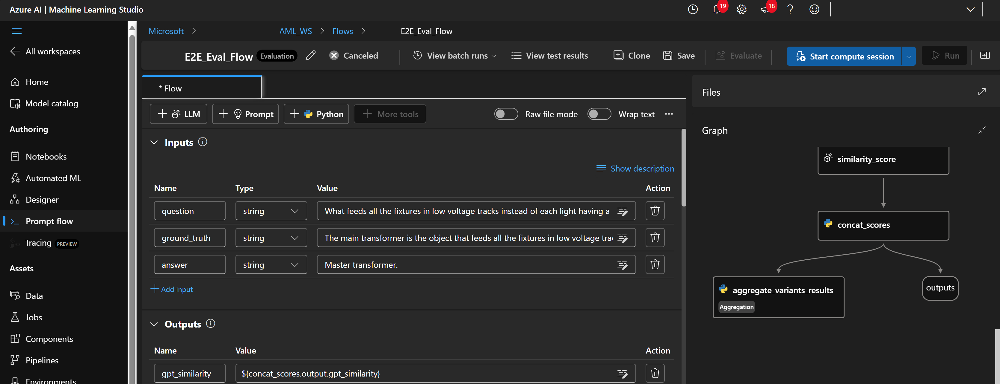

# `rag_eval` - RAG Evaluation Tool

Previous approaches to evaluating RAG Bot have been manual and time-consuming. This tool automates the evaluation process, allowing for a more efficient and accurate evaluation of RAG Bot's performance. Using AML for dataset storage and Prompt flow for LM-based evaluation, this tool allows practitioners to evaluate RAG Bot's performance on a given dataset without any manual intervention. This tool also unifies multiple evaluation flows to allow for a more comprehensive and consistent assessment of RAG Bot's capabilities. Evaluations supported by the tool are:

- `evaluate_tone` : Evaluation flow for assessing if a fine_tuned_answer sounds more like an expert.
- `evaluate_fanout_rephraser`: Evaluation flow to assess the quality of the fanout rephraser prompt.
- `evaluate_end_to_end`: Evaluation flow to assess the final responses of RAG Bot.

> [!Note]
We're currently facing multiple issues with authentication due to storage account security changes. You may need to run az login before running the tool. Each run may also require manual authentication via the browser.

# Getting Started

Below are the instructions to install and run the `rag_eval` tool along with basic usage examples. These steps have so far been tested on Windows with Python 3.10.


## Installation

Navigate to `<repo root>/Advanced_RAG/.vscode/launch.json` and add appropriate arguments under `RAG Evals: Launch` setting. Refer `<repo root>/Advanced_RAG/src/evals/rag_eval/evaluation_params.py` below for a detailed description of all the available arguments.


## Basic Usage
At a high level, `rag_eval` pulls an existing datset from AML, passes it to individual flow, and evaluates against a particular task, ultimately producing aggregate results. The results are then printed to the console and saved to disk. Logs, settings used and final results from an example run are included in the `results` directory.

The below instruction uses the default evaluation settings. This should be sufficient for most use cases. You can inspect the default settings by navigating to `<repo root>/Advanced_RAG/src/evals/rag_eval/evaluation_params.py`.


To start `evaluate_tone`
```json
"args": [
    "--eval_flow=evaluate_tone",
    "--aml_dataset=Tone_eval_dataset_sample"
]
```

To start `evaluate_fanout_rephraser`
```json
"args": [
    "--eval_flow=evaluate_fanout_rephraser",
    "--aml_dataset=Golden_fin_test"
]
```

To start `evaluate_end_to_end`
```json
"args": [
    "--eval_flow=evaluate_end_to_end",
    "--aml_dataset=Golden_All"
]
```

The tool defaults to calling RAG Bot's Dev endpoint. You can point `rag_eval` to a different RAG Bot endpoint by specifying the `--address` argument:
```json
"args": [
    "--eval_flow=evaluate_end_to_end",
    "--aml_dataset=Golden_All",
    "--address=http://localhost:<PORT>"
]
```

RAG Bot is non-deterministic. You can repeat the same query multiple times to get a more accurate evaluation.
```json
"args": [
    "--eval_flow=evaluate_end_to_end",
    "--aml_dataset=Golden_All",
    "--question_repeats=10"
]
```

You can select only a single diffiuclty level to evaluate using the `--difficulty` argument. The default is to evaluate all difficulty levels.
```json
"args": [
    "--eval_flow=evaluate_end_to_end",
    "--aml_dataset=Golden_All",
    "--difficulty=hard"
]
```

End-to-End evaluation runs are long running jobs and can crash due to transient issues or need to be stopped manually. You can resume a run by providing the `--resume_run_id` argument. The tool will use the configuration and saved answers from the previous run to continue the evaluation. Only provide this flag and none others. You will see a log message when you start the tool indicating that the tool is resuming a previous run and providing the run config.

```json
"args": [
    "--eval_flow=evaluate_end_to_end",
    "--resume_run_id=RAG-Eval_Dataset_eq_Golden_All_Start_eq_2024-11-13_155049"
]
```

## Configuration Service Support

The Configuration Service is a separate application for uploading and managing RAG Bot configurations. Users can point to a specific configuration at inference-time so as to have different configurations for different runs. Grid searching over the backend LLM is a representative use case. This document won't go into detail on how to use the Configuration Service.

The `--orchestrator_config` can be set to a specific version ID for an existing configuration in the Configuration Service. The tool will then use this configuration for the evaluation. You can also provide an absolute path to a local config json file which will be automatically uploaded to the Configuration Service. The version ID of the uploaded configuration will be the same experiment ID as the evaluation.

**Leverage an existing configuration:**
```json
"args": [
    "--eval_flow=evaluate_end_to_end",
    "--aml_dataset=golden_20",
    "--orchestrator_config_version=<my_existing_config_version_id>"
]
```


**Modify and upload a local file:**
```json
"args": [
    "--eval_flow=evaluate_end_to_end",
    "--aml_dataset=golden_20",
    "--orchestrator_config=<DIR PATH TO CONFIG FILE>/orchestrator_runtime_test.json"
]
```

Similarly, configuring the search index can be done with the `--search_config` argument.


## [Important] Upload Evaluation Flow to Prompt Flow for `evaluate_end_to_end`
1) Go to prompt_flow_resources/RAG_E2E_Eval_Flow/flow.dag.yaml and replace \<AZURE-OPENAI-CONNECTION> with your Azure OpenAI connection name
2) Compress all the files under prompt_flow_resources/RAG_E2E_Eval_Flow into a ZIP File (Note: flow.dag.yaml must be in the root of your ZIP File)
3) Navigate to ml.azure.com and go to your workspace
4) Click on Prompt Flow to see the list of your flows
5) Click on Create > Upload From Local > Zip File and select the ZIP file you created earlier
6) Set 'Folder name' as RAG_E2E_Eval_Flow and 'Select flow type' as Evaluation Flow.
7) Click on upload




## Tracking Results

`rag_eval` saves the evaluation results to disk in the `results` directory. Each experiment has a unique ID composed of various parameters and the start time. The results are saved in a JSON file with the same ID. For example:

If you want to use some prefix with the conversation id, to make it easier to locate the associated logs in the application insighst, then that can be provided with the `--coversation_id_prefix` parameter:


```json
"args": [
    "--eval_flow=evaluate_end_to_end",
    "--local_dataset=./rag_eval/datasets/wto_3.csv",
    "--aml_flow_name=RAG_E2E_Eval_Flow",
    "--address=http://localhost:5000",
    "--search_topk=30",
    "--search_config=demo-wto-tariff-profile-index_v2",
    "--config_address=http://localhost:5003"
    "--conversation_id_prefix=trade_demo"
]
```


```bash
ls rag_eval/results/RAG-Eval_Dataset=golden50_Start=2024-07-12_215655_Tag=spicy-biped

> Mode                 LastWriteTime         Length Name
----                 -------------         ------ ----
-a---           7/12/2024  9:58 PM          55601 benchmark_answers.csv
-a---           7/12/2024  9:58 PM            461 config.json
-a---           7/12/2024 10:04 PM           5045 run_details.csv
-a---           7/12/2024 10:04 PM             72 run_metrics.json
```

Metrics are saved in `run_metrics.json`, and answers logs is saved in `run_details.csv`.

**run_metrics.json:**
```json
{
    "gpt_similarity": 3.0,
    "gpt_similarity_pass_rate(%)": 25.0
}
```

**run_details.csv:**
Example with formatted Markdown table:

| inputs.question                                                                 | inputs.ground_truth                                                                               | inputs.line_number | outputs.gpt_similarity |
|---------------------------------------------------------------------------------|---------------------------------------------------------------------------------------------------|--------------------|------------------------|
| Why did the investment in associates and joint ventures change significantly?  | Investment in associates and joint ventures increased due to the acquisition of a new subsidiary. | 0                  | 2.0                    |
| What is the largest net currency exposure for the Group?                        | The Group has a net exposure of AED 7.24b to Indian Rupee.                                        | 1                  | 7.0                    |
| Why did share of profit from investment in associates change?                   | The company recognized Gain on acquisition of additional stake in XYZ Ltd.                         | 2                  | 2.0                    |
| What was the Net Profit and Net Profit growth for the year?                     | Net Profit, before non-controlling interests, increased by 15% to AED 5.6b.                        | 3                  | 1.0                    |ntrolling interests, ...  ...                  3                     1.0

Runs can also be viewed in the Azure Machine Learning workspace under the `RAG_E2E_Eval_Flow` flow.



## Azure Resources

This section describes the Azure resources used by the `rag_eval` tool. By default, we use the `RAGBotScenarioDemo` resource group and `RAGBotScenrarioDemo_AML_WS` workspace.

### Answers Data Asset

RAG Bot's answers are saved to new version of the `RAG-Eval-Results` AML data asset. This data asset is then referenced when the Prompt flow is invoked. Each run shpuld increment the version of the data asset. See the asset's tags for the experiment details, including the dataset used and the start time.



### Prompt Flow

By default, the tool uses the `RAG_E2E_Eval_Flow`. This flow can be extended to support additional evaluation scenarios, such as RAG evaluations (groundedness, relevance, etc.). A new run shhoul be created for each successful evaluation.

