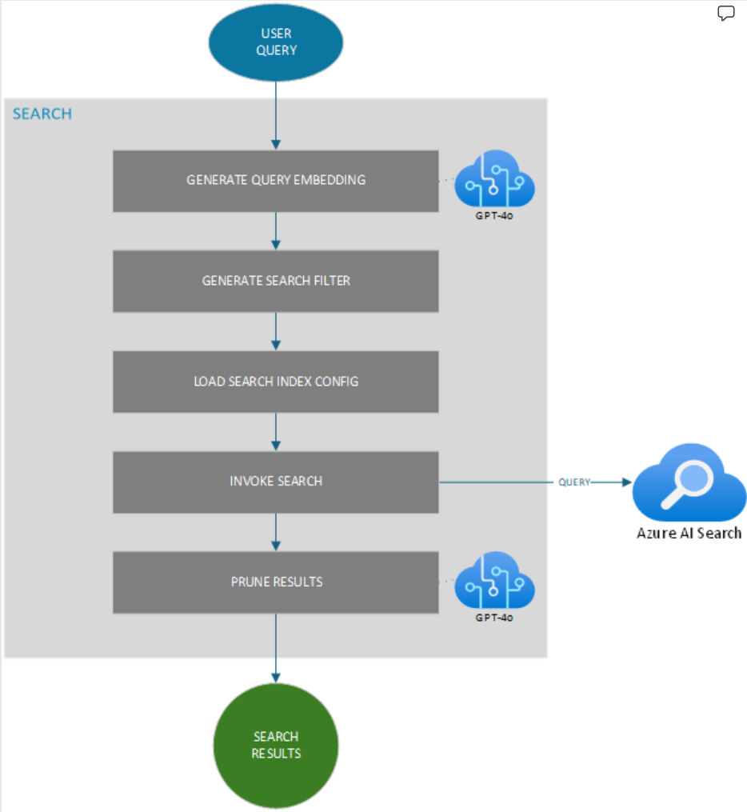

# SEARCH

Once the Ingestion pipeline is executed successfully resulting in a valid, queryable Search Index, the Search service can be configured and integrated into the end-to-end application.

The Search Service exposes an API that enables users to query a search index in Azure AI Search. It processes natural language queries, applies requested filters, and invokes search requests against the preconfigured search configuration using the Azure AI Search SDK.

Below is a detailed explanation of the various stages involved in the search service, including the terminology and processes to ensure users can leverage the API effectively.

## USER QUERY

 
The search process begins with a user query. This is a natural language input from the user, expressing what they are looking for. The query could be as simple as "red shoes" or more complex like "what is the profit to liabilities ratio for company XYZ?".

## QUERY EMBEDDINGS GENERATION

Query embedding involves converting the user's natural language query into a dense numerical representation (embedding) that captures the semantic meaning of the query. This allows the search system to understand the intent behind the query more effectively.

To generate an embedding from user query, the user query is passed to a model (such as GPT-4) and the model generates an embedding for the input query.

## SEARCH FILTER GENERATION

A search filter is a criterion applied to the search query to narrow down the search results. Filters can include conditions like equality, inequality, range conditions (greater than, less than), and substring matches.

Based on the requested filters as part of the Search API request, search service generates the necessary filters as a string. These filters are then applied to the user query to refine the search and generate high-quality results.

## SEARCH INDEX CONFIG

Search index configuration defines the schema of the search index, including the fields and their types, as well as any semantic configuration and the type of search to apply. The search types can include:

Simple Text Search: Traditional keyword-based search.

Vector Search: Search based on embeddings, allowing for semantic understanding.

Hybrid Search: Combines both simple text and vector search.

Hybrid + Semantic Search: An advanced hybrid search with additional semantic understanding.

## SEARCH INVOCATION

Azure AI Search is a cloud search service that provides powerful and sophisticated search capabilities, including full-text search, filtering, faceting, and more.

Process:

The search service constructs a query using the generated embedding and filters.

The constructed query is then sent to Azure AI Search using the Azure AI Search SDK.

Azure AI Search processes the query and returns the search results. Note that Azure AI Search can run multiple search queries in parallel and combine results by query in the response.

## PRUNING

Pruning involves refining and filtering the search results to ensure they are most relevant to the user's query. This step may involve additional semantic filtering and ranking of the results if a semantic configuration is present at the time of index creation.

Additionally, the results can also be pruned based on a search score threshold that can be configured inside Search service.

## Search Results

Search results are the final output of the search service. They represent the items from the search index that best match the user's query, after applying all filters and pruning.

