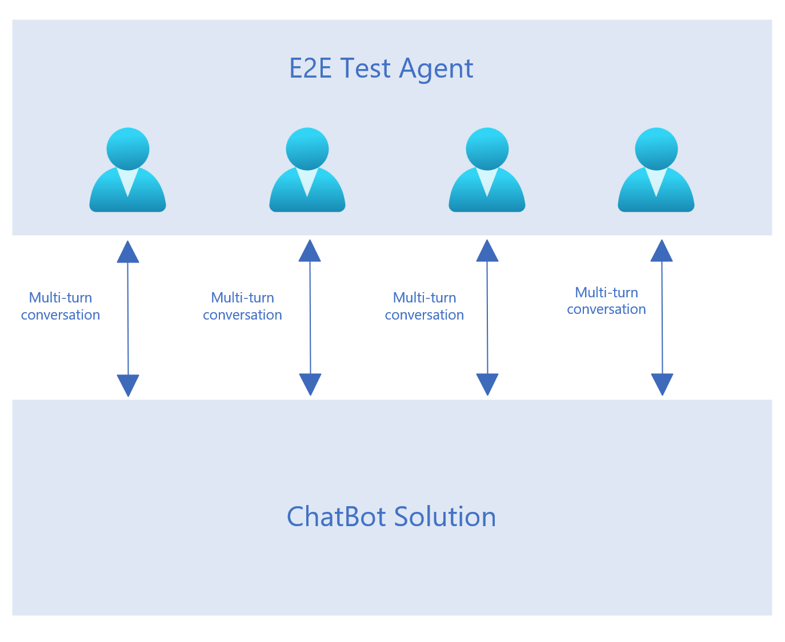

# End-to-End Test Agent

## Overview
The objective of this test agent is to enhance chatbot testing by leveraging the scalability and versatility of Large Language Models (LLMs). By enabling a higher number of test runs and covering a broader range of topics and scenarios, this service provides a more thorough and comprehensive testing process that identifies previously unnoticed issues.

The service operates by spawning multiple threads, with each thread simulating a multi-turn conversation. Moreover, it has the capability to automatically generate contextually relevant follow-up questions, maintaining the flow of the conversation up to a predefined depth. This feature ensures that the testing process mimics real-world interactions more accurately, uncovering potential flaws and improving the overall robustness of the chatbot.

The following describes the structure of a single dialog within a multi-turn conversation:

```
- conversation_id: SAMPLE_CONVERSATION_ID_0
  dialog_sequence: 0
  dialog: <SAMPLE QUESTION>
```
- conversation_id: A unique identifier that remains consistent throughout the entire multi-turn conversation.
- dialog_sequence: A numerical identifier or counter indicating the sequence number of the dialog within the conversation.
- dialog: The query or message intended for testing the chatbot.

A multi-turn test would be sequence of dialogs with increasing sequence numbers, example:
```
- conversation_id: SAMPLE_MULTITURN_CONVERSATION_ID_0
  dialog_sequence: 0
  dialog: <SAMPLE QUESTION 0>

- conversation_id: SAMPLE_MULTITURN_CONVERSATION_ID_0
  dialog_sequence: 1
  dialog: <SAMPLE QUESTION 1>

- conversation_id: SAMPLE_MULTITURN_CONVERSATION_ID_0
  dialog_sequence: 2
  dialog: <SAMPLE QUESTION 2>
```

## Steps to create and test multi-turn conversations
- **Create a YAML Test File**: Define the conversation queries in a YAML file, such as data/queries.yaml.
- **Set Environment Variables**: Ensure all necessary environment variables, including the conversation depth, are configured.

Once the service is set up, it can be triggered either manually or automatically based on a predefined schedule. For instructions on manual triggering and scheduling jobs, refer to `<repo root>\Advanced_RAG\docs\e2e_nightly_test_agent.http`.

During execution, the queries specified in the YAML file are processed and tested against the chatbot. If any conversations do not reach the predefined conversation depth, the test agent intelligently generates relevant follow-up queries based on the prior conversation context. Upon completing the execution, a detailed report is generated and stored in the Azure Blob container specified by the configuration variable `AZURE-BLOB-CONTAINER-NAME-E2E-TEST`. This report can be reviewed later for manual evaluation.


