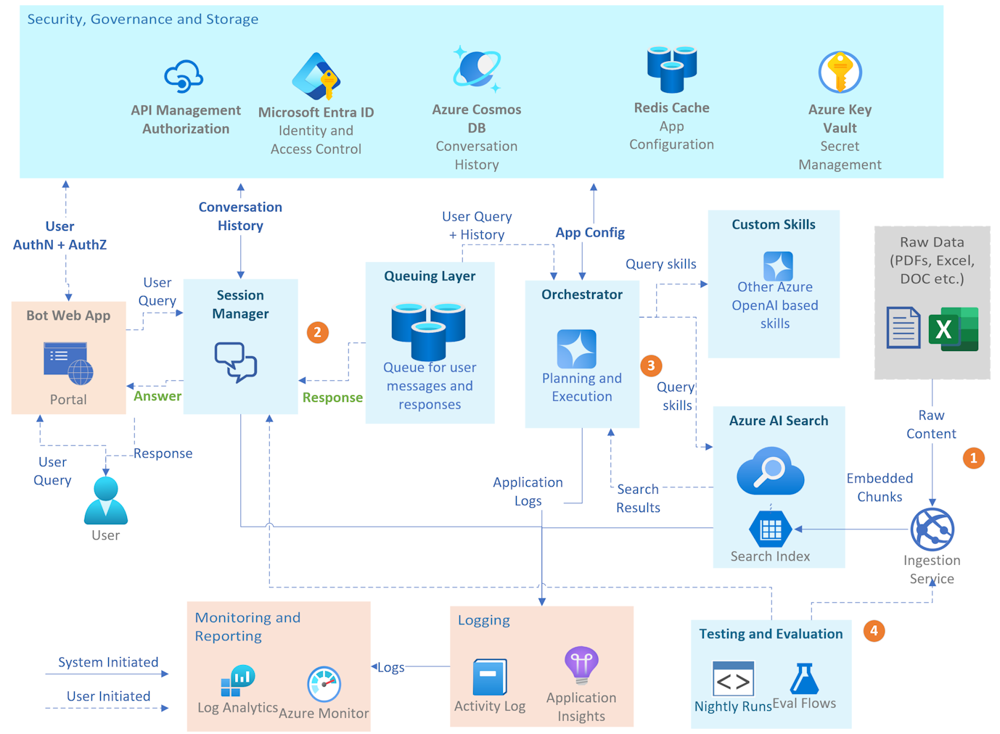

# Copilot for eCommerce

This sample highlights an approach to building a copilot for eCommerce, bringing in a multimodal experience to enable a personal concierge-like experience for shoppers. It combines the power of [Azure OpenAI Service](https://azure.microsoft.com/en-us/products/ai-services/openai-service/) and [Azure AI Search](https://azure.microsoft.com/en-us/products/ai-services/ai-search/) for indexing and retrieving multimodal content. The solution not only helps users find and recommend products based on their shopping needs but also leverages the power of multimodality. Whether they are preparing for an event, looking for matching styles, or even using an image to find the perfect match, the copilot has them covered.

## Table of Contents

- [Use Case](#use-case)
- [Features](#features)
- [Architecture](#architecture)
- [Getting Started](#getting-started)
- [Code of Conduct](#code-of-conduct)
- [Responsible AI Guidelines](#responsible-ai-guidelines)
- [Dataset License](#dataset-license)
- [License](#license)

## Use Case
This solution enables users to explore retail products such as clothing and accessories by interacting with the bot in natural language. Its multimodal capabilities ensure seamless experiences; for example, users can upload an image of their suit, and the bot will suggest matching shoes or accessories.

Imagine getting ready for a party and finding a complete outfit—simply by conversing with the bot. Whether you're searching for a suit, shoes, or complementary accessories, the bot provides relevant and tailored suggestions.

To showcase the solution’s capabilities, a pre-recorded voiceover demonstrates its functionality, ranging from simple queries to complex multimodal interactions. Watch the [Demo Video](docs/media/Retail_Accelerator_Demo%20(GitHub).mp4) and follow along with the [Demo Script](docs/demo_script/Retail%20Demo_Script.pdf).

## Features
The repository includes a complete end-to-end solution, comprising:

- **A frontend application** for seamless user interaction
- **Backend microservices** to handle core functionalities
- **A synthetically generated dataset** of product catalog items  to quickly set up and test the solution
- **A generic ingestion service** that enhances chunks with metadata (e.g., product descriptions using images) to drastically improve search results

## Architecture
The solution includes the following key components:

1. **Ingestion Service**: The ingestion service includes various enhancements to ensure that when raw content is ingested, there is minimum loss of information. Additional metadata is added to the chunks to the index to make search results more relevant.

2. **Enhanced User Interaction**: This includes a frontend with multimodal capabilities for users to interact with the bot and an implementation of a queuing layer in the backend. This allows users to send multiple questions to the copilot, and the copilot can produce multiple responses to a user query, making the overall experience more engaging.

3. **Core Microservices and Skills**: This includes the Orchestrator, which executes various skills to best address the user query. The core microservices handle different aspects of the solution, such as session management, data processing, runtime configuration, and orchestration. Specialized skills provide specific capabilities, such as AI search and image describer.

4. **Testing and Evaluation**: This includes the ability to simulate conversations with the copilot, run certain end-to-end tests on demand, and an evaluation tool to help perform end-to-end evaluation of the copilot.

Detailed architecture for the eCommerce Copilot can be found [here](ARCHITECTURE.md)

## Getting Started  
To set up and start using this project, follow our [Getting Started Guide](SETUP_RETAIL.md). It provides step-by-step instructions for both Azure resources and local environments.

## Code of Conduct

This project has adopted the [Microsoft Open Source Code of Conduct](https://opensource.microsoft.com/codeofconduct/).

Resources:

- [Microsoft Open Source Code of Conduct](https://opensource.microsoft.com/codeofconduct/)
- [Microsoft Code of Conduct FAQ](https://opensource.microsoft.com/codeofconduct/faq/)
- Contact [opencode@microsoft.com](mailto:opencode@microsoft.com) with questions or concerns

For more information see the [Code of Conduct FAQ](https://opensource.microsoft.com/codeofconduct/faq/) or
contact [opencode@microsoft.com](mailto:opencode@microsoft.com) with any additional questions or comments.

## Responsible AI Guidelines

This project follows below responsible AI guidelines and best practices, please review them before using this project:

- [Microsoft Responsible AI Guidelines](https://www.microsoft.com/en-us/ai/responsible-ai)
- [Responsible AI practices for Azure OpenAI models](https://learn.microsoft.com/en-us/legal/cognitive-services/openai/overview)
- [Safety evaluations transparency notes](https://learn.microsoft.com/en-us/azure/ai-studio/concepts/safety-evaluations-transparency-note)

## Dataset License

This dataset is released under the Community Data License Agreement – Permissive, Version 2.0 - CDLA, see the [LICENSE-DATA](LICENSE-DATA.md) file.

## License

This project is licensed under the MIT License. See the [LICENSE](./LICENSE) file for details.