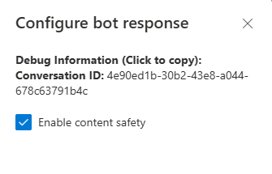
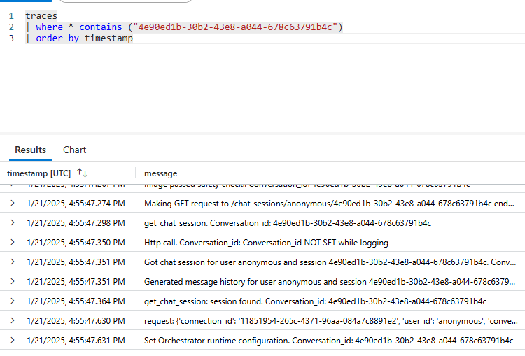
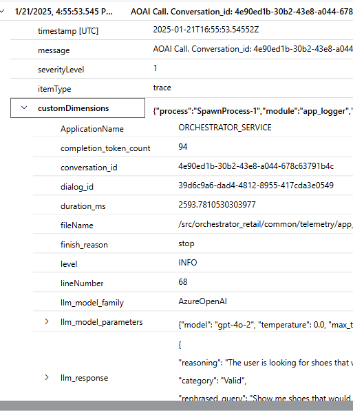
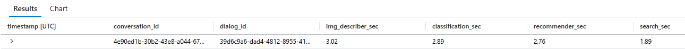

# Logging and Instrumentation
Logging using application insights is currently enabled on all core microservices and skills.
 
In addition to basic logging, certain custom fields are used to help trace end to end logs in the core microservices for every user session and interaction. This is done by passing three fields from web frontend to each microservices and using them in every log. These are:
1. user_id
2. conversation_id
3. dialog_id
 
When user starts a new session, a new conversation_id is set by the front end passed to the backend along with the user's query. Also a new dialog_id is set to track every interaction from the user. This way we are able to trace all logs at the dialog / user's prompt level.
 
To help with finding the conversation_id by the user to help with debugging, the web app (front end) exposes the conversation_id. This can be seen by going to the developer settings.
 

 
Once conversation_id is known, then all logs related to that conversation can easily be found in the application insights by querying for that conversation_id. Below is a sample KQL query 
 
```
traces
| where * contains (<conversation_id>)
| order by  timestamp asc 
```

 
As part of logging certain metrics are also logged. Below is an example of metrics logged by different services:
1. Orchestrator:
    - logs duration breakdown for each step of the call
    - logs inputs and outputs for each step
2. Session Manager:
    - logs duration for an end to end dilaog flow
    - logs inputs and outputs
3. All http calls (when different microservices are called)
    - logs durations 
    - logs request and responses 
4. All AOAI calls
    - logs system prompt
    - logs prompt version, hyper-parameters used
    - logs messages (history)
    - logs last user prompt
    - logs duration of the call
    - logs token counts
 
More details on what metrics are being logged can be seen in the various [logging classes](../src/common/telemetry/log_classes.py)
 
Metrics are stored in the customDimensions portion of the logs. Below is an example of a log from AOAI call for the above conversation
 

 
Here is an [example of a KQL query](kql_duration_breakdown_retail.md) that show duration breakdown for different steps in the orchestrator 
 

 
The numbers are in seconds.