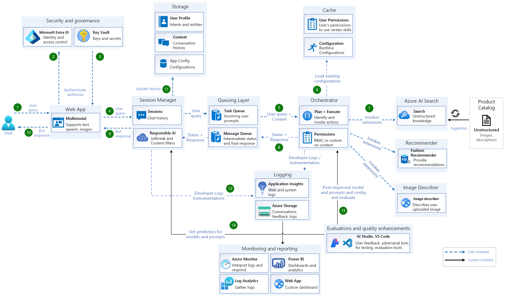

Before exploring the data flow, we begin with the Ingestion process, crucial for preparing the solution. This involves creating and populating the search index with relevant content (corpus). Detailed instructions on indexing product catalog with ability to enhance the catalog so that it can also work effectively with multi-modal searches can be found in then ingestion service documentation.
User Query Processing Flow

1.	User Authentication:
- Users interact with the bot via a web application and must authenticate using Microsoft Entra ID to ensure secure access.
2.	User Interaction:
- a.	Once authenticated, users can submit requests through text or voice:
- - The web app establishes a WebSocket connection with the backend session manager.
- - For voice interactions, Microsoft Speech Services are utilized for live transcription. The web app requests a speech token from the backend, which is then used in the Speech SDK for transcription.
3.	Token Management:
- The backend retrieves secrets from Key Vault to generate tokens necessary for frontend operations.
4.	Transcription and Submission:
- After transcription, the web app submits the transcribed text to the backend.
5.	Session Management:
- The session manager assigns unique connection IDs for each WebSocket connection to identify clients. User prompts are then pushed into a message queue, implemented using Azure Redis Cache.
6.	Orchestrator: The orchestrator plays a critical role in managing the flow of information. It reads the user query from the message queue and performs several actions:
- Plan & Execute: It identifies the required actions based on the user query and context.
- Permissions: It checks user permissions using Role-Based Access Control (RBAC) or custom permissions on the content. NOTE: The current implementation doesn’t do it, however Orchestrator could easily be updated to do so.
- Invoke Actions: It triggers the appropriate actions, such as invoking the Azure AI Search for retrieving relevant information.
7.	Azure AI Search: The orchestrator interacts with Azure AI Search to query the unstructured knowledge base. This involves searching through financial reports or other content to find the information the user requested.
8.	Status & Response: The orchestrator processes the search results and formulates a response. It updates the queue with the status and the final response, which includes any necessary predictions or additional information.
9.	Session Manager: The response from the orchestrator is sent back to the session manager. This component is responsible for maintaining the session integrity and ensuring that each client receives the correct response. It uses the unique connection ID to route the response back to the appropriate client.
10.	Web App: The web app receives the response from the session manager. It then delivers the bot's response back to the user, completing the interaction cycle. This response can be in text and /or speech format, depending on the user's initial input method.
11.	Update History: On successful completion of bot response, the session manager updates the user profile and conversation history in the storage component. This includes details about user intents and entities, ensuring that the system can provide personalized and context-aware responses in future interactions.
12.	Developer Logs / Instrumentation: Throughout the process, logs and instrumentation data are collected. These logs are essential for monitoring and debugging the system, as well as for enhancing its performance and reliability.
13.	Evaluations and Quality Enhancements: The collected data along with Golden datasets, manual feedbacks are utilized for ongoing evaluations and quality enhancements. Tools like AI Studio and VS Code along with the configuration service are used to test the bots, develop and evaluate different prompts and models.
14.	Monitoring and Reporting: The system is continuously monitored using Azure Monitor and other analytics tools. Power BI dashboards provide insights into system performance, user interactions, and other key metrics. This ensures that the solution remains responsive and effective over time.
