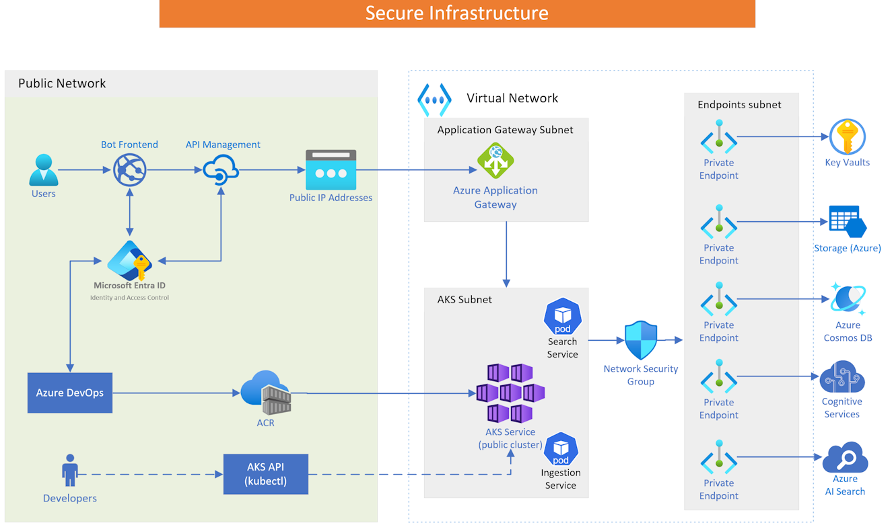

# Deployment and Runtime Architecture for Copilot

## Deployment Flow  
  
1. **Code Integration**: Developers commit changes to a repository managed by Azure DevOps, triggering automated build and deployment pipelines.  
2. **Containerization**: Applications are containerized and stored in the Azure Container Registry (ACR).  
3. **AKS Deployment**: Containers are deployed to the Azure Kubernetes Service (AKS).
  
## Runtime Flow  
  
1. **Traffic Management**: The Azure Application Gateway handles incoming traffic, providing load balancing and SSL termination. It routes requests to the appropriate AKS service.  
2. **Service Execution**: Within the AKS cluster, pods for various core microservices and skills like Search and Ingestion services execute requests. These services and AKS could be configured to scale automatically based on demand.  
  
## Security Measures  
  
- **Identity and Access Management**: Microsoft Entra ID provides robust identity management, ensuring only authenticated users access the system.  
- **Network Security**: A Network Security Group (NSG) protects the AKS subnet, allowing only necessary traffic.  
- **Private Endpoints**: Secure connections to Azure services like Key Vaults, Storage, Cosmos DB, and Cognitive Services prevent data exposure to the public internet.  
- **Managed Identities**: We use Azure Managed Identities to eliminate the need for API keys and passwords, simplifying the protection of secrets. This approach allows services to authenticate securely without storing sensitive credentials.

This architecture ensures a secure and efficient deployment and runtime environment for Copilot, leveraging Azure's comprehensive suite of services.  