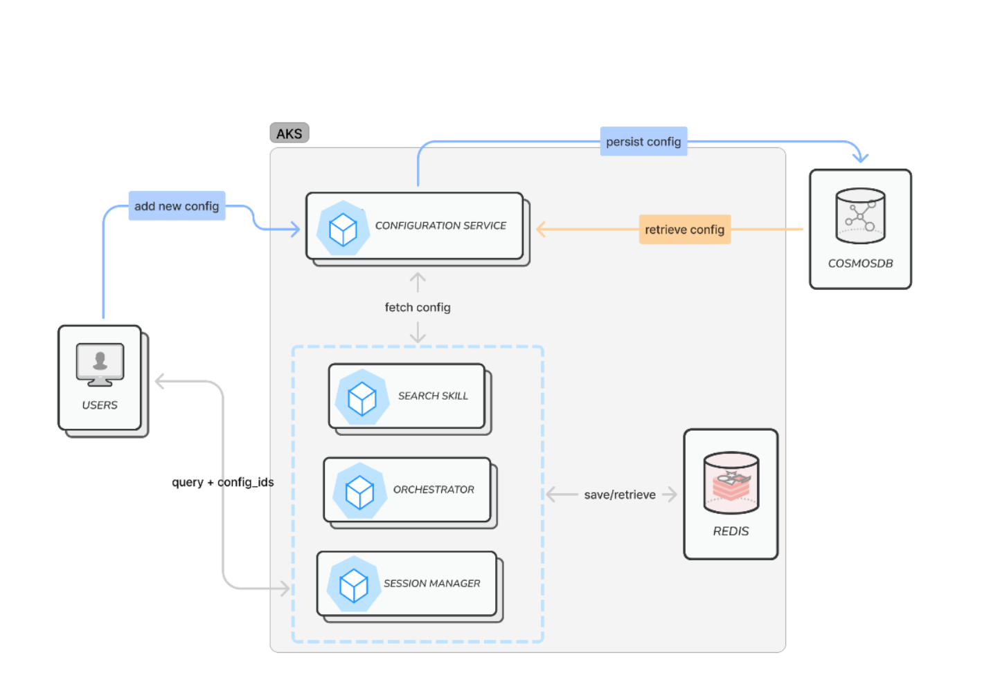

# Configuration Service

## Overview
The runtime configuration service enhances the architecture's dynamicity and flexibility. It enables core services and AI skills to decouple and parameterize various components, such as prompts, search data settings, and operational parameters. These services can easily override default configurations with new versions at runtime, allowing for dynamic behavior adjustments during operation. This dynamicity is especially helpful when trying to experiment with different configurations like prompts and search indexes.




**Core Services and AI Skills**: Define unique identifiers for their individual configurations. At runtime, they check if the payload consists of a configuration override. If yes, they attempt to retrieve it from the cache. In a scenario where it is not present in cache memory (Redis), i.e., first time fetch, they read from the configuration service (which retries saved configurations from cosmosDB). The configuration is then saved in cache memory for future references.  

**Configuration Service**: Facilitates Create, Read and Delete operations for a new configuration. Validates the incoming config against a Pydantic model and generates a unique version (if one not provided) for the configuration upon successful save.

**Cosmos DB**: Persists the new config version. 

**Redis**: High availability memory store for storing and quick retrievals of configurations for subsequent queries. 

## Steps to create and use a new configuration version
-  Identify the configuration ID that needs to be updated and retrieve the latest version. Supported configuration ID's:
    - orchestrator_runtime : `src/orchestrator_rag/app/static/static_orchestrator_prompts_config.yaml`
    - search_overrides: `src/skills/cognitiveSearch/src/components/templates/rag.config.json`
- Perform the required updates and create a new version by making a POST request to `{configuration-service-endpoint}/config/{config_id}`. Refer to [config service payload samples](../../docs/services/config_service.http) for examples.
    - _NOTE_: Currently only JSON payload (configurations passed via _config_body_ parameter is supported) is supported by the API. If there is a need to convert config data from one format to another, such as YAML to JSON, custom convertors like below could be used:

    ```
    import yaml
    import json

    def convert_yaml_to_json(yaml_file_path, json_file_path):
        with open(yaml_file_path, 'r') as yaml_file:
            yaml_content = yaml.safe_load(yaml_file)

        json_content = json.dumps(yaml_content, indent=4)

        with open(json_file_path, 'w') as json_file:
            json_file.write(json_content)
    ```
- To specify the configuration version as part of overrides in user request, refer to [session manager payload examples](../../docs/services/session_manager.http).
