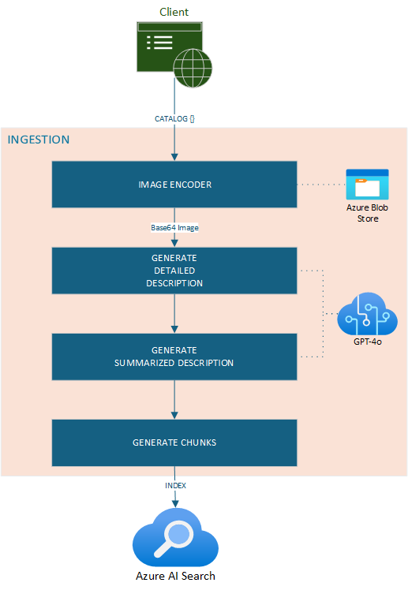

# Indexing Service
<!-- TOC -->
- [Product Catalog Processing Pipeline](#product-catalog-processing-pipeline)
    - [Catalog Image Encoder](#catalog-image-encoder)
        - [Validate and Download Images](#validate-and-download-images)
        - [Encode Images](#encode-images)
    - [Catalog Enrichment by Enhanced Description Generation](#catalog-enrichment-by-enhanced-description-generation)
        - [Feed Encoded Images to AI Model](#feed-encoded-images-to-ai-model)
        - [Generate Detailed Descriptions](#generate-detailed-descriptions)
        - [Generate Summarized Descriptions](#generate-summarized-descriptions)
    - [Indexer](#indexer)
        - [Combine Product Details and Descriptions](#combine-product-details-and-descriptions)
        - [Chunking](#chunking)
        - [Index Construction](#index-construction)
- [Steps to Use Ingestion Service for Indexing Catalog Items](#steps-to-use-ingestion-service-for-indexing-catalog-items)
- [Keep Your Index Updated by Re-running Ingestion](#keep-your-index-updated-by-re-running-ingestion)
- [Bring your own data](#bring-your-own-data)

<!-- /TOC -->

This section explains the behavior of the Product Catalog Indexer service and how it indexes catalog items into Azure AI Search - a service that enables efficient and intuitive natural language search capabilities for your product catalog.

## Product Catalog Processing Pipeline

The `Product Catalog Indexing` process iterates over each catalog item in the payload. Each catalog item can contain multiple pieces of information, such as article ID, gender, etc. This particular implementation of the catalog indexer performs the following steps:

- **CATALOG IMAGE ENCODER**
- **CATALOG ENRICHMENT**
- **INDEXER**



### Catalog Image Encoder

This step handles downloading the image associated with each catalog item from storage. After accessing the images, they will be converted into a base64 encoded format. This is crucial as the base64 format is necessary for subsequent image processing and description generation.

#### Validate and Download Images
The name for the image of each product catalog item is generated on the fly using the article ID, then it is validated against the onboarded storage account by making HTTP requests to the storage service. It is important to store images with names exactly the same as article IDs in the storage. After accessing the image, it is downloaded from Azure Blob Storage and saved locally in memory.

#### Encode Images
Once the images are downloaded, convert each image to a base64 encoded string. This conversion is necessary to embed the image data directly into text-based formats that can be processed by AI models. Ensure that the base64 encoding process handles different image formats (e.g., JPEG, PNG) correctly, preserving image quality.

### Catalog Enrichment by Enhanced Description Generation

Enhancements can be requested by the client at the time of catalog submission, and the ingestion service will ensure that the requested enhancements are applied to the data chunks before the indexing process begins.

Catalog items can optionally be enriched in this step. Detailed product descriptions are generated using `Azure AI Services` by incorporating the encoded product image into the prompt. From the detailed description provided with the catalog item, a summarized description is generated which only consists of key features of each item. These two enhance the catalog with richer, AI-driven metadata.

In the context of retail product catalog ingestion, enhanced descriptions generated using the catalog images can be exceptionally valuable. These enhancements include generating both detailed and summarized descriptions that provide comprehensive information about each item in the catalog.

#### Feed Encoded Images to AI Model
Utilize a powerful AI model, such as Azure OpenAI GPT-4, to process base64 encoded images. The AI model is capable of understanding and generating accurate descriptions based on visual data and prompts for your domain.

#### Generate Detailed Descriptions
The AI model generates detailed descriptions that provide in-depth information about the product's features, specifications, and visual characteristics. This description aims to capture every aspect of the product as seen in the image.

#### Generate Summarized Descriptions
In addition to detailed descriptions, generate concise summaries that highlight the key features of the product. To make sure that the description is accurate and only contains information about the product itself, the detailed description is used to generate the summarized description. These summaries are useful for quick reference and can be used in various parts of the application, such as search results snippets.

### Indexer
The `Indexing Phase` is responsible for creating individual chunks of data based on the defined index schema. In this implementation, each product catalog chunk includes the following information:
- `id`
- `articleId`
- `productName`
- `productType`
- `indexGroupName`
- `gender`
- `detailDescription`
- `detailDescriptionVector` (embeddings of product description)
- `imageUrl`
- `generatedDescription` (optional, generated during enrichment step)
- `generatedDescriptionVector` (optional, embeddings of generated detailed description)
- `summarizedDescription` (optional, generated during enrichment step)
- `summarizedDescriptionVector` (optional, embeddings of generated summarized description)

All embeddings are generated using `Azure AI Services`, enabling advanced natural language search capabilities.

This step involves generating chunks of the catalog data and indexing them in the search index.

Images are not stored in the search index; instead, an image URL is stored at the index level to fetch images as requested. This enables efficient querying and retrieval of product information by users.

#### Combine Product Details and Descriptions
For each product in the catalog, combine the original details (e.g., Article Id, Product Type, Product Name, Gender) with the enhanced descriptions (both detailed and summarized).

#### Chunking
Divide the combined product information into smaller, manageable chunks. Each chunk should contain sufficient information to be useful independently, such as a product summary, detailed description, and associated metadata.

#### Index Construction
Ingest final chunks into Azure AI Search. The search index is configured with semantic configurations to support efficient querying, including setting up appropriate analyzers, tokenizers, and rerankers.

## Steps to Use Ingestion Service for Indexing Catalog Items
1. Setup Secrets and Environment Variables
    - Copy the `debug.env.template`, paste it in the ingestion directory, and rename it to `debug.env`.
2. Update Environment Variables
    - Set desired values for variables. If not found in `debug.env`, they will be fetched from the KeyVault. So be sure to set `KEYVAULT-URI`.
3. Start an Instance of Ingestion Service
    - If running locally inside VS Code, then in VS Code, click on "Run and Debug" and select "Ingestion service: Launch & Attach Server" to start an instance of the ingestion service locally.
4. Store Images in Storage Container and Submit a Payload for Indexing
    There are two options, you can follow each one:
    - a. Upload images provided [here](../../../data/retail/product_images) to your storage container. Then submit a new payload for indexing, make a POST request to `{ingestion-service-endpoint}/indexer/index`. Refer to [this file](../../../docs/services/ingestion_service_retail.http) for an example.
    - b. Refer to [Ingestion Notebook](../../../samples/retail/retail_ingestion.ipynb). Go over instructions and run cells. Make sure to update place holders with name of index and storage account information.

## Keep Your Index Updated by Re-running Ingestion

Newer data can be indexed to make sure your resource is updated and the catalog has the newest version of items. During ingestion, a unique ID gets created for each item by code. So it is important to make sure all the data getting ingested are new and have not been indexed previously, otherwise, you would have duplicated items in your index and later in the answer to your search index.

If you cannot separate new data, you can create a new index. In your search service resource portal, choose Add index -> Add index (JSON). Use the JSON file provided [here](../../../infra/search_index/retail_index.json). This file has all the fields needed for catalog items; just make sure to add the index name and update the name of your index when submitting the payload for indexing.

## Bring your own data
To bring your data and use this CoPilot on it, the easiest scenario would be when your indexing needs can be met with the existing fields. However if you determine more fields are reqiured then following things needs to be considered:
1. Search Index: Does all the fields in the current design match to your product catalog. If not, you will need to create new search index with required fileds to index. Here are fields and their configuration for the [retail_index.json](../../../infra/search_index/retail_index.json)
2. Ingestion Service: Currently ingestion service expects these additional fields to be present in the index and then uses these fields and images to generate this additional data.
> a. Uses article_id field to find the product catalog image (one only). 
```
    image_bytes, image_url = await self.storage_client.download_file_async(
        payload.images_storage_container,
        f"{catalog_item.article_id}.png"
    )
```
> b. Genereates detailed descriptions and summarized descriptions:
```
# Step 2: Apply enrichment if requested
detailed_description = await self.generate_enhanced_description(payload, catalog_item, self.detailed_description_prompt, image_bytes)
summarized_description = await self.generate_enhanced_description(payload, catalog_item, self.summarized_description_prompt)
```
Which is then stored in these fields in the index:
> > 1. detailDescriptionVector
> > 2. generatedDescription
> > 3. generatedDescriptionVector
> > 4. summarizedDescriptionVector

If additional metadata is available and could be considered useful then that needs to be added to the index, and populated during indexing which would require changing the indexing service code -  `generate_chunk_async()` method in the [catalog_processor.py](../ingestion/processors/catalog_processor.py)
Once you have your updated index and are able to run ingestion service successfully, test it out using the [Search Notebook](../../../samples/retail/retail_ingestion.ipynb)

Here is an example of how to invoke [ingestion service](../../../docs/services/ingestion_service_retail.http) via http call.

3. Update the solution code:
If your product catalog is in a different domain, you also want to consider updating the prompts used by the [recommender](../recommender/src/prompts_config.yaml) and [image describer](../image_describer/src/static/prompts_config.yaml) skills to match your domain.

4. If there are changes in the fields, then update the [search index template](../search/src/components/templates/retail.config.json) that the search skil is using to match the updated search index

5. Update the data models used by the Search Skill. They can be found [here](../../common/contracts/skills/search/api_models.py).

